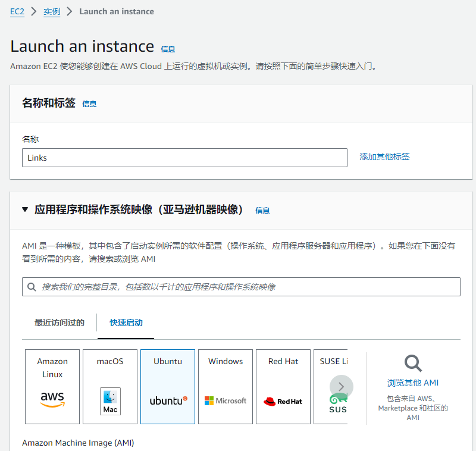
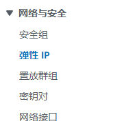
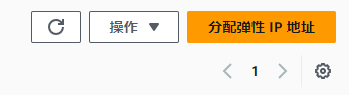
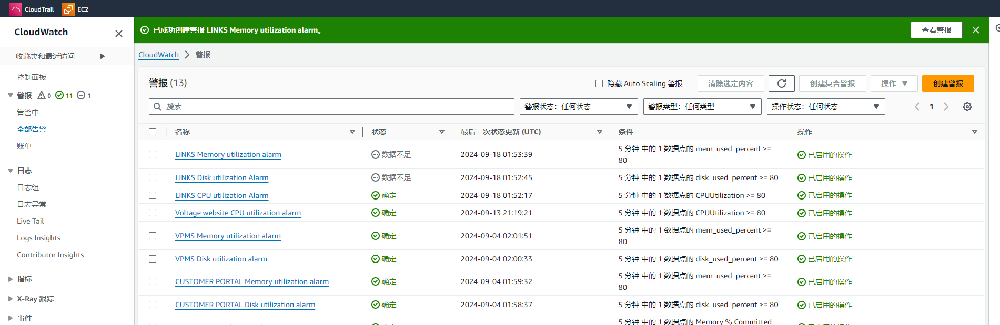
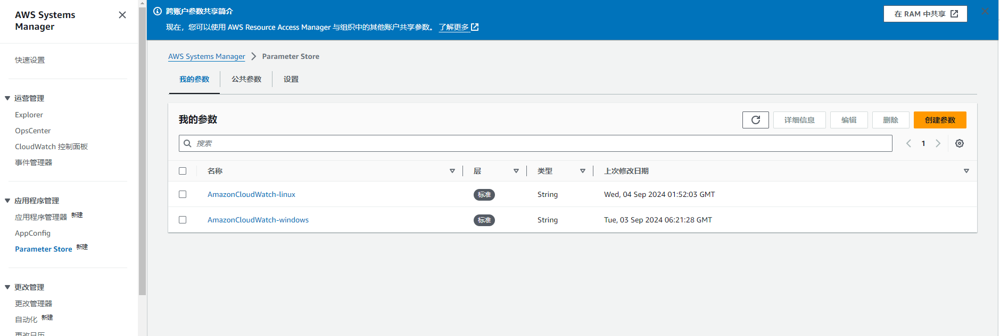

### ssh

```sh
# customer-logistics
ssh -i "C:\Users\Voltage\Downloads\voltage.pem" ubuntu@ec2-44-215-51-7.compute-1.amazonaws.com
# voltage
ssh -i "C:\Users\Voltage\Downloads\voltage.pem" ubuntu@ec2-52-4-64-231.compute-1.amazonaws.com
# links
ssh -i "C:\Users\Voltage\Downloads\voltage.pem" ubuntu@ec2-3-211-148-171.compute-1.amazonaws.com
```

https://632169122243.signin.aws.amazon.com/console

54.234.160.216

## upload file

```sh
# customer-logistics
sftp -i "C:\Users\Voltage\Downloads\voltage.pem" ubuntu@ec2-44-215-51-7.compute-1.amazonaws.com
# voltage
sftp -i "C:\Users\Voltage\Downloads\voltage.pem" ubuntu@ec2-52-4-64-231.compute-1.amazonaws.com
put logistic.sql
```

## mysql master slave

### master

```sh
sudo vi /etc/mysql/mysql.conf.d/mysqld.cnf
##
server-id               = 1
log_bin                 = /var/log/mysql/mysql-bin.log
#binlog_expire_logs_seconds     = 2592000
max_binlog_size   = 100M
binlog_do_db            = logistic
replicate-do-db = logistic
replicate-do-table = logistic.batches
replicate-do-table = logistic.contacts
replicate-do-table = logistic.projects
replicate-do-table = logistic.containers
replicate-do-table = logistic.customer_delivery_schedule
##
sudo systemctl restart mysql
```


```mysql
CREATE USER 'customer'@'%' IDENTIFIED BY 'Password@1!';
GRANT REPLICATION SLAVE ON *.* TO 'customer'@'%';
FLUSH PRIVILEGES;
FLUSH TABLES WITH READ LOCK;
mysql> show master status;
+------------------+----------+--------------+------------------+-------------------+
| File             | Position | Binlog_Do_DB | Binlog_Ignore_DB | Executed_Gtid_Set |
+------------------+----------+--------------+------------------+-------------------+
| mysql-bin.000001 |    35345 | logistic     |                  |                   |
+------------------+----------+--------------+------------------+-------------------+
# slave 设置成功以后解锁
UNLOCK TABLES;
```

### slave

```sql
CHANGE MASTER TO MASTER_HOST='pv20140610.synology.me',MASTER_USER='customer',MASTER_PASSWORD='Password@1!',MASTER_PORT=43306,MASTER_LOG_FILE='mysql-bin.000001',MASTER_LOG_POS=309808;

CHANGE MASTER TO MASTER_HOST='54.234.160.216',MASTER_USER='customer',MASTER_PASSWORD='VQbuGdPcj54A8Dv!',MASTER_PORT=3306,MASTER_LOG_FILE='mysql-bin.000028',MASTER_LOG_POS=7120;

STOP SLAVE;
RESET SLAVE ALL;
SET GLOBAL SQL_SLAVE_SKIP_COUNTER = 1;
START SLAVE;
SHOW SLAVE STATUS\G;

CHANGE MASTER TO MASTER_HOST='54.234.160.216',MASTER_USER='prod',MASTER_PASSWORD='KfCyGgPcj54A8DvG',MASTER_PORT=3306,MASTER_LOG_FILE='mysql-bin.000041',MASTER_LOG_POS=12337,GET_MASTER_PUBLIC_KEY=1;


CHANGE MASTER TO MASTER_HOST='52.4.64.231',MASTER_USER='customer_logistic',MASTER_PASSWORD='Password@1!',MASTER_PORT=3306,MASTER_LOG_FILE='mysql-bin.000003',MASTER_LOG_POS=853;
```

## AWS 创建新EC2实例

### Launch an instance

按需配置



### 关联弹性IP





### 关联CloudWatch



### intall CloudWatchAgent

#### Steps:

Step 1: Create an AWS EC2 IAM Role and add CloudWatch and SSM Full Access. - Role Name: EC2-CloudWatch-Role.
Step 2: Create a Parameter in Systems Manger with the name "AmazonCloudWatch-linux" and store the value.



```json
{
	"agent": {
		"metrics_collection_interval": 60,
		"run_as_user": "cwagent"
	},
	"metrics": {
		"aggregation_dimensions": [
			[
				"InstanceId"
			]
		],
		"append_dimensions": {
			"AutoScalingGroupName": "${aws:AutoScalingGroupName}",
			"ImageId": "${aws:ImageId}",
			"InstanceId": "${aws:InstanceId}",
			"InstanceType": "${aws:InstanceType}"
		},
		"metrics_collected": {
			"disk": {
				"measurement": [
					"disk_used_percent"
				],
				"metrics_collection_interval": 60,
				"resources": [
					"*"
				]
			},
			"mem": {
				"measurement": [
					"mem_used_percent"
				],
				"metrics_collection_interval": 60
			}
		}
	}
}
```

Step 3: Create an EC2 Instance, Attach the role created in Step 1 and Add the commands in the Userdata Section.

#### Commands that needs to be added in Userdata Section:

```
#!/bin/bash
wget https://s3.amazonaws.com/amazoncloudwatch-agent/linux/amd64/latest/AmazonCloudWatchAgent.zip
unzip AmazonCloudWatchAgent.zip
sudo ./install.sh
sudo /opt/aws/amazon-cloudwatch-agent/bin/amazon-cloudwatch-agent-ctl -a fetch-config -m ec2 -c ssm:AmazonCloudWatch-linux -s
```

#### Check if EC2 Instance has CWAgent Installed or not:

```
sudo /opt/aws/amazon-cloudwatch-agent/bin/amazon-cloudwatch-agent-ctl -m ec2 -a status
```

### 连接Navicat

出现error： No supported authentication methods available(server sent publickey)

这是新版本openssh的特性，rsa类型密钥不在当前公钥识别类型中，导致无法连接。

```sh
 sudo vi /etc/ssh/sshd_config 
 # 加上PubkeyAcceptedKeyTypes +ssh-rsa
 sudo systemctl restart sshd.service
```
