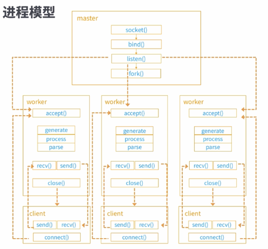
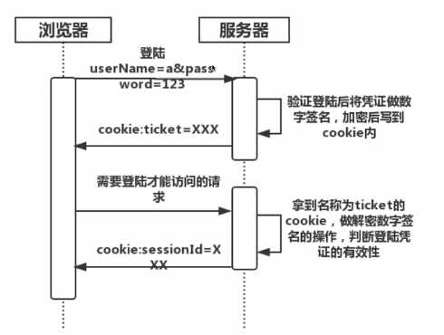
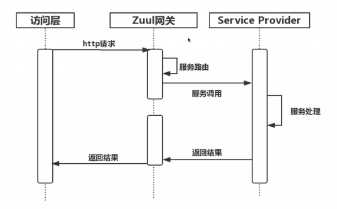
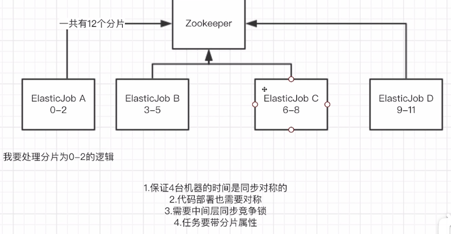
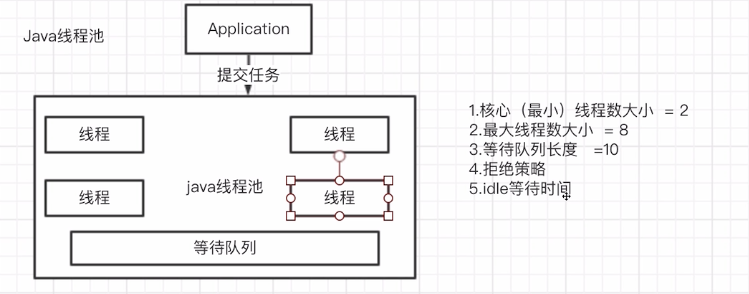

# Architecture 架构

## 课程介绍

### 1. 什么是架构

- 架构，又名软件架构，是有关软件整体结构与组建的**抽象描述**，用于**指导**大型软件系统各个方面的设计。

- 优秀的性能、超强 TPS/QPS 的承载能力、高可用决定了你的系统能够支撑多少 PV 的流量。

  - 高可用：承受高流量，系统出现局部问题时仍可用

  - QPS：Queries Per Second，每秒查询率，是一台服务器每秒能够响应的查询次数，是对一个特定的查询服务器在规定时间内所处理流量多少的衡量标准。

  - TPS：Transactions Per Second，每秒事务数，是软件测试结果的测量单位。一个事务是指一个客户机向服务器发送请求然后服务器作出反应的过程。

  - PV：Page View，页面浏览量

    

## 架构设计分层实现

### 1. 常见的分层设计

- 计算机网络 OSI 七层模型
- Web 系统 MVC 模型分层设计
- 给予领域模型的分层设计

### 2. 分布式分层

- 水平扩展：一台服务器能承受10个用户访问，增加服务器可以成倍增加访问承受量
- 负载均衡：10个请求可以均衡分配给多台服务器，而不是集中于某台
- 高可用
- 数据一致性

### 3. 亿级流量平台分层架构

## 访问层架构设计

### 1. LVS 接入系统

​		LVS集群采用**IP负载均衡**技术和基于**内容请求分发**技术，将请求均衡地转移到不同的服务器上执行，且调度器**自动屏蔽掉服务器的故障**，从而将一组服务器构成一个高性能的、高可用的虚拟服务器，整个服务器集群的结构对客户是透明的，而且无需修改客户端和服务器端的程序。

#### 1.1 三种不同的模式

- LVS/NAT
	
	​				
	
	​				显著缺点：LVS 会成为整个应用集群的性能瓶颈，当流量异常增加时，单台 LVS 无法承载巨大									的请求和响应。
	
	​				优点：部署方式简单，无需在网络地址上做映射，LVS 只是作为转发器 
	
- LVS/DR

  ​		 		

  ​				- 企业级应用使用最多的模式

  ​				优点：LVS 只管输入网络的转发

  ​				缺点：LVS 和 Realserver 的设备必须处在同一个机房中

- LVS/TUN

  ​				

  ​				LVS 将原有的源 ip 和目标 ip 作为 ip 协议的内容。并封装一层新的源 ip 和目标 ip。

  ​				优点：LVS 只管输入网络的转发，且无需和 Realserver 的设备处在同一个机房中

  ​				缺点：后端服务集群必须支持隧道模式

#### 1.2 LVS 调度策略

- 无脑轮询，带权重的无脑轮询 -> 某种程度上最佳的负载均衡设备
- 最少链接，带权重的最少链接 -> 挑选出负载最轻的一台设备
- IP_HASH，IP_HASH_GROUP
  - IP_HASH：将源客户端的ip地址做一个 hash ，把得到的整数对所有后端服务器数量取余，将得到的数字作为后端服务器某一个具体索引地址 -> 可以保证某一个源客户端永远会访问到固定的一个后端Realserver -> 可以用于分布式的登录问题

#### 1.3 LVS 强大的优势

- IP 层的负载均衡协议，无应用层回调消耗
- 通过 LVS-DR 或 LVS/TUN 模型的特性使得请求返回不经过 LVS
- 自动故障转移，心跳检测 -> 当后端服务器发生故障检测不到心跳时，LVS 会将对应的服务器踢出对应的集群，并可以将请求完全移植到其他服务器集群上。LVS 会定期轮询检测心跳是否恢复，当心跳恢复到达一定次数时，LVS 会将服务器自动加回集群组里。
- 配合主从 KeepAlive 加 Virtual IP 实现自身高可用 -> LVS 也可以有主备，主机处理外网请求，备机监测主机心跳，当发现异常时自动通过 Virtual IP 实现切换

### 2. Nginx 原理

- #### 接入层 Nginx 主要职责

  - 请求解析

  - 请求业务路由

  - 业务负载均衡

  - 响应压缩

- #### 应用层 Nginx 主要职责

  - 应用负载均衡
  - 缓存调度
  - 授权认证
  - 业务逻辑
  - 业务限流
  - 业务降级

- #### Nginx 高性能原因

  - master-worker 进程模型 -> master主进程和派生的子worker进程，由master进程负责管理对应worker进程实现的命令，worker进程处理客户端的请求（连接、请求的收/发、关闭连接）
  - 流式处理请求workflow，有主子请求
  - 协程机制
  - nginx lua ->  通过脚本语言的方式实现对应workflow不同的功能，lua 的处理模型和协程的处理机制完美结合，高性能地处理 web 服务器请求

- #### 多路复用

  程序不用等待在某个 socket 上，可以直接响应某个 socket 的请求

  - Apache - select ：
    - 监听1024个socket连接的句柄，当有任何一个句柄的网络收发包产生变化时，对应 apache 的主线程会被唤醒，连接到对应的socket
    - 缺点：一台服务器只能处理1024个以内的客户端连接；需要轮询查看客户端连接，效率低
  - Nginx - Epoll：
    - Linux 2.6 以上适用，不存在连接数量限制，当网络上对应的socket发生变化时，对应 Epoll 函数的回调会直接从内核级别判断是哪个 socket 连接发生变化 

- #### 进程模型

  

​		 Nginx 的配置文件会配置 master 程序需要启动多少 worker 进程，以及用什么方式启动。master 是 worker 的父进程，他们可以**共享内存空间**。当某个 worker 出现问题无法使用时，master 可以获取 worker 的内存地址空间，无需与 Client 断开连接，选择 其他可用的 worker 处理 socket 连接请求的发送和响应。	

### 3. Nginx 应用

- 反向代理，负载均衡（轮询）

- 动静分离

- 代理缓存服务器

  Nginx 只有作为反向代理的负载均衡服务器时，才可以使用 proxy_cache

## API 网关层架构设计

### 1. 分布式会话管理

`会话管理`：由于 http 请求的**无状态性**，引入了 session 会话管理机制，标识BS端之间**会话状态**

`分布式会话管理`：区别于传统的依赖 web server session 的会话管理状态，需要引入**集中**的会话存储容器 ( MemCache、redis )，用于鉴别分布式状态下的BS端之间的会话标识

BS 端： Browser/Server 的缩写，客户机上只要安装一个浏览器，浏览器通过 Web Server 同数据库进行数据交互

CS 端：Client/Server 的缩写，客户端需要安装专用的客户端软件

#### 1.1 会话管理的几种方式

- 基于 server 端的 session 管理方式

  

  `缺点`:

  - 依赖 web server 的 session 容器，很难定制集中化的 session 管理
  - cookie 跨域访问问题处理复杂
  - 浏览器禁用 cookie 问题

  

- 基于 cookie 的管理方式

  

  `缺点`:

  - cookie 跨域访问问题处理复杂

  - 浏览器禁用 cookie 问题

    

- 基于 token 的管理方式

  

  - 需要有效存储 token，保证每次调用都能拿到 token
  - 需要应用代码处理将 token 加到 header 或接口传参
  - 不依赖浏览器 cookie 禁用问题，能支持移动端的 native 应用的 hybrid 开发方式

#### 1.2 安全问题

- cookie 并非安全，被劫持概率高，xss、csrf 安全攻击等
  - xss：跨域脚本攻击，攻击者在web页面插入恶意的script代码（这个代码可以是JS脚本、CSS样式或者其他意料之外的代码），当用户浏览该页面之时，嵌入其中的script代码会被执行，从而达到恶意攻击用户的目的。比如读取cookie，session，tokens，或者网站其他敏感的网站信息，对用户进行钓鱼欺诈等
  - csrf：跨域请求伪造，攻击者构造网站后台某个功能接口的请求地址，诱导用户去点击或者用特殊方法让该请求地址自动加载

- token 凭证被劫持，伪造请求

#### 1.3 预防

- Https 请求防泄漏

- 风控主动失效及过期机制

### 2. 接入层控制

​		通过 API 网关接入层控制程序入口处需要实现的逻辑，包括**身份验证、流量控制、路由服务、记录调试或统计信息**等。

​		可通过不同接入层框架的通用 `Filter` 功能实现

- 身份验证：
  			 1. 通过会话管理获取登录用户凭证
      			 1. 通过用户凭证获取到用户身份信息
        			 1. 验证对应 URL 是否可被对应身份的用户访问

- 流量控制
  1. 对应 URL 的流量是否可以承载，若不能则限流
  2. 对应服务分级的流量是否可以承载，若不能则限流
  3. 对应整个系统的总流量是否可以承载，若不能则限流
- 路由服务
  1. 根据对应 URL 的规则寻找到响应服务
  2. 判定服务状态，做服务路由调用
- 调试或统计信息
  1. 切面打印日志调试信息
  2. 切面打印 cat 监控

### 3. 服务调用及聚合

​		API 网关通过了接入层控制后，通过路由进入核心的服务调用环节，通过对后端服务的调用并聚合多个服务输出的数据后返回访问层。

- 重接入

  

​			`优点`：可以灵活地在 web 层处理业务逻辑，聚合服务

​			`缺点`：服务单一性不够，且过度的 web 层业务聚合会导致服务不便于管						理

- 轻接入

  

​			`优点`：服务单一，可提供配置化接入

​			`缺点`：聚合服务处理不够灵活，需要有 service provider 提供聚合服务						能力

## 核心服务层架构设计

### 1. 服务通信

#### 1.1 微服务

- 传统的服务和服务分层

  

  `缺点`：

  - 所有服务耦合在一起
  - 隔离性弱，互相影响
  - 部署臃肿
  - 开发维护困难

  

-  微服务形态

  

  微服务是指开发一个小型的但有业务功能的服务，每个服务都有自己的处理机制和轻量通讯机制，可以部署在单个或多个服务器上。

  `优点`：

  - 服务高内聚，低耦合
  - 隔离性强，不会互相影响
  - 单独部署
  - 独立开发

-  微服务要解决的问题
  - 服务治理 (服务调用通信、健康管理、限流熔断等)
  - 数据一致性
  - 调用性能
  - 研发流程，调试、部署

#### 1.2 服务治理

- 服务治理的功能
  - 服务提供者注册服务
  - 服务消费者获取服务，并通过负载均衡策略选择服务提供者
  - 动态增减服务提供者和服务消费者
  - 服务监控
  - 服务限流
  - 服务降级
  - 高容错
  - 定制化开发 

#### 1.3 异步化消息服务

为避免消息中间件断电而遗失消息，会另存一份到磁盘。

- JMS (JAVA Message Service) Apache ActiveMQ  

  

  以 msg 为单位，同一个 topic 的 msg 可能在磁盘上的位置是不连续的，寻址不方便。一有消息就往 consumer 推送，无视其处理性能。

  - 点对点：发送者、接收者一对一发送，每个消息都被发送到一个特定的队列，接收者从队列中获取消息。队列保留着消息，直到他们被消费或超时。
  - 发布订阅：客户端将消息发送到主题，消息队列存放主题，订阅者消费主题消息。

- Kafka

  

  失败重试队列是 RocketMQ 的

  - 发布订阅：客户端将消息发送到主题，消息队列存放主题，订阅者消费主题消息，消息持久化到队尾，消费通过客户端指针，吞吐量高。

- RocketMQ (基于Kafka)

  

  - 发布订阅：客户端将消息发送到主题，消息队列存放主题，订阅者消费主题消息，消息队列维护高可用，并支持事务回溯机制。

### 2. 调度、池化

​		任务调度：使用一系列的触发规则在特定的时间点指挥计算机完成一系列的事情

#### 2.1  单机调度方式 (JAVA)

- Timer 定时器机制

  

  - 单线程调度任务 

- ScheduledExecutor

  

  - 若定时执行的任务数超出了线程池的线程数，则需要排队

- Quartz

  

#### 2.2 分布式调度方式

- Quartz 分布式版本

  - 以任务为单位，在不同的机器上分开执行

  

  

- Elastic-Job 分片分布式

  - 将同一个任务分片呈不同的子任务

​	

#### 2.3 池化技术

池化技术是用来**减少系统消耗，提升系统性能**的。

 池化技术就是通过**复用**来提升性能。

宁可限，不要滥。

- Java 连接池

  

- 数据库连接池

  

- Tomcat 连接及线程池

  

### 3. 缓存、隔离、队列

#### 3.1 缓存

缓存是分布式系统中的重要组件，主要解决高并发，大数据场景下，热点数据访问的性能问题。提供高性能的数据**快速访问**。

- 缓存分类

  - CDN 缓存 (CDN 服务器)：基本不会变的静态资源
  - 反向代理缓存 (Nginx Proxy Cache)：文件级别的缓存
  - 分布式 Cache (Redis)：支持集中化的缓存管理，分布式一致性，内存缓存效率高
  - 本地应用缓存 (JVM Guava) 

- 如何缓存

  - 实时写入

    

    当多线程时，线程可能被打断，导致信息存储不一致

  - 异步写入

    

    或许会激化实时写入的问题

  - 读取时实时写入

    

  - 读取时异步写入

    

#### 3.2 隔离

隔离是指将系统或资源分隔开，系统隔离是为了在系统发生故障时能限定传播范围和影响范围，即发生故障后不会出现滚雪球效应，从而保证只有出问题的服务不可用，其他服务仍可用。

- 常见隔离维度

  - 硬件隔离 (虚拟机)

    

    资源无法对等共享，只实行均分策略

  - 操作系统隔离 (容器虚拟化)

    

    使用 docker 实现操作系统的物理硬件虚拟化

  - 进程隔离 (系统拆分)

    

  - 线程隔离 (线程池独立)

    

  - 读写隔离 (读写分离)

    

  - 动静隔离 (动态静态资源分离)

  - 热点隔离 (热点账户、热点数据等)

    

#### 3.3 队列

队列在数据结构中是一种线性表，从一端插入数据，然后从另一端删除数据。

## 数据存储及接入层架构设计

### 1. 数据存储

#### 1.1 什么是数据存储

#### 1.2 数据存储的分类

结构化数据：可以通过二维甚至三维及以上的数组结构化地表示，有固定的列名，长度限制

半结构化数据：有清晰的层级结构，但列名可以无限扩展

#### 1.3 数据存储的重要性

- 所有的用户操作及变更最终都反映在数据存储层面
- 数据存储需要确保最终一致性
- 数据存储是系统的性能瓶颈点

#### 1.4 数据存储如何选型

 #### 1.5 常用的数据存储中间件

- NAS: 网络文件系统，基底层设备，提供文件磁盘

  ​		  提供对应网络文件的读写操作，可以兼容各种网络文件的格式。

  ​		  多用于运维

  

- 阿里OSS: 阿里云OSS网络文件存储

- SQL关系型数据库: MySQL，ms SQL，DB2，SQLite等

- 非关系型数据库: MongoDB，HBase等

- 缓存型数据库: H2，MemCache，Redis

### 2. 关系型与非关系型

- 关系型
  - MySQL：
    - 是一种开放源代码的关系型数据库管理系统 (RDBMS)
    - 使用最常用的数据库管理寓言--结构化查询语言 (SQL) 进行数据库管理
- 非关系型
  - MongoDB：
    - 是非关系数据库中功能最丰富，最像关系数据库的。支持的数据结构非常松散，类似JSON的BSON格式，因此可以存储比较复杂的数据类型。
    - 最大的特点是支持的查询语言非常强大，其余发类似面向对象的查询语言，几乎可以实现类似关系数据库单表查询的绝大部分功能，并且对数据建立索引。
  - Redis：
    - 是一个开源(BSD 许可)内存存储的数据结构服务器，可用作数据库，高速缓存和消息队列代理。
    - 支持字符串、哈希表、列表、集合、有序集合、位图、HyperLogLogs等数据类型
    - 内置复制、Lua脚本、LRU收回、事务以及不同级别磁盘持久化功能，同时通过Redis Sentinel提供高可用，通过Redis Cluster提供自动分区

### 3. 代理访问

#### 3.1 什么是代理访问

代理一个或一群后端的被访问对象，使得调用端看似在直接访问后端对象一样，代理访问的代理器从而可以实现多种负载均衡，故障转移，缓存策略等个性化配置，同时又可以分散被代理的后端对象压力

#### 3.2 常见的被代理对象

- 数据库服务器 -- Mycat 代理

  - 数据库可垂直分库分表 (根据业务划分)，水平分库分表 (根据时间戳划分)，代理可根据不同的条件指向不同的数据库

    

  

- 缓存服务器 -- Twemproxy 代理

  - 代理可解析读写操作，分配到对应的redis server，以此达到主从之间的高可用读写备份

    

  

- 后端应用服务器 -- Nginx 反向代理

  

 

##  监控、限流、降级

### 1. 监控

#### 1.1 为什么要监控

#### 1.2 监控什么

- 硬件指标
  - Cpu Idle Time：cpu 的空闲时间率, 跌倒40%以下需要关注
  - Free Memory：空闲内存数
  - IO Wait：等待 IO 返回的执行时间
  - Network Free：网络带宽
- 软件指标
  - Cpu Load Average: 负载，在一核的 cpu 负载超过1则是高 load
  - ParNew Count：新生代 gc (Garbage Collection 垃圾回收) 的清理次数
  - ParNew Time：新生代 gc 的清理时间
  - Old GC Count
  - Old GC Time
- 接口指标
  - url接口失败次数
  - url接口 95，99 lines：95%的请求控制在xx ms毫秒内
- 异常指标
  - Exception times and content
- 大盘指标
  - 基线成功率
  - 基线失败率
  - 总体响应时间指标

### 2. 限流

#### 2.1 为什么要限流

- 流量远比能力大
- 永远不知道对方怎么样
- 永远不知道自己怎么样

#### 2.2 限流的维度

- 维度一
  - URL
  - Dubbo 接口
  - SQL 操作数
- 维度二
  - 限制 TPS/QPS
  - 限制并发数
  - 限制总数

#### 2.3 限流算法原理

​	

- 限制并发数：在 dubbo provider 内存内以接口名为单位设置一个计数器，当调用开始，计数器-1并判断是否到0，若到0则返回限流异常，否则执行业务逻辑，返回后将计数器+1

- 令牌桶算法：设置限流 3tps，以桶模拟对应的接口令牌池，若有请求进入则获取对应的令牌并返回给调用方表示可以执行操作，然后有一个计时器每隔一秒钟重置桶内的令牌数量到可以访问的 tps

  

- 漏桶算法：匀速流出 tps，若要访问则流入 tps 的量不能大于桶内空余的容量，和令牌桶相比可以允许有突发流量的发生

  

集群限流：对应所有的操作都要通过中央管理点，性能瓶颈

单机限流：很难保证绝对意义上的负载均衡，推荐使用

### 3. 降级

#### 3.1 什么是降级

当系统遇到某些情况下主动或被动采取的一种保护策略，既可以保护系统正常运行，又可以使得用户体验在可接受的损失范围之内。

#### 3.2 为什么要降级

- 保护系统
- 保护用户体验
- 排查问题

降级更要考虑业务闭环，限流只是简单的隔离

#### 3.3 怎样降级

- 关闭接口并设置默认返回
- 降级逻辑

