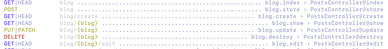

## LARAVEL


### Valet

[Laravel Valet](https://github.com/laravel/valet) is a development environment for macOS minimalists. Laravel Valet configures your Mac to always run [Nginx](https://www.nginx.com/) in the background when your machine starts. Then, using [DnsMasq](https://en.wikipedia.org/wiki/Dnsmasq), Valet proxies all requests on the `*.test` domain to point to sites installed on your local machine.

[Laravel Valet Setup (Mac)](https://gist.github.com/bradtraversy/b58f74cd863a465068eaeaae1544d9be)

- The `park` Command

The `park` command registers a directory on your machine that contains your applications. Once the directory has been "parked" with Valet, all of the directories within that directory will be accessible in your web browser at `http://<directory-name>.test`

```sh
cd ~/Sites
valet park
```

### 快速查看 phpinfo

```php
# in routes/web.php
Route::get('phpmyinfo', function () {
    phpinfo();
})->name('phpmyinfo');
```


### Setting up Debugbar

- install package

```sh
composer require barryvdh/laravel-debugbar --dev
```

- `/config/app.php`

​		add `Barryvdh\Debugbar\**ServiceProvider**::class,` in `providers`

- examples

```php
Debugbar::info('INFO!');
Debugbar::error('ERR!');
Debugbar::warning('warning!');
Debugbar::addMessage('msg!');
```

### Setting up ide-helper

- install package

```sh
composer require barryvdh/laravel-ide-helper --dev
```

- `/config/app.php`

	add `Barryvdh\LaravelIdeHelper\IdeHelperServiceProvider::class,` in `providers`
	
- /app/Providers/AppServiceProvider.php

  ```php
  public function register()
      {
          if ($this->app->environment() !== 'production') {
              $this->app->register(IdeHelperServiceProvider::class);
          }
      }
  ```

- ```sh
   php artisan ide-helper:generate
  ```

- 在每个 Model 加上

  ```
  /**
   * @mixin Eloquent
   */
  ```

  

### Start Server

```sh
php artisan serve
```


### Regenerate  App_Key

```sh
php artisan key:generate
```


### Controllers

```sh
php artisan make:controller PostsController
```

laravel allows `resource controller` to generate four crud methods automatically

```sh
php artisan make:controller PostsController --resource
```

- Routes

  - ```php
    Route::resource('blog', PostsController::class);
    ```

    resource方法获取Controller中所有方法，并与各endpoint相关联

    ```sh
    php artisan route:list
    ```

    


### Single Action Controllers

When there is only one action in the controller, we can use `__invoke` method;

- Routes

  - ```sh
    Route::get('/', HomeController::class);
    ```

    

### Basic Routing

```php
// GET
Route::get('/blog', [PostsController::class, 'index']);
Route::get('/blog/1', [PostsController::class, 'show']);

// POST
Route::get('/blog/create', [PostsController::class, 'create']);
Route::post('/blog/1', [PostsController::class, 'store']);

// PUT OR PATCH
Route::get('/blog/edit/1', [PostsController::class, 'edit']);
Route::patch('/blog/1', [PostsController::class, 'update']);

// DELETE
Route::delete('/blog/1', [PostsController::class, 'destroy']);
```

Equals 

```php
Route::resource('blog', PostsController::class);
```

#### Other methods

```php
// Multiple HTTP verbs
Route::match(['GET', 'POST'], 'blog', [PostsController::class, 'index']);
Route::any('/blog', [PostsController::class, 'index']);

// Return view
Route::view('/blog', 'index', ['name' => 'Code with Biyun']);
```

#### Route Parameters

```php
Route::get('/blog/{id}', [PostsController::class, 'show']);
```

#### Routes with Expressions

```php
Route::get('/blog/{id}/{name}', [PostsController::class, 'show'])->where([
    'id' => '[0-9]+',
    'name' => '[a-z]+',
]);

Route::get('/blog/{id}/{name}', [PostsController::class, 'show'])
    ->whereNumber('id')
    ->whereAlpha('name');
```

#### Named Routes

```php+HTML
Route::get('/blog', [PostsController::class, 'index'])->name('blog.index');
Route::get('/blog/{id}', [PostsController::class, 'show'])->name('blog.show');

<a href={{ route('blog.index') }}>Blog</a>
<a href={{ route('blog.show', ['id' => 1]) }}>Show Blog</a>
```

#### Route Prefixes

```php
Route::prefix('/blog')->group(function () {
    Route::get('/', [PostsController::class, 'index'])->name('blog.index');
    Route::get('/{id}', [PostsController::class, 'show'])->name('blog.show');
    Route::get('/create', [PostsController::class, 'create'])->name('blog.create');
    Route::post('/{id}', [PostsController::class, 'store'])->name('blog.store');
    Route::get('/edit/{id}', [PostsController::class, 'edit'])->name('blog.edit');
    Route::patch('/{id}', [PostsController::class, 'update'])->name('blog.update');
    Route::delete('/{id}', [PostsController::class, 'destroy']);
});
```

#### Fallback Routes

```sh
php artisan make:controller FallbackController
```

```php
Route::fallback(FallbackController::class);
```


### Database

#### Test Database connected Using Tinker

```sh
php artisan tinker
DB::connection()->getPdo();
```


#### Migrations

```sh
php artisan make:migration create_posts_table
```

```php
/**
* Run the migrations.
*
* @return void
*/
public function up()
{
  Schema::create('posts', function (Blueprint $table) {
    $table->id();
    $table->string('title')->unique();
    $table->text('excerpt')->nullable();
    $table->text('body');
    $table->integer('min_to_read')->default(1);
    $table->string('image_path');
    $table->boolean('is_published');
    $table->timestamps();
  });
}
```

```sh
php artisan migrate
php artisan migrate:status
php artisan migrate:reset (rollback all)
php artisan migrate:refresh (rollback all and run all)
php artisan migrate:refresh --path=database/migrations/2023_05_24_054016_create_posts_table.php
```

#### Seeders

```sh
php artisan make:seeder PostsTableSeeder
php artisan make:model Post
```


/database/seeders/PostsTableSeeder.php

```php
		/**
     * Run the database seeds.
     *
     * @return void
     */
    public function run()
    {
        $posts = [
            [
                'title' => 'Post One',
                'excerpt' => 'Summary of Post One',
                'body' => 'Body of Post One',
                'image_path' => 'Empty',
                'is_published' => false,
                'min_to_read' => 2
            ],
            [
                'title' => 'Post Two',
                'excerpt' => 'Summary of Post Two',
                'body' => 'Body of Post Two',
                'image_path' => 'Empty',
                'is_published' => false,
                'min_to_read' => 2
            ],
        ];

        foreach ($posts as $key => $value) {
            Post::create($value);
        }
    }
```


/database/seeders/DatabaseSeeder.php

```php
		/**
     * Seed the application's database.
     *
     * @return void
     */
    public function run()
    {
        $this->call(PostsTableSeeder::class);
    }
```


- Method 1

  - ```sh
    php artisan migrate:reset
    php artisan migrate --seed
    ```

- Method 2

  - ```sh
    php artisan migrate:reset
    php artisan migrate
    php artisan db:seed
    ```

    

	#### Factories

```sh
php artisan make:factory PostFactory
```


/database/seeders/DatabaseSeeder.php

```php
class DatabaseSeeder extends Seeder
{
    /**
     * Seed the application's database.
     *
     * @return void
     */
    public function run()
    {
        // $this->call(PostsTableSeeder::class);
        Post::factory(100)->create();
      	// Post::factory(100)->create([
        //    'body' => 'overriding the body of pur post'
        // ]);
    }
}
```

```sh
php artisan db:seed
```

One command for all 

Model, Factory, Migration, Seeder, Request, Controller, Policy

```sh
php artisan make:model Customer --all
```


#### Query Builder

```php
 $posts = DB::table('posts')
            ->select('id', 'title', 'min_to_read', 'is_published')
            ->where('id', '>', 50)
            ->where('is_published', true)
            ->whereBetween('min_to_read', [2, 6])
            ->orderBy('id', 'desc')
            ->get();
```

#### Variables & Control Structures

app/Http/Controllers/PostsController.php

```php
public function index()
    {
        $posts = DB::table('posts')->find(1);
        return view('blog.index')->with('posts', $posts);
    }
```

or

```php
public function index()
    {
        $posts = DB::table('posts')->get();
        return view('blog.index', compact('posts'));
    }
```

or

```php
public function index()
    {
        return view('blog.index', [
            'posts' => DB::table('posts')->get()
        ]);
    }
```

While iterating through a `foreach` loop, a `$loop` variable will be available inside of your loop. -> [tuto](https://laravel.com/docs/10.x/blade#the-loop-variable)

```php+HTML
<body>
    @forelse ($posts as $post)
        {{ $loop->index }}
    @empty
        <p>No posts have been set</p>
    @endforelse
</body>
```


### Eloquent ORM

#### Eloquent Model Conventions

Eloquent 是 Laravel 提供的 ORM 实现。它将数据库抽象为对象，这些对象 (也称为「模型」) 被创建、更新或删除时，Eloquent 会在数据库中进行相应的更改。

如果 Model 无法关联 数据库中的表，可以在 Model 中指定。

```php
class Post extends Model
{
    use HasFactory;
    
    protected $table = 'posts';
}
```

 [Eloquent tuto](https://laravel.com/docs/10.x/eloquent#table-names)

```php
public function index()
    {
        // all cannot use with methods chaining 
    	//$posts = Post::all();
    	$posts = Post::orderBy('id', 'desc')->take(10)->get();
        dd($posts);
        return view('blog.index');
    }
```

```php
public function index()
    {
        Post::chunk(25, function ($posts) {
            foreach ($posts as $post) {
                echo $post->title . '<br>';
            }
        });
    }
```

```php
public function show($id)
    {
        $post = Post::findOrFail($id);
        dd($post);
    }
```

#### Resource

```sh
php artisan make:resource CustomerResource
php artisan make:resource CustomerCollection
```

/app/Http/Resources/V1/CustomerResource.php

```php
public function toArray($request)
    {
        return [
            'id' => $this->id,
            'type' => $this->type,
            'name' => $this->name
        ];
    }
```

/app/Http/Resources/V1/CustomerCollection.php

```php
public function toArray($request)
    {
        return parent::toArray($request);
    }
```

/app/Http/Controllers/Api/V1/CustomerController.php

```php
public function index()
    {
        return new CustomerCollection(Customer::all());
    }

public function show(Customer $customer)
    {
        return new CustomerResource($customer);
    }
```

Resource 和 Collection 只需修改 Resource，Collection 自动沿用 Resource。

#### Filtering Data

/app/Filters/ApiFilter.php

```php
class ApiFilter
{
    protected array $safeParams = [];

    protected array $columnMap = [];

    protected array $operatorMap = [
        'eq' => '=',
        'lt' => '<',
        'lte' => '<=',
        'gt' => '>',
        'gte' => '>=',
        'ne' => '!='
    ];

    public function transform(Request $request): array
    {
        $eloQuery = [];
        foreach ($this->safeParams as $param => $operators) {
            $query = $request->query($param);
            if (!isset($query)) {
                continue;
            }
            $column = $this->columnMap[$param] ?? $param;
            foreach ($operators as $operator) {
                if (isset($query[$operator])) {
                    $eloQuery[] = [$column, $this->operatorMap[$operator], $query[$operator]];
                }
            }
        }

        return $eloQuery;
    }
}
```

/app/Filters/V1/CustomersFilter.php

```php
class CustomersFilter extends ApiFilter
{
    protected array $safeParams = [
        'name' => ['eq'],
        'type' => ['eq'],
        'email' => ['eq'],
        'address' => ['eq'],
        'city' => ['eq'],
        'state' => ['eq'],
        'postalCode' => ['eq', 'gt', 'lt']
    ];

    protected array $columnMap = [
        'postalCode' => 'postal_code'
    ];
}
```

/app/Http/Controllers/Api/V1/CustomerController.php

```php
public function index(Request $request)
    {
        $filter = new CustomersFilter();
        $queryItems = $filter->transform($request); // [['column', 'operator', 'value]]
        if (count($queryItems) == 0) {
            return new CustomerCollection(Customer::paginate());
        } else {
            $customers = Customer::where($queryItems)->paginate();
            return new CustomerCollection($customers->appends($request->query()));
        }
    }
```

url : http://127.0.0.1:8000/api/v1/customers?postalCode[gt]=30000

#### Including Related Data

/app/Http/Controllers/Api/V1/CustomerController.php

```php
public function index(Request $request)
    {
        $filter = new CustomersFilter();
        $filterItems = $filter->transform($request);
        $includeInvoices = $request->query('includeInvoices');
        $customers = Customer::where($filterItems);

        if ($includeInvoices) {
            $customers = $customers->with('invoices');
        }
        return new CustomerCollection($customers->paginate()->appends($request->query()));
    }

public function show(Customer $customer)
    {
        $includeInvoices = request()->query('includeInvoices');
        if ($includeInvoices) {
            return new CustomerResource($customer->loadMissing('invoices')); // load invoices if not loaded
        }
        return new CustomerResource($customer);
    }
```

/app/Http/Resources/V1/CustomerResource.php

```php
public function toArray($request)
    {
        return [
            'id' => $this->id,
            'type' => $this->type,
            'name' => $this->name,
            'email' => $this->email,
            'address' => $this->address,
            'city' => $this->city,
            'postalCode' => $this->postal_code,
            'invoices' => InvoiceResource::collection($this->whenLoaded('invoices'))
        ];
    }
```

url : http://127.0.0.1:8000/api/v1/customers?postalCode[gt]=30000&includeInvoices=true

#### Creating Resources With POST Requests

/app/Models/Customer.php

```php
protected $fillable = [
        'name',
        'type',
        'email',
        'address',
        'city',
        'state',
        'postal_code'
    ];
```

/app/Http/Requests/V1/StoreCustomerRequest.php

```php
public function authorize()
    {
        return true;
    }

    /**
     * Get the validation rules that apply to the request.
     *
     * @return array<string, mixed>
     */
    public function rules()
    {
        return [
            'name' => ['required'],
            'type' => ['required', Rule::in(['I', 'B'])],
            'email' => ['required', 'email'],
            'address' => ['required'],
            'city' => ['required'],
            'state' => ['required'],
            'postalCode' => ['required']
        ];
    }

    protected function prepareForValidation()
    {
        $this->merge([
            'postal_code' => $this->postalCode
        ]);
    }
```

/app/Http/Controllers/Api/V1/CustomerController.php

```php
public function store(StoreCustomerRequest $request)
    {
        return new CustomerResource(Customer::create($request->all()));
    }
```

#### Updating With PUT and PATCH

/app/Http/Requests/V1/UpdateCustomerRequest.php

```php
public function authorize()
    {
        return true;
    }

    /**
     * Get the validation rules that apply to the request.
     *
     * @return array<string, mixed>
     */
    public function rules()
    {
        $method = $this->method();
        if ($method == 'PUT') {
            return [
                'name' => ['required'],
                'type' => ['required', Rule::in(['I', 'B'])],
                'email' => ['required', 'email'],
                'address' => ['required'],
                'city' => ['required'],
                'state' => ['required'],
                'postalCode' => ['required']
            ];
        } else {
            return [
                'name' => ['sometimes', 'required'],
                'type' => ['sometimes', 'required', Rule::in(['I', 'B'])],
                'email' => ['sometimes', 'required', 'email'],
                'address' => ['sometimes', 'required'],
                'city' => ['sometimes', 'required'],
                'state' => ['sometimes', 'required'],
                'postalCode' => ['sometimes', 'required']
            ];
        }
    }

    protected function prepareForValidation()
    {
        if ($this->postalCode) {
            $this->merge([
                'postal_code' => $this->postalCode
            ]);
        }
    }
```

/app/Http/Controllers/Api/V1/CustomerController.php

```php
public function update(UpdateCustomerRequest $request, Customer $customer)
    {
        $customer->update($request->all());
    }
```

#### Implementing Bulk Insert

/routes/api.php

```php
Route::post('invoices/bulk', [InvoiceController::class, 'bulkStore']);
```

/app/Http/Requests/V1/BulkStoreInvoiceRequest.php

```php
public function authorize()
    {
        return true;
    }

    /**
     * Get the validation rules that apply to the request.
     *
     * @return array<string, mixed>
     */
    public function rules()
    {
        return [
            '*.customerId' => ['required', 'integer'],
            '*.amount' => ['required', 'numeric'],
            '*.status' => ['required', Rule::in(['P', 'B', 'V'])],
            '*.billedDate' => ['required', 'date_format:Y-m-d H:i:s'],
            '*.paidDate' => ['date_format:Y-m-d H:i:s', 'nullable']
        ];
    }

    protected function prepareForValidation()
    {
        $data = [];
        foreach ($this->toArray() as $obj) {
            $obj['customer_id'] = $obj['customerId'] ?? null;
            $obj['billed_date'] = $obj['billedDate'] ?? null;
            $obj['paid_date'] = $obj['paidDate'] ?? null;
            $data[] = $obj;
        }

        $this->merge($data);
    }
```

/app/Http/Controllers/Api/V1/InvoiceController.php

```php
public function bulkStore(BulkStoreInvoiceRequest $request)
    {
        $bulk = collect($request->all())->map(function ($arr, $key) {
            return Arr::except($arr, ['customerId', 'billedDate', 'paidDate']);
        });
        Invoice::insert($bulk->toArray());
    }
```

#### Update or create with ID

id 存在则更新，不存在则新增

```php
$upsertData = [
	[
		'id' => 1,
		'name' => 'test'
	],
	[
		'id' => 0,
		'name' => 'row to create'
	]
];
Model::upsert($upsetData, ['id']);
```


### Fake Data

/database/factories/CustomerFactory.php

```php
public function definition()
    {
        $type = $this->faker->randomElement(['I', 'B']);
        $name = $type == 'I' ? $this->faker->name() : $this->faker->company();
        return [
            'name' => $name,
            'type' => $type,
            'email' => $this->faker->email(),
            'address' => $this->faker->streetAddress(),
            'city' => $this->faker->city(),
            'state' => $this->faker->state(),
            'postal_code' => $this->faker->postcode(),
        ];
    }
```

/database/seeders/CustomerSeeder.php

```php
public function run()
    {
        Customer::factory()
            ->count(25)
            ->hasInvoices(10)
            ->create();
        Customer::factory()
            ->count(100)
            ->hasInvoices(5)
            ->create();
        Customer::factory()
            ->count(100)
            ->hasInvoices(10)
            ->create();
        Customer::factory()
            ->count(25)
            ->create();
    }
```

/database/seeders/DatabaseSeeder.php

```php
public function run()
    {
        $this->call([
            CustomerSeeder::class
        ]);
    }
```


### Restful API

```
- app
    |-- Http
        |-- Controllers
            |-- Api
                |-- V1
                    |-- CustomerController.php
                    |-- InvoiceController.php
```

/routes/api.php

```php
Route::group([
    'prefix' => 'v1',
    'namespace' => 'App\Http\Controllers\Api\V1'
], function () {
    Route::apiResources('customers', CustomerController::class);
    Route::apiResources('invoices', InvoiceController::class);
});
```


### Authentification

/app/Http/Kernel.php

```php
'api' => [
             \Laravel\Sanctum\Http\Middleware\EnsureFrontendRequestsAreStateful::class,
        ],
```

/routes/api.php

```php
Route::group([
    'prefix' => 'v1',
    'namespace' => 'App\Http\Controllers\Api\V1'
], function () {
    Route::post('register', [AuthController::class, 'register']);
    Route::post('login', [AuthController::class, 'login'])->name('login');
});

Route::group([
    'prefix' => 'v1',
    'namespace' => 'App\Http\Controllers\Api\V1',
    'middleware' => 'auth:sanctum' // add this line to protect route
], function () {
    Route::apiResource('customers', CustomerController::class);
    Route::apiResource('invoices', InvoiceController::class);
    Route::post('invoices/bulk', [InvoiceController::class, 'bulkStore']);
});
```

/app/Http/Controllers/Api/V1/AuthController.php

```php
public function register(Request $request)
    {
        $validator = Validator::make($request->all(), [
            'name' => 'required',
            'email' => 'required|email',
            'password' => 'required'
        ]);
        if ($validator->fails()) {
            $response = [
                'success' => false,
                'message' => $validator->errors()
            ];
            return response()->json($response, 400);
        }

        $input = $request->all();
        $input['password'] = bcrypt($input['password']);
        $user = User::create($input);

        $success['token'] = $user->createToken("MyApp")->plainTextToken;
        $success['name'] = $user->name;

        $response = [
            'success' => true,
            'data' => $success,
            'message' => 'User register successfully'
        ];
        return response()->json($response);
    }

    public function login(Request $request)
    {
        $credentials = [
            'email' => $request->email,
            'password' => $request->password
        ];
        if (Auth::attempt($credentials)) {
            $user = Auth::user();
            $success['token'] = $user->createToken("MyApp")->plainTextToken;
            $success['name'] = $user->name;

            $response = [
                'success' => true,
                'data' => $success,
                'message' => 'User login successfully'
            ];
            return response()->json($response);
        } else {
            $response = [
                'success' => false,
                'message' => 'Unauthorised'
            ];
            return response()->json($response, 400);
        }
    }
```

Request 的 header 需加上

```
'Authorization' : 'Bearer ' + token
```


### Service Provider

```sh
php artisan make:provider DingtalkServiceProvider
```

```php
// config/app.php
'providers' => [
	App\Providers\DingtalkServiceProvider::class
]
```


```php
// DingtalkServiceProvider
use App\Libraries\Dingtalk;
use Illuminate\Contracts\Foundation\Application;

public function register(): void
    {
        $this->app->singleton('dingtalk', function (Application $app) {
            return new Dingtalk($app['config']['services.dingtalk']);
        });
    }
```

```php
// DingtalkService
use App\Libraries\Dingtalk;

class DingtalkService
{
    private Dingtalk $dingtalk;

    public function __construct()
    {
        $this->dingtalk = app('dingtalk');
    }
}

```


### Redis

```sh
composer require predis/predis
```

```
// .env
CACHE_DRIVER=redis
REDIS_CLIENT=predis
```

```php
// _ide_helper_redis.php
<?php

namespace Illuminate\Support\Facades;

/**
 * @method static int    del( array $keys )
 * @method static string dump( $key )
 * @method static int    exists( $key )
 * @method static int    expire( $key, $seconds )
 * @method static int    expireat( $key, $timestamp )
 * @method static array  keys( $pattern )
 * @method static int    move( $key, $db )
 * @method static mixed  object( $subcommand, $key )
 * @method static int    persist( $key )
 * @method static int    pexpire( $key, $milliseconds )
 * @method static int    pexpireat( $key, $timestamp )
 * @method static int    pttl( $key )
 * @method static string randomkey()
 * @method static mixed  rename( $key, $target )
 * @method static int    renamenx( $key, $target )
 * @method static array  scan( $cursor, array $options = null )
 * @method static array  sort( $key, array $options = null )
 * @method static int    ttl( $key )
 * @method static mixed  type( $key )
 * @method static int    append( $key, $value )
 * @method static int    bitcount( $key, $start = null, $end = null )
 * @method static int    bitop( $operation, $destkey, $key )
 * @method static array  bitfield( $key, $subcommand, ...$subcommandArg )
 * @method static int    decr( $key )
 * @method static int    decrby( $key, $decrement )
 * @method static string get( $key )
 * @method static int    getbit( $key, $offset )
 * @method static string getrange( $key, $start, $end )
 * @method static string getset( $key, $value )
 * @method static int    incr( $key )
 * @method static int    incrby( $key, $increment )
 * @method static string incrbyfloat( $key, $increment )
 * @method static array  mget( array $keys )
 * @method static mixed  mset( array $dictionary )
 * @method static int    msetnx( array $dictionary )
 * @method static mixed  psetex( $key, $milliseconds, $value )
 * @method static mixed  set( $key, $value, $expireResolution = null, $expireTTL = null, $flag = null )
 * @method static int    setbit( $key, $offset, $value )
 * @method static int    setex( $key, $seconds, $value )
 * @method static int    setnx( $key, $value )
 * @method static int    setrange( $key, $offset, $value )
 * @method static int    strlen( $key )
 * @method static int    hdel( $key, array $fields )
 * @method static int    hexists( $key, $field )
 * @method static string hget( $key, $field )
 * @method static array  hgetall( $key )
 * @method static int    hincrby( $key, $field, $increment )
 * @method static string hincrbyfloat( $key, $field, $increment )
 * @method static array  hkeys( $key )
 * @method static int    hlen( $key )
 * @method static array  hmget( $key, array $fields )
 * @method static mixed  hmset( $key, array $dictionary )
 * @method static array  hscan( $key, $cursor, array $options = null )
 * @method static int    hset( $key, $field, $value )
 * @method static int    hsetnx( $key, $field, $value )
 * @method static array  hvals( $key )
 * @method static int    hstrlen( $key, $field )
 * @method static array  blpop( array $keys, $timeout )
 * @method static array  brpop( array $keys, $timeout )
 * @method static array  brpoplpush( $source, $destination, $timeout )
 * @method static string lindex( $key, $index )
 * @method static int    linsert( $key, $whence, $pivot, $value )
 * @method static int    llen( $key )
 * @method static string lpop( $key )
 * @method static int    lpush( $key, array $values )
 * @method static int    lpushx( $key, $value )
 * @method static array  lrange( $key, $start, $stop )
 * @method static int    lrem( $key, $count, $value )
 * @method static mixed  lset( $key, $index, $value )
 * @method static mixed  ltrim( $key, $start, $stop )
 * @method static string rpop( $key )
 * @method static string rpoplpush( $source, $destination )
 * @method static int    rpush( $key, array $values )
 * @method static int    rpushx( $key, $value )
 * @method static int    sadd( $key, array $members )
 * @method static int    scard( $key )
 * @method static array  sdiff( array $keys )
 * @method static int    sdiffstore( $destination, array $keys )
 * @method static array  sinter( array $keys )
 * @method static int    sinterstore( $destination, array $keys )
 * @method static int    sismember( $key, $member )
 * @method static array  smembers( $key )
 * @method static int    smove( $source, $destination, $member )
 * @method static string spop( $key, $count = null )
 * @method static string srandmember( $key, $count = null )
 * @method static int    srem( $key, $member )
 * @method static array  sscan( $key, $cursor, array $options = null )
 * @method static array  sunion( array $keys )
 * @method static int    sunionstore( $destination, array $keys )
 * @method static int    zadd( $key, array $membersAndScoresDictionary )
 * @method static int    zcard( $key )
 * @method static string zcount( $key, $min, $max )
 * @method static string zincrby( $key, $increment, $member )
 * @method static int    zinterstore( $destination, array $keys, array $options = null )
 * @method static array  zrange( $key, $start, $stop, array $options = null )
 * @method static array  zrangebyscore( $key, $min, $max, array $options = null )
 * @method static int    zrank( $key, $member )
 * @method static int    zrem( $key, $member )
 * @method static int    zremrangebyrank( $key, $start, $stop )
 * @method static int    zremrangebyscore( $key, $min, $max )
 * @method static array  zrevrange( $key, $start, $stop, array $options = null )
 * @method static array  zrevrangebyscore( $key, $max, $min, array $options = null )
 * @method static int    zrevrank( $key, $member )
 * @method static int    zunionstore( $destination, array $keys, array $options = null )
 * @method static string zscore( $key, $member )
 * @method static array  zscan( $key, $cursor, array $options = null )
 * @method static array  zrangebylex( $key, $start, $stop, array $options = null )
 * @method static array  zrevrangebylex( $key, $start, $stop, array $options = null )
 * @method static int    zremrangebylex( $key, $min, $max )
 * @method static int    zlexcount( $key, $min, $max )
 * @method static int    pfadd( $key, array $elements )
 * @method static mixed  pfmerge( $destinationKey, array $sourceKeys )
 * @method static int    pfcount( array $keys )
 * @method static mixed  pubsub( $subcommand, $argument )
 * @method static int    publish( $channel, $message )
 * @method static mixed  discard()
 * @method static array  exec()
 * @method static mixed  multi()
 * @method static mixed  unwatch()
 * @method static mixed  watch( $key )
 * @method static mixed  eval( $script, $numkeys, $keyOrArg1 = null, $keyOrArgN = null )
 * @method static mixed  evalsha( $script, $numkeys, $keyOrArg1 = null, $keyOrArgN = null )
 * @method static mixed  script( $subcommand, $argument = null )
 * @method static mixed  auth( $password )
 * @method static string echo ( $message )
 * @method static mixed  ping( $message = null )
 * @method static mixed  select( $database )
 * @method static mixed  bgrewriteaof()
 * @method static mixed  bgsave()
 * @method static mixed  client( $subcommand, $argument = null )
 * @method static mixed  config( $subcommand, $argument = null )
 * @method static int    dbsize()
 * @method static mixed  flushall()
 * @method static mixed  flushdb()
 * @method static array  info( $section = null )
 * @method static int    lastsave()
 * @method static mixed  save()
 * @method static mixed  slaveof( $host, $port )
 * @method static mixed  slowlog( $subcommand, $argument = null )
 * @method static array  time()
 * @method static array  command()
 * @method static int    geoadd( $key, $longitude, $latitude, $member )
 * @method static array  geohash( $key, array $members )
 * @method static array  geopos( $key, array $members )
 * @method static string geodist( $key, $member1, $member2, $unit = null )
 * @method static array  georadius( $key, $longitude, $latitude, $radius, $unit, array $options = null )
 * @method static array  georadiusbymember( $key, $member, $radius, $unit, array $options = null )
 */
class Redis
{

}
```

### Queue - Supervisor

Supervisor is a process control system for Linux that allows you to monitor and control processes on your server. It is particularly useful for managing long-running processes, such as Laravel queues, which can run for hours or even days at a time. In this post, we will go through the process of installing and using Supervisor with Laravel queue

#### 1. Install Supervisor

The first step is to install Supervisor on your server. This can typically be done using your server’s package manager. For example, on Ubuntu, you can install Supervisor using the following command:

```
sudo apt-get install supervisor
```

Once Supervisor is installed, you can start and stop it using the following commands:

```
sudo systemctl start supervisor
sudo systemctl stop supervisor
```

#### 2. Configure Supervisor

The next step is to configure Supervisor to manage your Laravel queue processes. Supervisor uses configuration files to define the processes it should manage. These files are typically stored in the `/etc/supervisor/conf.d/` directory.

Create a new configuration file for your Laravel queue using the following command:

```
sudo vi /etc/supervisor/conf.d/laravel-queue.conf
```

In this file, you will need to define the command that Supervisor should use to start your Laravel queue. Here is an example configuration file:

```
[program:laravel-queue]
process_name=%(program_name)s_%(process_num)02d
command=php /path/to/artisan queue:work --queue=default --sleep=3 --tries=3 --max-time=3600
autostart=true
autorestart=true
stopasgroup=true
killasgroup=true
user=www-data
numprocs=8
redirect_stderr=true
stdout_logfile=/var/log/laravel-queue.log
```

In this configuration file, we have defined a process called `laravel-queue`, which will run the `queue:work` command. We have specified that the process should start automatically and restart if it crashes, and we have set the number of processes to run to 8. We have also redirected the stderr output to a log file.

Save and close the configuration file when you are done.

#### 3. Reload Supervisor

Once you have created your configuration file, you will need to tell Supervisor to reload its configuration:

```
sudo supervisorctl reread
sudo supervisorctl update
```

This will read your new configuration file and add the `laravel-queue` process to the list of processes that Supervisor should manage.

#### 4. Start the Laravel Queue

With Supervisor configured, you can now start the Laravel queue using the following command:

```
sudo supervisorctl start laravel-queue:*
```

This will start all of the processes defined in your configuration file.

#### 5. Monitor the Laravel Queue

This will display the status of all processes managed by Supervisor, including your Laravel queue processes.

#### Conclusion

In this post, we have gone through the process of installing and using Supervisor with Laravel queue. By using Supervisor to manage your Laravel queue processes, you can ensure that they run reliably and continuously, even if they encounter errors or crashes. This can help to ensure that your application runs smoothly and efficiently, even under heavy load.


