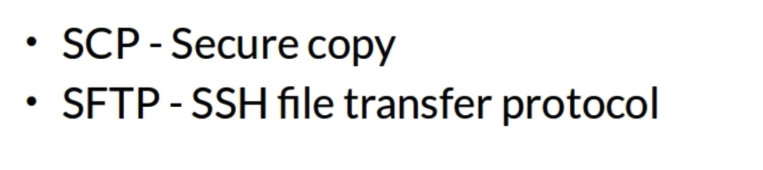
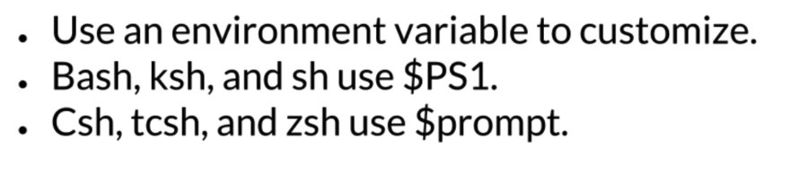

# Linux


### Common Directories


### Comprehensive Directory Listing


### Basic Linux Commands


### Navigating Man pages

```shell
ENTER # move down one line
SPACE # move down one page
g # move to the top of the page
G # move to the bottom of the page
q # quit
```

### Environmental Variables

- PATH

  

### Directory Shortcuts


### Creating and removing directories


```sh
# [-p]: create the parent directories
mkdir -p dir1/dir2
#--dir1		
#		|--dir2

# rmdir only removes directories that are empty
```

## Listing Files and Understanding ls output

### Decoding ls -l output


### Listing All files, including hidden files


### Listing files by type


### Listing files by time and in reverse


### Listing files recursively

ls -R


### The tree command


## Permissions

  

### files vs directories


### Permission categories


### Groups


### Secret Decoder Ring


### Changing Permissions


### Numeric based permissions


### Order has meaning


### Working with Groups


### Displaying the content of files


### Head and tail


## Editing files in Vi


### Finding files


```sh
find . -size +1M
```

## Actions to files

### Removing files


### Copying files


```sh
cp -i # prompt before overwrite
```

### Moving and Renaming files


### Sorting files


### Disk usage


### Input/Output types


### Redirection


### Comparing files


### Searching in files and using pipes

- ### grep

- ### The file commande

- ### Pipes

- ### Cut

  

  

- ### Strings

  

```sh
cat file2 | grep -i tot | head -1
# total 0
cat file2 | grep -i tot | head -1 | cut -d ' ' -f 1
# total
```

- ### tr

```sh
cat file2 | grep -i tot | head -1
# total 0
cat file2 | grep -i tot | head -1 | tr "0" "1"
# total 1
```

### Transferring and copying files over the network

- ### copying files over the network




### Customizing the shell prompt



- ### Customizing the Prompt with PS1


### Shell aliases


## Environment variables

### Viewing

```sh
printenv
printenv $HOME
echo $HOME
```

### Creating

```sh
export EDITOR="vi"
```

### Removing

```sh
unset EDITOR
```

## Processes and job control

- ### Listing processes and information

  

   

- ### Other ways to view processes


- ### Background and foreground processes

  
  
  


- ### Killing processes

  


### Scheduling repeated jobs with cron


### Crontab command


## Installing software

### APT - Advanced packaging tool


## Commands

### RSYNC

- 常用选项
  - -a 包含 -rtplgoD
  - -r 同步目录时要加上
  - -t 保持文件的时间属性
  - -p 保持文件的权限属性
  - -l 保留软链接
  - -g 保持文件的属组
  - -o 保持文件的属主
  - -D 保持设备文件信息
  - -L 加上该选项后，同步软链接时会把源文件一起同步
  - -v 同步时显示信息
  - --delete 删除DEST中SRC没有的文件
  - --exclude 过滤指定文件，如 --exclude “logs” 会把文件名包含logs的文件或目录过滤掉，不同步
  - -P 显示同步过程，比如速率，比 -v 更加详细
  - -u 如果DEST中的文件比SRC新，则不同步
  - -z 传输时压缩

​		

```sh
rsync SRC/ DEST/

# 模拟同步过程
rsync -av --dry-run SRC/ DEST/
```

