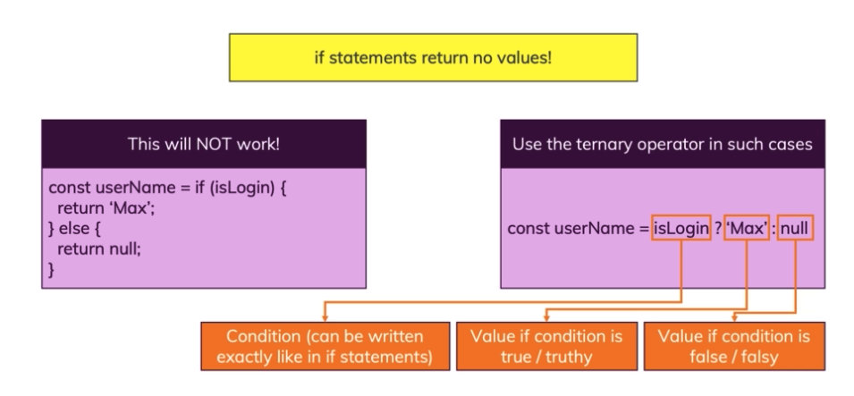
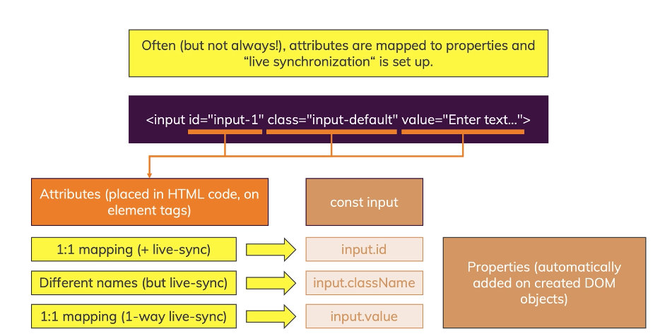
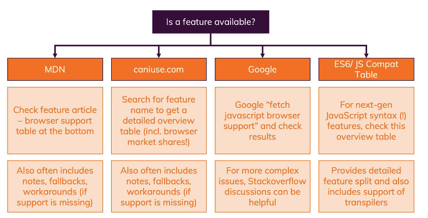
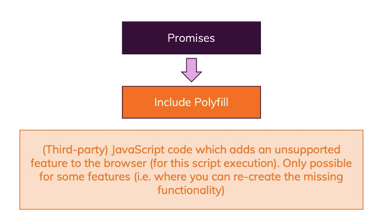

# Core Basics

### Variable Naming


### More Operators

`result = 0`

`result++` returns the value before addition => 0

`++result` returns the value after addition => 1

but finally `result = 1`.

### Array

```js
let log = [];
let number = 2;

// add new element
log = [number];
// or
log.push(number);
```

### Import Scripts

```html
<head>
  <script src="app.js" defer></script>
  <script src="app.js" async></script>
</head>
```

​		`defer` means the browser download the script right away and continue with parsing HTML. It only executes the scripts after everything has been parsed.

​		`async` means the browser download the script right away and continue with parsing HTML. Scripts execute right away once it was downloaded. Parsing of HTML will be paused until script is executed.


### Ternary Operator



### Logical Operator

- If the first value if truthy, the && operator ALWAYS returns the second value
- If the first value if truthy, the || operator returns the first value
- If the first value if falsy, the || operator ALWAYS returns the second value
- If the first value if falsy, the && operator ALWAYS returns the first value

```js
const userName = 'Max';
const altName = '';
console.log(userName === 'Max'); // generates and prints a boolean => true
console.log(userName); // wasn't touched, still is a string => 'Max'
 
console.log(userName || null); // userName is truthy and therefore returned by || => 'Max'
console.log(altName || 'Max'); // altName is falsy (empty string), hence 'Max' is returned => 'Max'
console.log(altName || ''); // both altName and '' are falsy but if the first operand is falsy, the second one is always returned => ''
console.log(altName || null || 'Anna'); // altName and null are falsy, 'Anna' is returned => 'Anna'
 
console.log(userName && 'Anna'); // userName is truthy, hence second (!) value is returned => 'Anna'
console.log(altName && 'Anna'); // altName is falsy, hence first value is returned => ''
console.log(userName && ''); // userName is truthy, hence second value is returned => ''
```

### Loops


### Labeled Statement

```JS
let j = 0;
outerWhile: do {
	consome.log("Outer");
  innerFor: for(let k=0; k < 5; k++) {
    if(k === 3) {
      break outerWhile;
    }
    console.log("Inner", k);
  }
  j++;
} while (j < 3)
```

### var vs let


A variable created with `var` in a function can't be used outside of it, a globally can be used everywhere. Now for `let ` and `const` , they don't care about functions but the curly barces `{}` . The curly barces for `if` statements, for `loops`, for `functions` , but not for the `objects` . 

`var` assigns a initial value of  `undefined` , `let` and `const` assign no initial value at all.

`var` allows to re-declare a variable.

we don't use `var` any more.

### Spread Operator ...

```js
let person = { age: 30 };
let anotherPerson = { ...person };
let yetAnotherPerson = person;
person.age = 32; // anotherPerson.age = 30; yetAnotherPerson.age = 32;
```

It pulls out all the key-value pairs in person and adds them as new key-value pairs to this new object.

### A different way of Defining Functions


### Arrow function


### Rest Operator

```js
const sumUp = (a, b, ...numbers) => {
  let sum = 0;
  for(const num of numbers) {
    sum += sum;
  }
  return sum;
}

sumUp(1, 5, 10, -3, 6, 10);
```

Rest Operator takes all arguments this function gets and merges them into an array. Rest parameter must be last formal parameter, we can only have one rest parameter.

### Alternative of Rest Operator : arguments

```js
const subtractUp = function() {
  let sum = 0;
  for(const num of arguments) { // don't use that
    sum -= sum;
  }
  return sum;
}
```

but rest parameter is recommended.

### Callback Functions

```js
const sumUp = (resultHandler, ...numbers) => {
  let sum = 0;
  for(const num of numbers) {
    sum += sum;
  }
  resultHandler(sum);
}

// call back
const showResult = (result) => {
  alert('The result after adding all numbers is: ' + result);
}

sumUp(showResult, 1, 5, 10, -3, 6, 10);
```


### Working with bind()

```js
const combine = (resultHandler, operation, ...numbers) => {
  let sum = 0;
  for(const num of numbers) {
    if(operation == 'ADD') {
       sum += sum;
    }
    else {
      sum += sum;
    }
  }
  resultHandler(sum); // sum will be appended as the last argument in function showResult
}

// call back
const showResult = (messageText, result) => {
  alert(messageText + ' ' + result);
}

combine(showResult.bind(this, 'The result after adding all numbers is:'), 'ADD', 1, 5, 10, -3, 6, 10); // the argument binded will always come first
combine(showResult.bind(this, 'The result after substracting all numbers is:'), 'SUBSTRACT', 1, 5, 10, -3, 6, 10);
```

# Interacting With HTML Pages


### DOM

The Document Object Model


### Nodes & Elements


### Attributes vs Properties




`document.querySelectorAll()` returns a static array, if there is element added or removed, it don't change. Not Like `document.getElementsByTagName()`.


### Traversing the DOM


```html
<body>
  <header>
    <h1 id="main-title">Dive into the DOM!</h1>
  </header>
  <ul>
    <li class="list-item">Item 1</li>
    <li class="list-item">Item 2</li>
    <li class="list-item">Item 3</li>
  </ul>
  <input type="text">
</body>
```

#### Child Nodes

```js
const ul = document.querySelector('ul');
ul.children
// HTMLCollection(3) [li.list-item, li.list-item, li.list-item]

ul.childNodes
// NodeList(7) [text, li.list-item, ..., text]
// text is the text node (whitespace) before <li>

ul.lastChild // => text Node
ul.lastElementChild // element: li
```

#### 		ParentNode

```js
const li = document.querySelector('li');
li.parentElement // ul
li.parentNode // ul
li.closest('body') // search for the ancestor: <body>...</body>
```

​		In most cases, `parentElement` is equal to `parentNode` . But `document.documentElement.parentElement = null` , `document.documentElement.parentNode = document`.

#### 		Sibling Elements

```js
ul.previousSibling // text Node 
ul.previousElementSibling // search for the same level element: <header>...</header>
```

### Adding Elements via HTML in code

```js
div.insertAdjacentHTML('beforeend', '<p>Something went wrong!</p>')
```

- `'beforebegin'`: Before the `element` itself.
- `'afterbegin'`: Just inside the `element`, before its first child.
- `'beforeend'`: Just inside the `element`, after its last child.
- `'afterend'`: After the `element` itself.

But in this case

```js
div.querySelector('p')
// p
```

we cannot get an element, so we cannot add an event listener etc.

### Adding Elements via CreateElement()

```js
const newLi = document.createElement('li');
newLi.textContent = 'Item 4';
ul.appendChild(newLi);

ul.prepend(newLi); // insert at first
ul.lastElementChild.before(newLi); // move to the last seconde //safari don't support
ul.lastElementChild.replaceWith(newLi);
```

### Updating Elements

```js
div.innerHTML = '<p>...</p>';
```

### Cloning DOM Nodes

```js
newLi.cloneNode(false) // only copy element itself
newLi.cloneNode(true) // copy all its descendants as well
```

### Removing Elements

```js 
ul.remove();
```

# More On Arrays & Iterables


### Functions for Arrays

`array.from()` can be useful for converting array-like or iterable objects to real arrays.

`array.push()` : adding element at last, return new length of the array

`array.unshift()` : adding element at first, return new length of the array

`array.pop()` : remove the last element, return the removed element

`array.shift()` : remove the element at the beginning, return the removed element

`array.splice(startIndex, deleteCount, ...items(optional))` only works on real arrays

```js
const hobbies = ['Sports', 'Cooking'];

hobbies.splice(0, 0, 'Coding'); // add item at index 0, don't delete any item
console.log(hobbies);
// (3) ["Coding", "Sports", "Cooking"]

hobbies.splice(-1, 1); // delete the last element
```


`array.slice()` copy an array, the copy one will not be affected if the original changes.

`array.slice(startIndex, endIndex(optional))` copy a part of array, start is included end is not.

`array.concat()` : adding array to arrays

`array.includes()`: return true or false

`array.indexOf()` : search for index of specified element

`array.lastIndexOf()`

`array.find()` : find a specific element

```js
const manuel = personData.find((person) => {
	return person.name === 'Manuel';
});
```

`array.findIndex()` as find()

`array.forEach()`  provides index for each iteration

```js
prices.forEach((price, index) => {
	// ...
});
```

`array.map()` creates a brand new array, and transform data based on it.

```js
const prices = [10.99, 5.99, 3.99, 6.59];
const tax = 0.19;

const taxAdjustedPrices = prices.map((price, index) => {
  const priceObj = { index: index, taxAdjPrice: price * (1 + tax)};
  return priceObj;
});
```

`array.sort()` sorts an array by the order of the first character

```js
// we can define by ourselves
const sortedPrices = prices.sort((a,b) => {
  if(a > b) {
    return 1;
  } else if(a === b) {
    return 0;
  } else {
    return -1;
  }
})
// [3.99, 5.99, 6.59, 10.99]
```

`array.reverse()`

`array.filter()`

```js
const filteredArray = prices.filter((price) => {
	return price > 6;
});
```

`array.reduce()` applique a custom function for each element in array.

```js
const sum = prices.reduce((prevValue, curValue) => {
  return prevValue + curValue;
}, 0);

// equals to

let sum = 0;
prices.forEach(price => {
  sum += price;
})
```

### Arrays & Strings

`String.split()` converts a string to an array by a separator.

```js
const data = 'new york;10.99;2000';
const tranformedData = data.split(';');

// (3) ["new york", "10.99", "2000"]
```

`array.join()` merges into one string with a separator

```js
const nameFragment = ['Max', 'Schwarz'];
const name = nameFragment.join(' ');

// Max Schwarz
```

### Array Destructuring

```js
const nameData = ['Max', 'Schwarz', 'Mr', 30];
const [ firstName, lastName, ...otherInformation ] = nameData; // rest operator collects all rest informations
console.log(firstName, lastName, otherInformation);

// Max Schwarz (2) ["Mr", 30]
```

### Maps & Sets


### Working with Sets

```js
const ids = new Set(['Hi', 'from', 'set!']);
if(ids.has('Hi')) {
    ids.delete('Hi');
}

for (const entry of ids.entries()) {
    console.log(entry[0]);
}
```

### Working with Maps

```js
const person1 = { name: 'Max' };
const person2 = { name: 'Manuel' };

const personData = new Map([
    [person1, { date: 'yesterday', price: 10 }]
]);

personData.set(person2, { date: 'two weeks ago', price: 100 });

for (const [key, value] of personData.entries()) {
    console.log(key, value);
}

for (const key of personData.keys()) {
    console.log(key);
}

for (const value of personData.values()) {
    console.log(value);
}
```

### Maps vs Objects


### WeakSet / WeakMap

```js
let person = {name: 'Max'};
const persons = new WeakSet();
persons.add(person);

person = null; // it is able to release these unuse datas for browsers
```


# More On Objects

```js
let person = {
    name: 'Max',
    age: 30,
    hobbies: ['Sports', 'Cooking'],
    greet: function() {
        alert('Hi there!');
    }
};
```

### Adding, Modifying & Deleting Properties

```js
person.isAdmin = true;
person.age = 31;
delete person.age; 
```

### Object Destructuring

```js
const { name } = person;
// now we can use name instead of person.name
```

### Checking for Property Existance

```js
if ('name' in person) {
  // ...
}
// or
if (person.name === undefined) {
  // ...
}
```

### This

```js
const newMovie = {
  info: {
    title,
    extraName: extraValue
  },
  id: Math.random().toString(),
  getFormattedTitle: function() {
    return this.info.title.toUpperCase();
  }
};

movie.getFormattedTitle(); // "this" refers to movie who is calling the function.
```

#### Using Object Destructuring

```js
const { getFormattedTitle } = movie;
let text = getFormattedTitle() + ' - ';
```

​		In this case, the thing for triggering the function is our global execution context, it will never refer to movie.

### Bind()

​		we can use `bind()` to not only preconfigure arguments a function will get but also to preconfigure what this will refer to.

```js
let { getFormattedTitle } = movie;
getFormattedTitle = getFormattedTitle.bind(movie);
```

### Call() and Apply()

​		`call()` and `apply()` are similar to `bind()` but  allow to execute the function right away.

```js
let { getFormattedTitle } = movie;
let text = getFormattedTitle.call(movie) + ' - ';
// in other cases, if we need more arguments: getFormattedTitle.call(movie, arg1, arg2); call takes arguments directly

let text = getFormattedTitle.apply(movie) + ' - ';
// in other cases, if we need more arguments: getFormattedTitle.apply(movie, [arg1, arg2]); apply takes arguments in an array 
```

### "this" and arrow functions

​		Every function created with the `function` keyword or with it shorthand has its own this binding . However, arrow functions don't bind `this` to anything, so that `this` will refer to global window.


# Classes & Object-oriented Programming ( OOP )


### Definition


```js
const productList = {
    products: [
        {
            title: 'A pillow',
            imageUrl: 'https://www.livingspaces.com/globalassets/productassets/100000-199999/100000-109999/100000-100999/100400-100499/100417/100417_0.jpg?w=650&h=438&mode=pad',
            price: 19.99,
            description: 'A soft pillow!'
        },
        {
            title: 'A Carpet',
            imageUrl: 'https://encrypted-tbn1.gstatic.com/shopping?q=tbn:ANd9GcSS0TDgwumrGGCXjtCVOJOmMRoVlFYtyLIvPK0WQ8ZHzwfwsIfn6bvi0nxlgNat&usqp=CAc',
            price: 89.99,
            description: 'A carpet which you might like - or not.'
        }
    ],
    render() {
        const renderHook = document.getElementById('app');
        const prodList = document.createElement('ul');
        prodList.className = 'product-list';
        for (const prod of this.products) {
            const prodEl = document.createElement('li');
            prodEl.className = 'product-item';
            prodEl.innerHTML = `
                <div>
                    
                    <div class="product-item__content">
                        <h2>${prod.title}</h2>
                        <h3>\$${prod.price}</h3>
                        <p>${prod.description}</p>
                    </div>
                </div>
            `;
            prodList.append(prodEl);
        }
        renderHook.append(prodList);
    }
};

productList.render();
```

### Classes & Instances


```js
class Product {
  title = 'DEFAULT';
  imageUrl; // undefined
  description;
  price;

  constructor(title, image, desc, price) {
    this.title = title;
    this.imageUrl = image;
    this.description = desc;
    this.price = price;
  }
}

 new Product(
      'A pillow',
      'https://www.livingspaces.com/globalassets/productassets/100000-199999/100000-109999/100000-100999/100400-100499/100417/100417_0.jpg?w=650&h=438&mode=pad',
      'A soft pillow!',
      19.99
    )
```

### Class Fields(vs Properties)


If fields have same name as properties, we can remove these fields. The field is magically added as a property during the construction process anyways.

```
class Product {
  constructor(title, image, desc, price) {
    this.title = title;
    this.imageUrl = image;
    this.description = desc;
    this.price = price;
  }
}
```

### Example

```js
class Product {
  constructor(title, image, desc, price) {
    this.title = title;
    this.imageUrl = image;
    this.description = desc;
    this.price = price;
  }
}

class ShoppingCart {
  items = [];

  render() {
    const cartEl = document.createElement('section');
    cartEl.innerHTML = `
      <h2>Total: \$${0}</h2>
      <button>Order Now!</button>
    `;
    cartEl.className = 'cart';
    return cartEl;
  }
}

class ProductItem {
  constructor(product) {
    this.product = product;
  }

  addToCart() {
    console.log('Adding product to cart...');
    console.log(this.product);
  }

  render() {
    const prodEl = document.createElement('li');
    prodEl.className = 'product-item';
    prodEl.innerHTML = `
        <div>
            
            <div class="product-item__content">
                <h2>${this.product.title}</h2>
                <h3>\$${this.product.price}</h3>
                <p>${this.product.description}</p>
                <button>Add to Cart</button>
            </div>
        </div>
        `;
    const addCartButton = prodEl.querySelector('button');
    addCartButton.addEventListener('click', this.addToCart.bind(this));
    return prodEl;
  }
}

class ProductList {
  products = [
    new Product(
      'A pillow',
      'https://www.livingspaces.com/globalassets/productassets/100000-199999/100000-109999/100000-100999/100400-100499/100417/100417_0.jpg?w=650&h=438&mode=pad',
      'A soft pillow!',
      19.99
    ),
    new Product(
      'A Carpet',
      'https://encrypted-tbn1.gstatic.com/shopping?q=tbn:ANd9GcSS0TDgwumrGGCXjtCVOJOmMRoVlFYtyLIvPK0WQ8ZHzwfwsIfn6bvi0nxlgNat&usqp=CAc',
      'A carpet which you might like - or not.',
      89.99
    ),
  ];
  constructor() {}

  render() {
    const prodList = document.createElement('ul');
    prodList.className = 'product-list';
    for (const prod of this.products) {
      const productItem = new ProductItem(prod);
      const prodEl = productItem.render();
      prodList.append(prodEl);
    }
    return prodList;
  }
}

class Shop {
  render() {
    const renderHook = document.getElementById('app');
    const cart = new ShoppingCart();
    const cartEl = cart.render();
    const productList = new ProductList();
    const prodListEl = productList.render();

    renderHook.append(cartEl);
    renderHook.append(prodListEl);
  }
}

const shop = new Shop();
shop.render();

```

### Static Properties, Fields & Methods


​		If we work with instance always, we can't use one property in other classes cause even they have the same structure but  hold different data. With static properties and static methods, we have a class which is not instantiated and which therefore always works on the same data. we could share some functionality across different parts of our application.

```js
class App {
  static cart;
  
  static init() {
    const shop = new Shop();
    shop.render();
    this.cart = shop.cart;
  }

  static addProductToCart(product) {
    this.cart.addProduct(product);
  }
}

App.init();

// In Class ProductItem
 addToCart() {
    console.log('Adding product to cart...');
    console.log(this.product);
    App.addProductToCart(this.product);
  }
```

### Getters & Setters

```js
class ShoppingCart {
  items = [];

  set cartItems(val) {
    this.items = val;
    this.totalOutput.innerHTML = `<h2>Total: \$${this.totalAmount.toFixed(2)}</h2>`;
  }

  get totalAmount() {
    const sum = this.items.reduce(
      (prevValue, curItem) => prevValue + curItem.price,
      0
    );
    return sum;
  }

  addProduct(product) {
    const updatedItems = [...this.items];
    updatedItems.push(product);
    this.cartItems = updatedItems;
  }

}
```

### Inheritance


```js
class ShoppingCart extends Component 
```

​		If subclass (`ShoppingCart`) don't have a constructor, the constructor of parent class (`Component`) will automatically be called but there is a probleme with parameters. we could use `super` to solve it.

```js
class Component {
  constructor(renderHookId) {
    this.hookId = renderHookId;
  }

  createRootElement(tag, cssClasses, attributes) {
    const rootElement = document.createElement(tag);
    if (cssClasses) {
      rootElement.className = cssClasses;
    }
    if (attributes && attributes.length > 0) {
      for (const attr of attributes) {
        rootElement.setAttribute(attr.name, attr.value);
      }
    }
    document.getElementById(this.hookId).append(rootElement);
    return rootElement;
  }
}
```

```js
class ShoppingCart extends Component {
/*
 * Inheritance
 */

  constructor(renderHookId) {
    super(renderHookId);
  }

}
```

```js
this.cart = new ShoppingCart('app');
```

### A bug with Inheritance

```js
 render() {
    const prodList = document.createElement('ul');
    prodList.id = 'prod-list';
    prodList.className = 'product-list';
    for (const prod of this.products) {
      const productItem = new ProductItem(prod, 'prod-list'); // productItem is going to be appended to ProdList which is not yet created in the DOM.
      const prodEl = productItem.render();
      prodList.append(prodEl);
    }
    return prodList;
  }
```

​		==>

```js
 render() {
    this.createRootElement('ul', 'product-list', [
      new ElementAttribute('id', 'prod-list'),
    ]);
    for (const prod of this.products) {
      const productItem = new ProductItem(prod, 'prod-list');
      productItem.render();
    }
  }
```

### Overriding Methods

```js
class Component {
  constructor(renderHookId) {
    this.hookId = renderHookId;
    this.render(); // Actually, subclass's render overrides it
  }

  render() {} // this render just takes a place here, not working
}
```

```js
class ShoppingCart extends Component {
	  constructor(renderHookId) {
    	super(renderHookId);
  	}
  	
  	render() {
      // ...
    }
}

this.cart = new ShoppingCart('app'); // It renders automatically thanks to this.render() in Component
```

But rendering too early may leads to a problem:

```js
class ProductItem extends Component {
  constructor(product, renderHookId) {
    super(renderHookId);
    this.product = product;
  }
}

// it renders before defining the product

// Solution
class Component {
  constructor(renderHookId, shouldRender=true) {
    this.hookId = renderHookId;
    if (shouldRender) {
      this.render(); // Actually, subclass's render overrides it
    }
  }

  render() {} // this render just takes a place here, not working
}


class ProductItem extends Component {
  constructor(product, renderHookId) {
    super(renderHookId, false);
    this.product = product;
    this.render();
  }
}
```

### Different ways of Adding Methods

```js
// way 1 
orderButton.addEventListener('click', this.orderProducts.bind(this));

// way 2
 orderButton.addEventListener('click', () => this.orderProducts());

//way 3
 constructor(renderHookId) {
   super(renderHookId, false);
   this.orderProducts = () => {
    console.log('Ordering...');
    console.log(this.items);
   };
   this.render();
 }
 orderButton.addEventListener('click', this.orderProducts);
```

### Private Properties


### Pseudo-private properties

```js
class User {
    constructor() {
        this._role = 'admin';
    }
}
 
// or directly in an object
 
const product = {
    _internalId: 'abc1'
};
```

It's a quite common convention to prefix private properties with an underscore (`_`) to signal that they should not be accessed from outside of the object.

**Important:** It's **just a convention** that should signal something! It does **NOT technically prevent** access. You **CAN** run this code without errors for example:

```js
const product = {
    _internalId: 'abc1'
};
console.log(product._internalId); // works!
```

### Prototype


# Advanced DOM Interactions

### Using 'dataset' (data-* Attributes)

the `data-` attribute in general is a special attribute you can add to your own elements to attach any kind of data to them.

we can decide the name on our own. These `data- ` attributes are all merged together in a dataset.

```js
<li
  id="p1"
  data-extra-info="Got lifetime access, but would be nice to finish it soon!"
  class="card"
>
```

```js
const projectElement = document.getElementById('p1');
console.log(projectElement.dataset.extraInfo);
// Got lifetime access, but would be nice to finish it soon!
```

### Handling Scrolling

`element.scrollTo(x, y)`   ==> (0, 0) -> (x, y)   after repeating n times, the final position is (x, y)

`element.scrollBy(x, y)`   ==> (0, 0) + (x, y) -> (x, y) after repeating n times, the final position is (n*x, n*y)

`element.scrollIntoView({ behavior: 'smooth' })`  ==> jump to the position of this element directly with a smooth behavior

### Working with <template> Tags

```html
// HTML
<template id="tooltip">
  <h2>More Info</h2>
  <p></p>
</template>
```

```js
const tooltipElement = document.createElement('div');
const tooltipTemplate = document.getElementById('tooltip');
const tooltipBody = document.importNode(
  tooltipTemplate.content,
  true
);
tooltipBody.querySelector('p').textContent = this.text;
tooltipElement.append(tooltipBody);
```

### Setting Timers & Intervals

```js
// execute after 3 secondes
const timerId = setTimeout(() => {
	console.log('hhh');
}, 3000);

// clean up the timer set
clearTimeout(timeId);

// execute every 2 secondes
const intervalId = setInterval(() => {
  console.log('www');
}, 2000);
// clean up the interval
clearInterval(intervalId);


// we can pass a third argument (an array) as parameters for anonymous function


```

### The 'location' and 'history' Object

```js
// navigate to this address
location.href = 'https://www.google.com';

// replace the current page with the new page, can't go back
location.replace('https://www.google.com');

// https://haiirboom.com/products/professional-360-degree-automatic-rotation-curling-iron
location.host // "haiirboom.com"
location.origin // "https://haiirboom.com"
location.pathname // "/products/professional-360-degree-automatic-rotation-curling-iron"
```

```js
history.back() // go back
history.length
```

### Working with Dates

```js
const date = new Date();
date.getTime()
// timestamp: 1627958755706
```

# Events

### Different ways of Listening to Events

```html
<!-- 1 -->
<button onclick="alert('Hello there!');">Click Me</button>
```

```js
const btn = document.querySelector('button');
// 2
btn.onclick = function() {};

// 3 recommended, allows to add multiple event listeners to the same element, and also have a remove event listener
btn.addEventListener('click', buttonClickHandler);
btn.removeEventHandler('click', buttonClickHandler);
```

### preventDefault()

​		To customize action on clicking the submit button , we should first prevent the default behaviour.

```html
<form action="">
  <label for="title">title</label>
  <input type="text" id="title" />
  <button type="submit">Submit</button>
</form>
```

```js
const form = document.querySelector('form');
form.addEventListener('submit', event => {
  event.preventDefault();
});
```

### DOM Event - Bubbling & Capturing


Bubbling phase: If we have an event listener on the button and on the section, the button event listener will run first. (Default)

Capturing phase: In the same case, the section event listener will run first.

### Event Propagation & stopPropagation()

```js
const div = document.querySelector('div');
const button = document.querySelector('button');

div.addEventListener('click', (event) => {
  console.log('CLICKED DIV');
  console.log(event);
});

button.addEventListener('click', (event) => {
  // event.stopPropagation(); // only event listener on the ancestor element would not execute
  console.log('CLICKED BUTTON');
  console.log(event);
});

// Click on button

// CLICKED BUTTON
// PointerEvent {isTrusted: true, pointerId: 1, width: 1, height: 1, pressure: 0, …}
// CLICKED DIV
// PointerEvent {isTrusted: true, pointerId: 1, width: 1, height: 1, pressure: 0, …}


// click on button with event.stopPropagation()

// CLICKED BUTTON
// PointerEvent {isTrusted: true, pointerId: 1, width: 1, height: 1, pressure: 0, …}
```

If we have multiple event listener on the same element, using `event.stopImmediatePropagation()` after the first listener, the other listeners wouldn't run anymore.

### Using Event Delegation 代表

The idea is that if we have a lot of elements handled in a similar way, then instead of assigning a handler to each of them – we put a single handler on their common ancestor.

In the handler we get `event.target` to see where the event actually happened and handle it.

```js
const listItems = document.querySelectorAll('li');
const list = document.querySelector('ul');

list.addEventListener('click', (event) => {
  event.target.classList.toggle('highlight');
});
```

`event.currentTarget ` refers to the element on which you added the listener.

`event.target` refers to the actual element on which you clicked

`event.target.closest('li')` search for the closest li ancestor element.

### Drag & Drop


- #### Configuring Draggable Elements

  ```
  document.getElementById(this.id).addEventListener('dragstart', (event) => {
        event.dataTransfer.setData('text/plain', this.id);
        event.dataTransfer.effectAllowed = 'move';
  });
  ```

- #### Making the 'Drop Area'

  ```js
  const list = document.querySelector(`#${this.type}-projects ul`);
  list.addEventListener('dragenter', (event) => {
    if (event.dataTransfer.types[0] === 'text/plain') {
      event.preventDefault();
    }
    list.parentElement.classList.add('droppable');
  });
  
  list.addEventListener('dragover', (event) => {
    if (event.dataTransfer.types[0] === 'text/plain') {
      event.preventDefault();
    }
  });
  
  list.addEventListener('dragleave', (event) => {
    // check the element is dragged outside parentElement
    if (event.relatedTarget.closest(`#${this.type}-projects ul`) !== list) {
      list.parentElement.classList.remove('droppable');
    }
  });
  ```

  `event.relatedTarget` : the element where cursor is

- #### Dropping & Moving Data + Elements

  ```js
  list.addEventListener('drop', (event) => {
    const prjId = event.dataTransfer.getData('text/plain');
    if (this.projects.find((p) => p.id === prjId)) {
      return;
    }
    document
      .getElementById(prjId)
      .querySelector('button:last-of-type')
      .click();
    list.parentElement.classList.remove('droppable');
    event.preventDefault(); // not required
  });
  ```
  
  

# More on Strings

### tagged template

```js
function productDescription(strings, productName, productPrice) {
  console.log(strings);
  return 'This is a product!';
}
const prodName = 'JS course';
const prodPrice = 29.99;
const productOutput = productDescription`This product (${prodName}) is ${prodPrice}`;
console.log(productOutput);

// (3) ["This product (", ") is ", "", raw: Array(3)]
// 0: "This product ("
// 1: ") is "
// 2: ""
// This is a product!

function productDescription(strings, productName, productPrice) {
  let priceCategory = 'pretty cheap';
  if (productPrice > 20) {
    priceCategory = 'fairly priced';
  }
  return `${strings[0]}${productName}${strings[1]}${priceCategory}${strings[2]}`;
}
const prodName = 'JS course';
const prodPrice = 29.99;
const productOutput = productDescription`This product (${prodName}) is ${prodPrice}`;
console.log(productOutput);

// This product (JS course) is fairly priced
```

### Regular Expression

```js
const regex = /^\S+@\S+\.\S+$/;

// '^' means start from left with any kind of word
// and a '@' + any kind of word + '.' + any kind of word
// '$' means end

regex.test('test@test.com');
//true
```

```js
const regex = /.ello/;
// it doesn't care about the starting word
```

# Async : Promise & Callbacks

JavaScript is single-threaded, which means Javascript can only execute one task at a time. When it handle asynchronous code execution, it's always single-threaded but offloads longer-taking tasks to the browser (which uses multiple threads).

### Promises


A promise is in the end an object with the functionality or with the idea of having such a then method which you can call on it.

​	The function which we pass to the promise constructor is executed right away. This function takes two arguments and each argument itself actually is a function

```js
const setTimer = duration => {
  const promise = new Promise((resolve, reject) => {
    setTimeout(() => {
      resolve('Done!');
    }, duration);
  });
  return promise;
}
```

### Chaining multiple promises

```js
getPosition()
	.then(posData => {
  	console.log('jjj');
  	return setTimer(2000);
	})
	.then(data => {
  	console.log(data);
	});
```

### Promise error handling

​		If we add catch somewhere in the middle, all prior ones are skipped if one of them rejects but then blocks after catch will be executed. 

```js
getPosition()  
  .then(posData => {    
  	console.log('jjj');    
  	return setTimer(2000);  
	})  
	.catch(err => {
  	console.log(err);
	}) 
  .then(data => {    
  	console.log(data);  
	})
	.finally(() => {
  	// not required
	});
```

### Async / await & error handling

```js
try {
  const posData = await getPosition();
	const timerData = await setTimer(2000);
} catch(err) {
  console.log(err);
}
// if the first rejects, the second will not be executed
```

```js
Promise.race([getPosition(), setTimer(1000)]).then(data => {}) 
// the data returns the result of the fastest promise

Promise.all([getPosition(), setTimer(1000)]).then(data => {}) 
// the date returns the combined data of all individual promises

Promise.allSettled([getPosition(), setTimer(1000)]).then(data => {}) 
// execute all promise no matter they are rejected or not, and return a summary of status
```

# Http Requests

`JSON.stringify()` helps to convert Javascript code or Javascript objects and arrays to JSON data.

`JSON.parse()` helps to convert JSON data to Javascript.

### Using Fetch API

```js
fetch(url, {
	method: method,
	body: JSON.stringify(data),
  headers: {
    'Content-Type': 'application/json'
  }
}).then(response => {
  if(response.status >= 200 && response.status < 300) {
    return response.json();
  } else {
    throw new Error('Something went wrong!');
  }
}).catch(error => {
  console.log(error);
})
```

### Working with FormData (not with fetch)

```js
const data = new FormData();
data.append('title', title);
data.append('body', content);

fetch(url, {
	method: method,
	body: data
}).then(response => {
  if(response.status >= 200 && response.status < 300) {
    return response.json();
  } else {
    throw new Error('Something went wrong!');
  }
}).catch(error => {
  console.log(error);
})
```

advantage of FormData:

​	1) more structured to build data

​	2) can easily add files

​	3) can automatically parse a form

```js
const form = document.querySelector('form'); // should have a name in inpit or textarea etc
const data = new FormData(form);
```

# Javascript tooling & Workflows


### Limitations of 'Basic projects'


### Setting up a npm project

```shell
npm init
npm install --save-dev eslint
node_modules/.bin/eslint --init
```


To fully understand all options you can configure in `.eslintrc.json`, this part of the official docs should be helpful:

 https://eslint.org/docs/user-guide/configuring

To explore all available rules and what they mean, explore this part of the official docs: https://eslint.org/docs/rules/

Want to use a preset? Here you go: https://www.npmjs.com/search?q=eslint-config (just click on one of the results and follow the instructions provided there)

Also check out the docs in general: https://eslint.org/docs/user-guide/getting-started

### Bunding with Webpack

```
npm install --save-dev webpack webpack-cli
```

==> webpack.config.js

```js
const path = require('path');

module.exports = {
  entry: './src/app.js',
  output: {
    filename: 'app.js',
    path: path.resolve(__dirname, 'assets', 'scripts'), // build an absolute path where we want to start in our current path
    publicPath: 'assets/scripts/'
  }
};
```


==> package.json

```
"scripts": {
	"build": "webpack"
}
// npm run build
```

### Using webpack-dev-server

```shell
npm install --save-dev webpack-dev-server
```

==> webpack.config.js

```js
const path = require('path');

module.exports = {
  entry: './src/app.js',
  output: {
    filename: 'app.js',
    path: path.resolve(__dirname, 'assets', 'scripts'), // build an absolute path where we want to start in our current path
    publicPath: 'assets/scripts/'
  },
  devtool
};
```

==> package.json

```
"scripts": {
	"build": "webpack",
	"build:dev": "webpack-dev-server"
}
```

# Browser Storage


`e.g.` current shopping cart;   session Id

### Browser Storage Options


`Cookies` : we can set a cookie to expire at some time in the future so that it automatically gets deleted basically. Beding deleted manually is also possible. Cookies are sent to the `server` with outgoing HttpRequests, they can be read by the server.

`LocalStorage` : we have to delete manually through Javascript.

### LocalStorage vs sessionStorage

```js
const userId = 'u123';
sessionStorage.setItem('uid', userId);
sessionStorage.getItem('uid');

const userId = 'u123';
const user = {
  name: "Max",
  age: 30,
  hobbies: ['sports', 'cooking']
};
localStorage.setItem('uid', userId);
localStorage.setItem('user', JSON.stringify(user));

localStorage.getItem('uid');
JSON.parse(localStorage.getItem('user'));
```

**Session storage** data lives as long as your page is open in the browser, so as long as you have it in an active tab even if you reload the page. Thereafter if you ever close that tab or close all tabs where your application is running, session storage is cleared.

**Local storage** is never cleared unless the user clears it manually or the browser clears it because it's running out of space or anything like that.

### Cookies

```js
// it will add a new entry to the cookie, so it will not override or clear the existing cookie data, it will add something to it
const userId = 'u123';
document.cookie = `uid=${userId};max-age=2`; // the expiration of uid is set to 2s.
console.log(document.cookie);
```

**cookies** only are available if your web page is getting served with a real server.

### IndexedDB

```js
let db;
const dbRequest = indexedDB.open('StorageDummy', 1); // arg1: name of database not exist yet, arg2: version of database
dbRequest.onsuccess = function(event) {
  db = event.target.result;
};
dbRequest.onupgradeneeded = function(event) {
  db = event.target.result;
  const objStore = db.createObjectStore('products', {keyPath: 'id'});
  objStore.transaction.oncomplete = function(event) {
		const productsStore = db.transaction('products', 'readwrite').objectStore('products');
    productsStore.add({
      id: 'p1',
      title: 'A First Product',
      price: 12.99,
      tags: ['Expensive', 'Luxury']
    });
  };
};
dbRequest.onerror = function(event) {
  console.log('Error!');
};

// retrieve data
const productsStore = db.transaction('products', 'readwrite').objectStore('products');
const request = productsStore.get('p1');
request.onsuccess = function() {
  console.log(request.result);
};
```

# Browser Support




### Using Feature Detection & Fallback 


```js
 const text = textParagraph.textContent;
  if (navigator.clipboard) {
    navigator.clipboard
      .writeText(text)
      .then((result) => {
        console.log(result);
      })
      .catch((error) => {
        console.log(error);
      });
  } else {
    alert('Feature not available, please copy manually');
  }
```

### Using Polyfills



### Using Transpilation


```
npm install --save-dev babel-loader @babel/core @babel/preset-env
```

# Programming Paradigms


