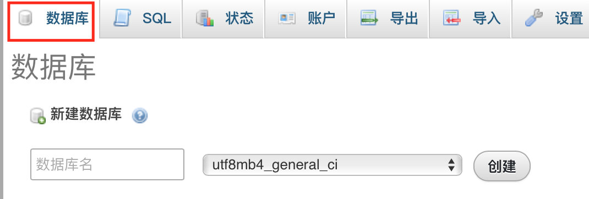
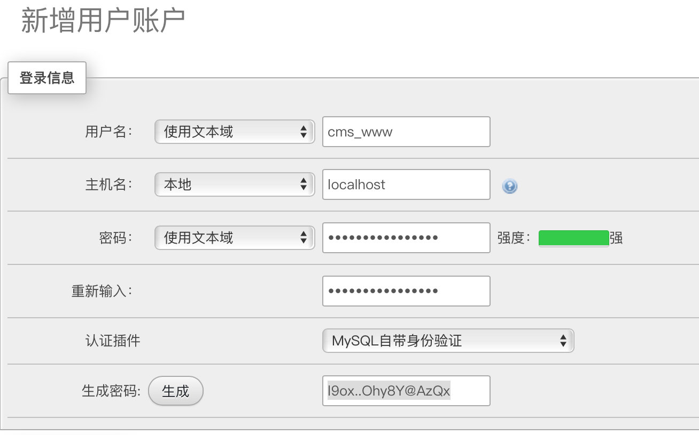
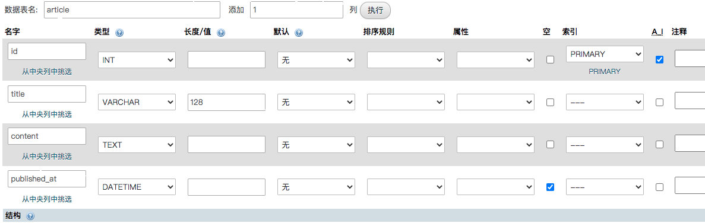
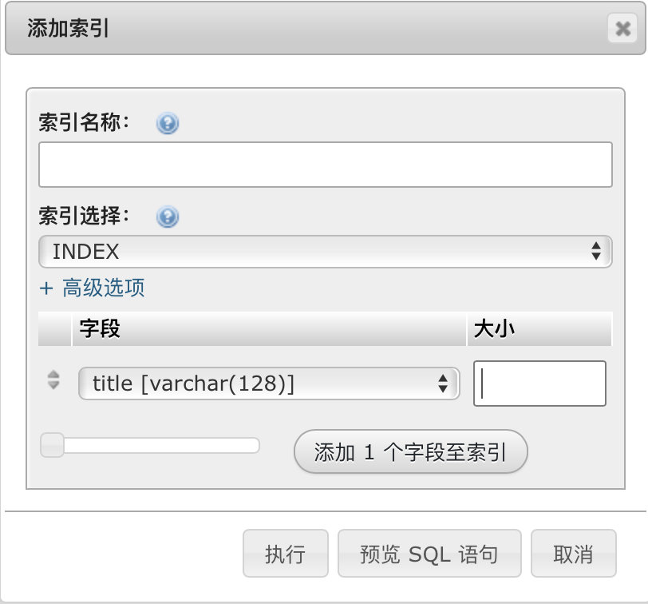
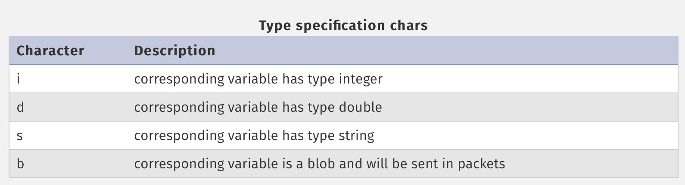
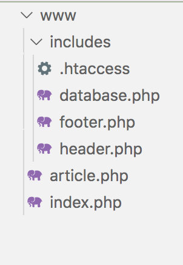

# Environment

1. In Manager-osx, configue Apache Web Server
2. modify `DocumentRoot "/Users/Biyun/Desktop/Heyme/PHP/www"
   <Directory "/Users/Biyun/Desktop/Heyme/PHP/www">` with current php folder path.
3. Start Manager-osx
4. to browser: localhost/filename
5. http://localhost/phpmyadmin/

# PHP

### Variables

```php
<?php

$message = "Hello again!";

echo $message;
```

​		`var_dump` print out the details of the variable.

### Variable Interpolation 插补

```php
<?php

$name = "Dave";

echo "Hello $name";
//{$name} is more safe
```

### Operators

1. Dot .

   ```php
   <?php
   
   $message = "Hello";
   $name = "Dave";
   
   echo $message . " " . $name;
   // Hello Dave
   ```

2. Multiple *

   Php can change the type of the variable from a string to an integer automatically.

   ```php
   <?php
   
   $price = "150";
   $quantity = 3;
   
   $price = $price * $quantity;
   
   var_dump($price);
   // int(450)
   ```

### Quote

```php
$start = "3 o'clock";
$end = '4 o\'clock';

echo $start, $end;
```

### Array

```php
$articles = ["First post", "Another post", "Read this!"];
$posts = array("First post", "Another post", "Read this!");
```

#### 		Multidimentional Array

```php
$people = [
    [   "name" => "Alice",
        "email" => "alice@test.com",
        "height" => 1.80 ],
    [   "name" => "Bob",
        "email" => "bob@test.com",
        "height" => 1.67 ],
    [   "name" => "Carol",
        "email" => "carol@test.com",
        "height" => 1.74 ],
];
$alice_email = $people[0]["email"];
```

### Loop

#### foreach

```php
$articles = [ "First post", "Another post", "Read this!" ];

foreach($articles as $article) {
    echo $article, ", ";
}

foreach($articles as $index => $article) {
    echo $index . ' - ' . $article . ", ";
}
```

#### 		while

```php
$month = 1;

while ($month <= 12) {
    echo $month . ', ';
    $month++;
}
```

#### 		for

```php
for ($i=0; $i < 10; $i++) { 
    echo $i . ", ";
}
```

### Construct

#### 	If

```php
$articles = [ "First post", "Another post", "Read this!" ];

if(empty($articles)) {
    echo "Empty!";
}
```

# Mixing Html And Php

```php+HTML
<!DOCTYPE html>
<html lang="en">
<head>
    <meta charset="UTF-8">
    <meta http-equiv="X-UA-Compatible" content="IE=edge">
    <meta name="viewport" content="width=device-width, initial-scale=1.0">
    <title>My website</title>
</head>
<body>
    <h1>Lorem Ipsum</h1>
    <p>Hello, <?php echo "Dave"; ?>!</p>
</body>
</html>
```

### Php Control Structures (if, endif...)

```php+HTML
<?php
    $hour = 11;
?>
<!DOCTYPE html>
<html lang="en">
<head>
    <meta charset="UTF-8">
    <meta http-equiv="X-UA-Compatible" content="IE=edge">
    <meta name="viewport" content="width=device-width, initial-scale=1.0">
    <title>My website</title>
</head>
<body>
    <h1>Lorem Ipsum</h1>
   <?php if($hour < 12): ?>
    <p>Good Morning!</p>
   <?php endif; ?>
</body>
</html>
```

# Database

http://localhost/phpmyadmin/

### Create a New Database



### Create A New User



pwd: l9ox..Ohy8Y@AzQx

### Create a New Table



published_at can be empty.

### SELECT statement

```sql
SELECT * FROM table_name;
```

### WHERE clause

```sql
SELECT column1, column2
FROM table_name
WHERE condition;
```

### Use Index to make Queries faster



```sql
SELECT * FROM article WHERE title = 'Second post';
```

### Ordering the Result Set

```sql
SELECT * 
FROM table_name 
ORDER BY column;
```

### Connect to the Database from PHP

```php
<?php

$db_host = "localhost";
$db_name = "cms";
$db_user = "cms_www";
$db_pass = "l9ox..Ohy8Y@AzQx";

$conn = mysqli_connect($db_host, $db_user, $db_pass, $db_name);
if(mysqli_connect_error()) {
    echo mysqli_connect_error();
    exit;
}

echo "Connected successfully.";
```

### Query the Database from PHP

```php
$sql = "SELECT * 
        FROM article
        ORDER BY published_at;";

$results = mysqli_query($conn, $sql);

if($results === false) {
    echo mysqli_error($conn);
} else {
    $articles = mysqli_fetch_all($results, MYSQLI_ASSOC);
    var_dump($articles);
}
```

### Fetch Single Article

```php
$sql = "SELECT * 
        FROM article
        WHERE id = 1";

$results = mysqli_query($conn, $sql);

if($results === false) {
    echo mysqli_error($conn);
} else {
    $article = mysqli_fetch_assoc($results);
}
```

​		`mysqli_fetch_assoc` returns `null` if there are no more rows in result set.

### Insert New Article to Database

```php
if($_SERVER['REQUEST_METHOD'] == 'POST') {
        $sql = "INSERT INTO article (title, content, published_at)
                VALUES  ('" . $_POST['title'] . "','" 
                            . $_POST['content'] . "','"
                            . $_POST['published_at'] . "')";

        $results = mysqli_query($conn, $sql);

        if($results === false) {
            echo mysqli_error($conn);
        } else {
            $id = mysqli_insert_id($conn);
            echo "Inserted record with ID: $id";
        }
    }


// html
// name is necessary to send form
<form method="POST">
        <div>
            <label for="title">Title</label>
            <input name="title" id="title" placeholder="Article Title">
        </div>
        <div>
            <label for="content">Content</label>
            <textarea name="content" id="content" cols="40" rows="4" placeholder="Article Content"></textarea>
        </div>
        <div>
            <label for="published_at">Publication date and time</label>
            <input type="datetime-local" name="published_at" id="published_at">
        </div>
        <button>Add</button>
    </form>
```

### Avoid SQL Injection Attacks

- **Escape Input**

  when a text contains `''` , it may allow other to attack sql. like if we insert 

  ```
  ', (SELECT password FROM mysql.user WHERE user = 'root' LIMIT 1), ''), ('
  ```

  It becomes

  ```sql
  INSERT INTO foos (text) VALUES ('', (SELECT password FROM mysql.user WHERE user = 'root' LIMIT 1), ''), ('','','')
  ```

  So we need to escape character like `''`.

  ```php
  mysqli_escape_string($conn, $_POST['title'])
  ```

  $text = 'I'm a "foobar"';
  mysql_real_escape_string($text)  => `I\'m a \"foobar\"`

- **Prepared Statement**

  ```php
  if($_SERVER['REQUEST_METHOD'] == 'POST') {
    $sql = "INSERT INTO article (title, content, published_at) VALUES  (?, ?, ?)";
    $stmt = mysqli_prepare($conn, $sql);
  
    if($stmt === false) {
      echo mysqli_error($conn);
    } else {
      mysqli_stmt_bind_param($stmt, "sss", $_POST['title'], $_POST['content'], $_POST['published_at']);
  
      if(mysqli_stmt_execute($stmt)) {
        $id = mysqli_insert_id($conn);
        echo "Inserted record with ID: $id";
      } else {
        echo mysqli_stmt_errno($stmt);
      }
    }
  }
  ```

  mysqli_stmt_bind_param(
    [mysqli_stmt](https://www.php.net/manual/en/class.mysqli-stmt.php) `$stmt`,
    string `$types`,
    [mixed](https://www.php.net/manual/en/language.types.declarations.php#language.types.declarations.mixed) `&$var`,
    [mixed](https://www.php.net/manual/en/language.types.declarations.php#language.types.declarations.mixed) `&...$vars`
  ): bool

  

# Multiple Pages 

### Passing Data in the URL

```php
var_dump($_SERVER['QUERY_STRING']);
```

​		http://localhost/query.php?hello

​		==> string(5) "hello"

```php
var_dump($_SERVER['QUERY_STRING']);

var_dump($_GET);
```

​		http://localhost/query.php?id=1&color=blue

​		==> string(15) "id=1&color=blue" array(2) { ["id"]=> string(1) "1" ["color"]=> string(4) "blue" }

### Application

```php
$sql = "SELECT * 
        FROM article
        WHERE id = " . $_GET['id'];
```

http://localhost/article.php?id=1


### Get rid of Duplicating codes

extract repeated code to a separate file and use `include`, if file don't exist, php script keep going. And `require ` will stop the script if file is not there.

php part:

```php
// database.php
<?php
$db_host = "localhost";
$db_name = "cms";
$db_user = "cms_www";
$db_pass = "l9ox..Ohy8Y@AzQx";

$conn = mysqli_connect($db_host, $db_user, $db_pass, $db_name);
if(mysqli_connect_error()) {
    echo mysqli_connect_error();
    exit;
}
```

​		`include 'database.php';`

html part:

```html
<!DOCTYPE html>
<html lang="en">
<head>
    <meta charset="UTF-8">
    <meta http-equiv="X-UA-Compatible" content="IE=edge">
    <meta name="viewport" content="width=device-width, initial-scale=1.0">
    <title>My blog</title>
</head>
<body>
    <header>
        <h1>My blog</h1>
    </header>
    <main>
```

​		`<?php require 'header.php'; ?>`

### Secure Access to included files

create a file named `.htaccess` in includes folder



```
Deny from all
```

