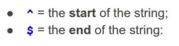

# PHP framework

Folders


### `public` folder

1. The only folder accessible to the web
2. The root of the web server, i.e. the folder http://localhost/ points to
3. The front controller and any static files go in here

Configuration in Apache: DocumentRoot => /framework/public

### Using a front controller

1. The URL doesn't map to an individual PHP script
2. All request are sent through one page
3. Handle everything common to every request, such as session handling

### Configure the web server to have pretty URLs in .htaccess

```
RewriteEngine On
RewriteBase /
RewriteCond %{REQUEST_FILENAME} !-f
RewriteCond %{REQUEST_FILENAME} !-d
RewriteRule ^(.*)$ index.php?$1 [L,QSA]
```

### require or include

If the file is not found, `require` will stop the script and produce an error. `include` will just carry on.

### Create Router class

The router contains a table that matches routes to controllers and actions.


### A regular expression for a simple URL structure


The 'P' after '?' can be ignored 


```php
$route = preg_replace('/\//', '\/', $route);
$route = preg_replace('/\{([a-z]+)\}/', '(?<\1>[a-z-]+)', $route);
$route = preg_replace('/\{([a-z]+):([^\}]+)\}/', '(?<\1>\2)', $route);
$route = '/^' . $route . '$/i';
```

### Controller

1. Controllers are what the user interacts with
2. They receive a request from the user, decide what to do, and send a response back.

### Controllers and actions

1. Controllers are `classes`
2. They contain `methods` that are the actions

#### Organise classes by using namespace


#### Class autoloading


#### The __call method


#### Action filters: call a method before and after every action


### View

1. Views are what the user sees on the screen
2. They present data to the user
3. just shows data, so contains a minimum amount of PHP: `echo, if, for` etc
4. Has no knowledge of models, sessions, databases etc.

### Controllers and Views

1. The controller doesn't write any output(i.e. HTML)
2. It loads and outputs a view file, which is what contains the content (HTML, JSON, XML etc.)

#### Output escaping

`htmlspecialchars()` get rid of cross-site attack

#### Pass data from the controller to the view

1. Extracting variables from an array


#### Template Engine

1. Tool that helps to separate application code from presentation code
2. Templates contain no PHP at all: just HTML and simple tags to show data


### Composer

#### Autoloader

```php
// composer.json
"autoload": {
    "psr-4": {
      "Core\\": "Core/",
      "App\\": "App/"
    }
  }
```

```
composer dump-autoload
```

### Model

1. Models are where an application's data stored
2. Responsible for storing and retrieving data
3. Models commonly store data in a database
4. A single model often has an equivalent database table, e.g. a `Post` model -> `posts` table

### PDO

(PHP Data Objects) is a code library for accessing databases.


# Regular Expression

1. Metacharacters


2. The start and end of the string

   

3. Repetition

   

4. Wildcards

   

5. Escaping

   

   

6. Character sets

   

7. Character ranges

   

8. Negated character sets

   

9. Capture groups

   

10. Named capture groups

    

11. Backreferences to capture groups

    

### Regular expression matching


### Replace parts of strings using regular expressions


