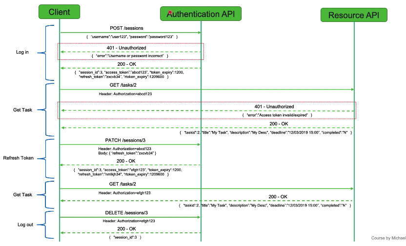

# REST API


| POST   | Create   |
| ------ | -------- |
| GET    | Retrieve |
| PATCH  | Update   |
| PUT    | Replace  |
| DELETE | Delete   |


### Common HTTP Response Status Codes:

| Code |        Message        |
| :--: | :-------------------: |
| 200  |          OK           |
| 201  |        Created        |
|      |                       |
| 400  |      Bad Request      |
| 401  |     Unauthorised      |
| 403  |       Forbidden       |
| 404  |       Not Found       |
| 405  |  Method Not Allowed   |
| 409  |       Conflict        |
|      |                       |
| 500  | Internal Server Error |
|      |                       |


### Output

```json
{
		"code": 200,
    "ok": true,
    "msg": "",
    "data": {
        "rows_returned": 1,
        "tasks": [
            {
                "id": 11,
                "title": "title 1",
                "description": "desc test",
                "deadline": "30/09/2021 15:00",
                "completed": "Y",
                "images": [
                    {
                        "id": 5,
                        "title": "Test Title",
                        "filename": "image1.jpg",
                        "mimetype": "image/jpeg",
                        "taskId": 11,
                        "url": "http://localhost/PHP/rest-api/controller/task?taskid=11&imageId=5"
                    }
                ]
            }
        ]
    }
}
```

### Folder Structure

```
taskImages
	|
	|
htdocs
	|
	|__	rest-api
			|
			|___ .htaccess
			|
			|___ controller
			|			|
			|			|___ db.php
			|
			|___ model
						|
						|___ response.php
						|
						|___ task.php
```

#### .htaccess (Apache 专用)

```
php_flag display_errors on

RewriteEngine On 
RewriteCond %{REQUEST_FILENAME} !-d 
RewriteCond %{REQUEST_FILENAME} !-f 
```

#### response.php

```php
<?php
  class Response {
    private $_ok;
    private $_httpStatusCode;
    private $_msg;
    private $_data;
    private $_toCache = false; // cache the response to get rid of loading many times from the server
    private $_responseData = array();

    public function __construct($ok, $httpStatusCode, $msg, $data = null) {
      $this->setOk($ok);
      $this->setHttpStatusCode($httpStatusCode);
      $this->setMsg($msg);
      if($data !== null) {
        $this->setData($data);
      }
      $this->send();
      exit;
    }

    public function setOk($ok) {
      $this->_ok = $ok;
    }

    public function setHttpStatusCode($httpStatusCode) {
      $this->_httpStatusCode = $httpStatusCode;
    }

    public function setMsg($msg) {
      $this->_msg = $msg;
    }

    public function setData($data) {
      $this->_data = $data;
    }

    public function toCache($toCache) {
      $this->_toCache = $toCache;
    }

    public function send() {
      header('Content-type: application/json;charset=utf-8');

      if($this->_toCache) {
        header('Cache-control: max-age=60'); // can cache the response for a maximum of 60 seconds
      } else {
        header('Cache-control: no-cache, no-store');
      }

      if(($this->_ok !== false && $this->_ok !== true) || !is_numeric($this->_httpStatusCode)) {
        http_response_code(500);
        $this->_responseData['code'] = 500;
        $this->_responseData['ok'] = false;
        $this->_responseData['msg'] = 'Response creation error';
      } else {
        http_response_code($this->_httpStatusCode);
        $this->_responseData['code'] = $this->_httpStatusCode;
        $this->_responseData['ok'] = $this->_ok;
        $this->_responseData['msg'] = $this->_msg;
        $this->_responseData['data'] = $this->_data;
      }

      echo json_encode($this->_responseData);
    }
  }
?>
```

#### task.php

```php
<?php

class TaskException extends Exception {}

class Task {
  private $_id;
  private $_title;
  private $_description;
  private $_completed;
  private $_deadline;

  public function __construct($id, $title, $description, $deadline, $completed) {
    $this->setID($id);
    $this->setTitle($title);
    $this->setDescription($description);
    $this->setDeadline($deadline);
    $this->setCompleted($completed);
  }

  public function getID() {
    return $this->_id;
  }

  public function getTitle() {
    return $this->_title;
  }

  public function getDescription() {
    return $this->_description;
  }

  public function getCompleted() {
    return $this->_completed;
  }

  public function getDeadline() {
    return $this->_deadline;
  }

  public function setID($id) {
    // 9223372036854775807 is max of Bigint
    if(($id !== null) && (!is_numeric($id) || $id <= 0 || $id > 9223372036854775807 || $this->_id !== null)) {
      throw new TaskException("Task ID error");
    } 
    $this->_id = $id;
  }

  public function setTitle($title) {
    if(strlen($title) < 0 || strlen($title) > 255) {
      throw new TaskException("Task title error");
    }
    $this->_title = $title;
  }

  public function setDescription($description) {
    // 16777215 is max of mediumtext
    if(($description !== null) && strlen($description) > 16777215) {
      throw new TaskException("Task description error");
    }
    $this->_description = $description;
  }

  public function setCompleted($completed) {
    if(strtoupper($completed) !== 'Y' && strtoupper($completed) !== 'N') {
      throw new TaskException("Task completed must be Y or N");
    }
    $this->_completed = $completed;
  }

  public function setDeadline($deadline) {
    // convert datetime to string and back to datetime, verify it's same or not
    if(($deadline !== null) && date_format(date_create_from_format('d/m/Y H:i', $deadline), 'd/m/Y H:i') != $deadline ) {
      throw new TaskException("Task deadline date time error");
    }
    $this->_deadline = $deadline;
  }

  public function returnTaskAsArray() {
    $task = array();
    $task['id'] = $this->getID();
    $task['title'] = $this->getTitle();
    $task['description'] = $this->getDescription();
    $task['deadline'] = $this->getDeadline();
    $task['completed'] = $this->getCompleted();
    return $task;
  }
}
```

#### image.php

```php
<?php

class ImageException extends Exception {}

class Image {
  private $_id;
  private $_title;
  private $_filename;
  private $_mimetype;
  private $_taskid;
  private $_uploadFolderLocation;

  public function __construct($id, $title, $filename, $mimetype, $taskid) {
    $this->setID($id);
    $this->setTitle($title);
    $this->setFilename($filename);
    $this->setMimetype($mimetype);
    $this->setTaskID($taskid);
    $this->_uploadFolderLocation = "../taskimages/";
  }

  public function getID() {
    return $this->_id;
  }

  public function getTitle() {
    return $this->_title;
  }

  public function getFilename() {
    return $this->_filename;
  }

  public function getFileExtension() {
    $filenameParts = explode(".", $this->_filename);
    $lastArrayElement = count($filenameParts) - 1;
    $fileExtension = $filenameParts[$lastArrayElement];
    return $fileExtension;
  }

  public function getMimetype() {
    return $this->_mimetype;
  }

  public function getTaskID() {
    return $this->_taskid;
  }

  public function getUploadFolderLocation() {
    return $this->_uploadFolderLocation;
  }

  public function getImageURL() {
    $httpOrHttps = (isset($_SERVER['HTTPS']) && $_SERVER['HTTPS'] === 'on') ? "https" : "http";
    $host = $_SERVER['HTTP_HOST'];
    $url = "/images?id=" . $this->getID() . "&taskid=" . $this->getTaskID();
    return $httpOrHttps . "://" . $host . $url;
  }

  public function setID($id) {
    // 9223372036854775807 is max of Bigint
    if(($id !== null) && (!is_numeric($id) || $id <= 0 || $id > 9223372036854775807 || $this->_id !== null)) {
      throw new ImageException("Image ID error");
    } 
    $this->_id = $id;
  }

  public function setTitle($title) {
    if(strlen($title) < 1 || strlen($title) > 255) {
      throw new ImageException("Image title error");
    }
    $this->_title = $title;
  }

  public function setFilename($filename) {
    if(strlen($filename) < 1 || strlen($filename) > 30 || preg_match("/^[a-zA-Z0-9_-]+(.jpg|.gif|.png)$/", $filename) != 1) {
      throw new ImageException("Image filename error - must be between 1 and 30 characters and only be .jpg .gif .png");
    }
    $this->_filename = $filename;
  }

  public function setMimetype($mimetype) {
    if(strlen($mimetype) < 1 || strlen($mimetype) > 255) {
      throw new ImageException("Image mimetype error");
    }
    $this->_mimetype = $mimetype;
  }

  public function setTaskID($taskid) {
    if(($taskid !== null) && (!is_numeric($taskid) || $taskid <= 0 || $taskid > 9223372036854775807 || $this->_taskid !== null)) {
      throw new ImageException("Image Task ID error");
    } 
    $this->_taskid = $taskid;
  }

  public function returnImageAsArray() {
    $image = array();
    $image['id'] = $this->getID();
    $image['title'] = $this->getTitle();
    $image['filename'] = $this->getTitle();
    $image['mimetype'] = $this->getMimetype();
    $image['taskid'] = $this->getTaskID();
    $image['url'] = $this->getImageURL();
    return $image;
  }
}
```


#### db.php

```php
<?php
  class DB {

    private static $dbConnection;

    public static function connectDB() {
      if(self::$dbConnection === null) {
        self::$dbConnection = new PDO('mysql:host=127.0.0.1:3306;dbname=task_db;charset=utf8', 'root', '123456');
        // when catch exceptions we can roll back if something is not right
        self::$dbConnection->setAttribute(PDO::ATTR_ERRMODE, PDO::ERRMODE_EXCEPTION);
        // emulate prepared statement allows assign the data to the sql rather than hard code the sql itself
        self::$dbConnection->setAttribute(PDO::ATTR_EMULATE_PREPARES, false);
      }

      return self::$dbConnection;
    }

  }
?>
```

### Manipulate with database

```php
 $query = $db->prepare('select id, title, description, DATE_FORMAT(deadline, "%d/%m/%Y %H:%i") as deadline, completed from tasks where id = :taskid');
 $query->bindParam(':taskid', $taskid, PDO::PARAM_INT);
 $query->execute();

$rowCount = $query->rowCount();
if($rowCount === 0) {
	new Response(false, 404, 'Task not found');
}

while($row = $query->fetch(PDO::FETCH_ASSOC)) {

}
```


### Nginx 改写路由

1. 进入vagrant 

2. /etc/nginx/site-enabled/

3. sudo vi xxxx.conf

4. ```
   rewrite ^/tasks/(.*) /controller/tasks/$1.php last;
   rewrite ^/task /controller/task.php last;
   ```

5. sudo systemctl restart nginx

### Pagination with MySQL

`Total pages = CEIL(Total number of rows / Limit number of rows)` 

`OFFSET = LIMIT * (PAGE - 1)` 

```sql
SELECT id, name
FROM users
LIMIT 2
OFFSET 0
```

### GET Input Data

```php
if($_SERVER['REQUEST_METHOD'] !== 'POST') {
  new Response(false, 405, 'Request method not allowed');
}

if($_SERVER['CONTENT_TYPE'] !== 'application/json') {
  new Response(false, 400, 'Content type header not set to JSON');
}

$rowPOSTData = file_get_contents('php://input');

if(!$jsonData =json_decode($rowPOSTData)) {
  new Response(false, 400, 'Request body is not valid JSON');
}
```

### Hash password

```php
  $hashed_password = password_hash($password, PASSWORD_DEFAULT);
```

### Verify password

```php
	password_verify($password, $returned_password)
```

### Generate token

```php
base64_encode(bin2hex(openssl_random_pseudo_bytes(24)).time())
```


### Token Based Authentication

A token is like a password with a limited lifespan, when a user authenticates with a user name and password they are given two tokens, an access token and a refresh token.

An access token has really short lifespan (usually minutes or hours) and a refresh token is valid for a lot longer (usually weeks or months). Both tokens are usually just a random set of base64 encoded characters, e.g:

​															`KUPDfxgdsWef2kJVjtGss1x6ra5UA==`

This random base64 encoded string is sent in the HTTP header and this is  used as a password to authenticate you for every request.

When an access token expires, you then use the refresh token to get a new access token (and accompanying new refresh token).

#### Sessions

We use sessions so we can use the system from multiple devices at the same time.




### Cross-Origin Resource Sharing (CORS) Setup

​		CORS is a way to instruct browser applications to allow resources to be accessed from a different origin (domain, protocol or port). e.g. allow fornt end application hosted on `https://site1.com` to access resource from `https://site2.com/api/users`.  Browsers by default restrict this behaviour for security reasons by using the same-origin policy.

​		The configuration/additional code handling we are going to go through now will instruct the browser to allow-origin, either by opening it to all origins or just a selected 'one' origin.

**CORS Apache config**

Add a new config line into `.htaccess` file for Apache to allow cross-origin requests.

For one specific origin (max 1 specific origin):

```
Header Set Access-Control-Allow-Origin "https://yourfrontendsite.com"
```

For all origins - for public use APIs:

```
Header Set Access-Control-Allow-Origin "*"
```

### Allow image upload

#### Content Type

​			When dealing with binary files (such as images or documents) we must use a different content type,  as binary files do not contain ASCII content (just normal text character) so we cannot send an image as part of a JSON request.

​			But actually we can send a binary file as **BASE64 encoded** text (which converts a binary file into ASCII characters), however it does add an overhead of around 33% larger file sizes so it's not generally best practice.

​			The content type we will be using is: **multipart/form-data**

```css
Content-Type: multipart/form-data; boundary=EaH63L
/* boundary is a random character string that's used to separate each individual part of the request*/

--EaH63L
Content-Disposition: form-data; name="attributes"
{"title":"My Selfie", "filename":"myselfie"}
--EaH63L
Content-Disposition: file;filename="Selfie.jpg"
Content-Type: image/jpeg
Content-Transfer-Encoding: binary
--EaH63L--
```

`mimetype`: the type of image, things like image/jpeg or image/png.

