# UML Distilled


## 1. Introduction To The UML

1. UML 被用作草图、设计图、编程语言
2. 正向工程是在编程之前画 UML 图表，而逆向工程是根据存在的代码画 UML 图表以助于理解代码


### 本质区别

- Sketching (草图)
  - forward
    - Your aim is to use the sketches to help communicate ideas and alternatives about what you’re about to do.
  - reverse
    - you use sketches to explain how some part of a system works. 
- Blueprint (设计图)
  - forward
    - That design should be sufficiently complete in that all design decisions are laid out, and the programmer should be able to follow it as a pretty straightforward activity that requires little thought. 
  - reverse
    - blueprints aim to convey detailed information about the code either in paper documents or as an interactive graphical browser. 
- Programming Language
  - 没有 forward 和 reverse 之分，UML 和源代码在此种模式下是相同的


### UML 图表分类

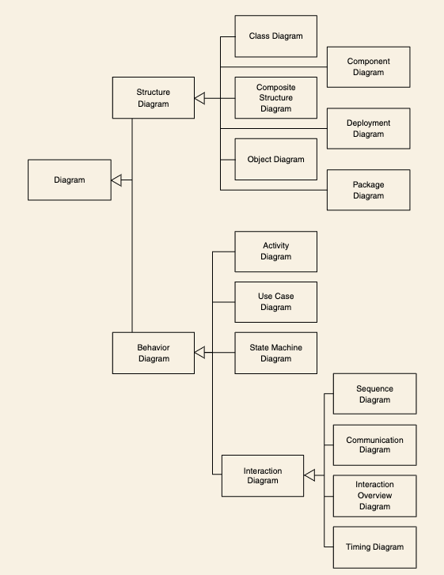


### 什么是合法的 UML

- A language with **prescriptive rules** is controlled by an official body that states what is or isn’t legal in the language and what meaning you give to utterances in that language

- A language with **descriptive rules** is one in which you understand its rules by looking at how people use the language in practice.

  for most people, the UML has descriptive rules

### 寻找适合你和你的团队的图表

​	**class diagrams** 和 **sequence diagrams** 是最常见也是最有用的


## 2. Development Process 开发过程

### Iterative and Waterfall Process

- Waterfall style
  - The waterfall style breaks down a project based on activity. 
  - 在一年内完成需求分析、方案设计、开发、测试
- Iterative style
  - The iterative style breaks down a project by subsets of functionality. 
  - 将功能分成四部分，在一年内循环四次需求分析、方案设计、开发、测试

可以使用混合的处理方式，高质量的设计方案，将开发过程迭代。比如需求分析、方案设计使用 waterfall style，用四个月完成，再将开发和测试分成四次迭代，每次持续2个月


### Predictive and Adaptive Planning

- Predictive planning
  - With predictive planning, a project has two stages. The first stage comes up with plans and is difficult to predict, but the second stage is much more predictable because the plans are in place.
- Adaptive Planning
  - we should face the reality of constant change and use a planning approach that treats change as a constant in a software project. 

**Two important pieces of advice**

- Don’t make a predictive plan until you have precise and accurate requirements and are confident that they won’t significantly change.

- If you can’t get precise, accurate, and stable requirements, use an adaptive planning style.


### Agile Processes 敏捷开发

- 项目团队的质量和合作方式是首要的, 用什么process和工具是次要的
- Agile methods tend to use short, time-boxed iterations, most often of a month
  or less.
  - A timeboxed iteration is a time-limited period where the team focus on a single goal and produce an increment of the software.
  - Most use the UML in sketch mode, with a few advocating using it as a programming language.

- Agile processes tend to be low in ceremony. 
  - A high-ceremony, or heavyweight,
    process has a lot of documents and control points during the project.


### Rational Unified Process 同一软件开发过程

Although the Rational Unified Process (RUP) is independent of the UML, the
two are often talked about together.

Although RUP is called a process, it actually is a **process framework**, provid-
ing a vocabulary and loose structure to talk about processes.

RUP is essentially an iterative process. A waterfall style isn’t compatible with the philosophy of RUP, although sadly it’s not uncommon to run into projects that use a waterfall-style process and dress it up in RUP’s clothes.


All RUP projects should follow four phases.

1. **Inception** makes an initial evaluation of a project. Typically in inception, you decide whether to commit enough funds to do an elaboration phase.one

2. **Elaboration** identifies the primary use cases of the project and builds software in iterations in order to shake out the architecture of the system. At the end of elaboration, you should have a good sense of the requirements and a skeletal working system that acts as the seed of development. In particular, you should have found and resolved the major risks to the project.

3. **Construction** continues the building process, developing enough functionality to release.

4. **Transition** includes various late-stage activities that you don’t do iteratively. These may include deployment into the data center, user training, and the like.

### Fitting a Process to a Project

You should never expect there to be a one-size-fits-all process that will work for all projects.

Consequently, you always have to adapt a process to fit your particular environment. One of the first things you need to do is look at your project and consider which processes seem close to a fit

You should then consider what adaptations you need to make to fit them to your project.

Remember that it’s usually easier to start with too little and add things than it is to start with too much and take things away.

At the end of each iteration, conduct an iteration retrospective 回顾

1. **Keep**: things that worked well that you want to ensure you continue to do
2. **Problems**: areas that aren’t working well
3. **Try**: changes to your process to improve it


### Fitting the UML into a Process

- Requirement Analysis
  - **Use cases**: describe how people interact with the system
  - **Class diagram**: drawn from the conceptual perspective, which can be a good way of building up a rigorous vocabulary of the domain
  - **Activity diagram**: show the work flow of the organization, showing how software and human activities interact. An activity diagram can show the context for use cases and also the details of how a complicated use case works
  - **State diagram**: can be useful if a concept has an interesting life cycle, with various states and events that change that state
- Design
  - **Class diagram** from a software perspective. These shows the classes in the software and how the interrelate.
  - **Sequence diagram** for common scenarios. A valuable approach is to pick the most important and interesting scenarios from the use cases and use CRC cards or sequence diagrams to figure out what happens in the software.
  - **Package diagrams** to show the large-scale organization of the software.
  - **State diagrams** for classes with complex life histories.
  - **Deployment diagrams** to show the physical layout of the software.
- Documentation
  - **A package diagram** makes a good logical road map of the system. Within each package, a class diagram is needed, acts as a graphical table of contents.
  - **Deployment diagram** shows the high-level physical picture.
  - **Class diagram** shows the most important interactions in the system.
  - **State diagrams** needed only if a class has sufficiently complex life-cycle behavior.
  - Some important code, written in a literate program style. If a particularly complex algorithm is involved, consider using an **activity program**.
  - **Design alternatives** you didn't take and why you didn't do them. That's most forgotten and most useful piece you can provide.

- Understanding Legacy Code
  - With modern tools, you can generate detailed diagrams for key parts of a
    system.


## 3. Class Diagrams: The Essentials

- A **class diagram** describes the types of objects in the system and the various kinds of static relationships that exist among them.      

  类图描述了一个系统中对象的各种类型以及它们之间不同的关系

- **Class diagrams** also show the <u>properties</u> and <u>operations</u> of a class and the <u>constraints</u> that apply to the way objects are connected.

- The UML uses the term **feature** as a general term that covers <u>properties</u> and <u>operations</u> of a class.


### Example

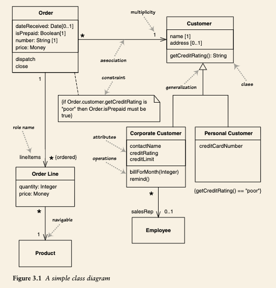

- The boxes in the diagram are classes, which are divided into three compartments: the <u>name</u> of the class (in bold), its <u>attributes</u>, and its <u>operations</u>.
- Figure 3.1 also shows two kinds of relationships between classes: <u>associations</u> and <u>generalizations</u>.

### Properties

Properties are a single concept, but they appear in two quite distinct notations: <u>attributes</u> and <u>associations</u>.

- Attributes

  - The attribute notation describes a property as a line of text within the class box
    itself. The full form of an attribute is:

    ```
    visibility name: type multiplicity = default {property-string}
    
    - name: String [1] = “Untitled” {readOnly}
    ```

- Associations

  - An association is a solid line between two classes, directed from the source
    class to the target class. The name of the property goes at the target end of the association, together with its multiplicity. The target end of the association links to the class that is the type of the property.

    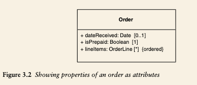

​				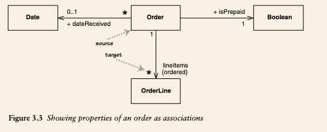

*Although most of the same information appears in both notations, some items are different. In particular, associations can show multiplicities at both ends of the line.*


### Multiplicity

The multiplicity of a property is an indication of how many objects may fill the
property. The most common multiplicities you will see are
• 1 (An order must have exactly one customer.)
• 0..1 (A corporate customer may or may not have a single sales rep.)
• * (A customer need not place an Order and there is no upper limit to the number of Orders a Customer may place—zero or more orders.)


### Bidirectional Associations

The associations we’ve looked at so far are called unidirectional associations. Another common kind of association is a bidirectional association.

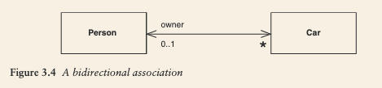

A bidirectional association is a pair of properties that are linked together as inverses. The Car class has property <u>owner:Person[0 ..1]</u>, and the Person class has a property <u>cars:Car[*]</u>.

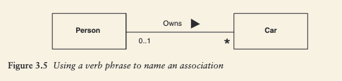

This form is also allowed, but Figure 3.4 is more clear.


### Operations

Operations are the actions that a class knows to carry out. Operations most obviously correspond to the methods on a class.

The full UML syntax for operations is:

```
visibility name (parameter-list) : return-type {property-string}

+ balanceOn (date: Date) : Money
```

- **Query**: an operation that gets a value from a class <u>without changing the system state</u>—in other words, without side effects.
- **Modifier** (Commands): operations that do change state, do not return a value.

An **operation** is something that is invoked on an object—the procedure declaration—whereas a
**method** is the body of a procedure.

operations are internal to an object and used to implement its behavior, while methods are external and provide an interface for other objects or users to interact with the object's behavior.


### Generalization 泛化

A typical example of **generalization** involves the personal and corporate customers of a business. They have differences but also many similarities. The similarities can be placed in a general Customer class (the supertype), with Personal Customer and Corporate Customer as subtypes.

通过使用泛化关系，我们可以从一个通用类中继承出更具体的子类，这些子类可以拥有通用类的属性和方法，并且可以定义自己的新属性和方法。

在 UML 中，泛化关系可以描述类的继承关系，也可以描述接口之间的继承关系。对于类的继承关系，父类与子类之间的泛化关系表示子类是父类的一种特殊情况。对于接口的继承关系，子接口继承了父接口的行为约束，并可能定义自己的新行为约束。

在 UML 中，泛化关系用带空心箭头的实线表示。


### Dependency

A dependency exists between two elements if changes to the definition of one element (the supplier or target) may cause changes to the other (the client or source). With classes, dependencies exist for various reasons: 

- One class sends a message to another;
- one class has another as part of its data;
- one class mentions another as a parameter to an operation.

The important thing here is that the dependency is in only one direction and goes from the presentation class to the domain class.

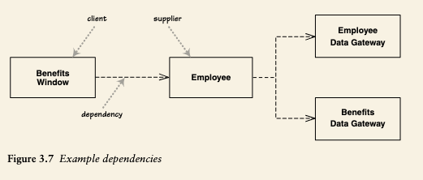


## 4. Sequence Diagrams

**Interaction diagrams** describe how groups of objects collaborate in some behav-
ior. The UML defines several forms of interaction diagram, of which the most
common is the <u>sequence diagram</u>.

- the sequence diagram indicates clearly the differences in how the participants interact

- Centralized control

  - with one participant pretty much doing all the processing and other participants there to supply data

    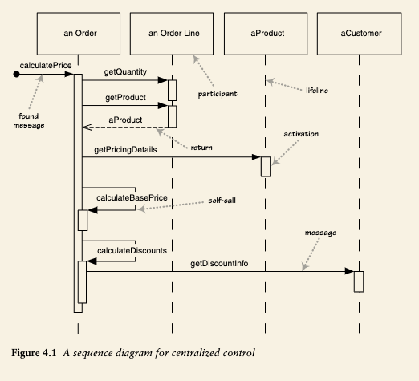

- Distributed control

  - the processing is split among many participants, each one doing a little bit of the algorithm.

    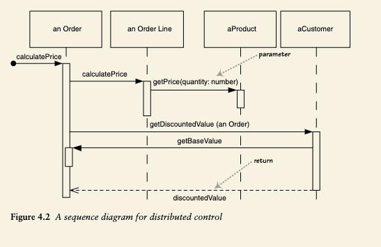


### Creating and Deleting Participants

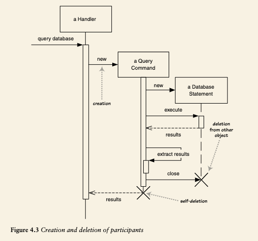

### Loop, Conditionals, and the Like

```
procedure dispatch
  foreach (lineitem)
    if (product.value > $10K)
    	careful.dispatch
    else
    	regular.dispatch
    end if
  end for
  if (needsConfirmation) messenger.confirm
end procedure
```

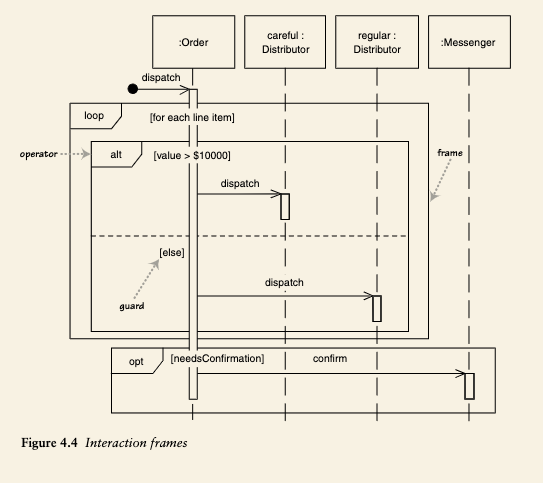

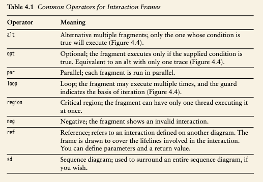


### Synchronous and Asynchronous Calls

 In UML 2, filled arrowheads show a synchronous message, while stick arrowheads show an asynchronous message.

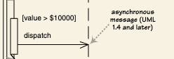

If a caller sends a **synchronous message**, it must wait until the message is done, such as invoking a subroutine. If a caller sends an **asynchronous message**, it can continue processing and doesn’t have to wait for a response.


## 5. Class Diagrams: Advanced Concepts


## 6. Object Diagrams

An **object diagram** is a snapshot of the objects in a system at a point in time.
Because it shows instances rather than classes, an object diagram is often called
an instance diagram.

对象关系图是系统中某个时间点对象的快照。因为它显示的是实例而不是类，对象图常被称为实例图。

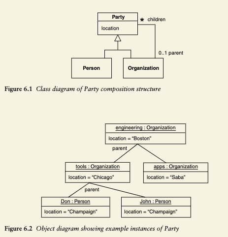


## 7. Package Diagrams

## 8. Deployment Diagrams


## 9. Use Cases

Use cases are a technique for capturing the functional requirements of a system. Use cases work by <u>describing the typical interactions between the users of a system and the system itself,</u> providing a narrative of how a system is used.

So if we have a Webbased on-line store, we might have a Buy a Product scenario that would say this:
	*The customer browses the catalog and adds desired items to the shopping*
	*basket. When the customer wishes to pay, the customer describes the shipping* 
	*and credit card information and confirms the sale. The system checks*
	*the authorization on the credit card and confirms the sale both immediately*
	*and with a follow-up e-mail.*

A use case is a set of scenarios tied together by a common user goal.

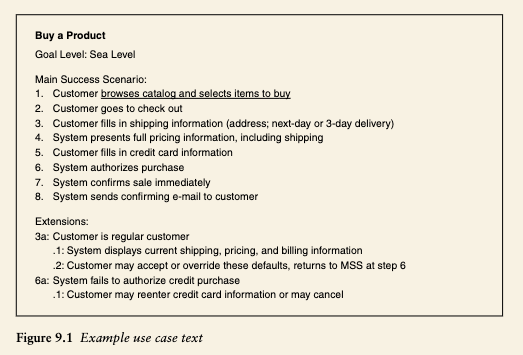


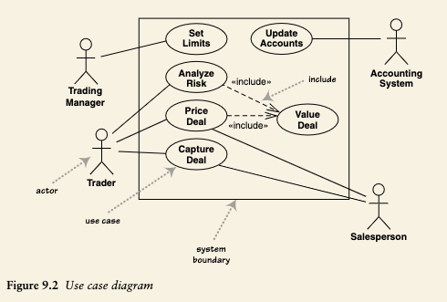


The more I see of use cases, the less valuable the use case diagram seems to
be. With use cases, **concentrate your energy on their text** rather than on the dia-
gram.


## 10. State Machine Diagrams

