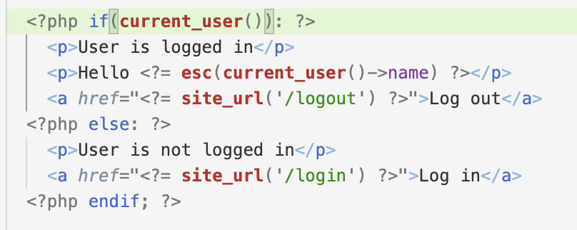
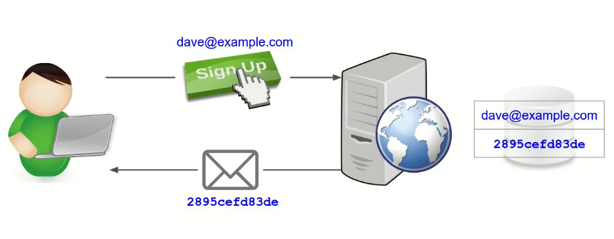
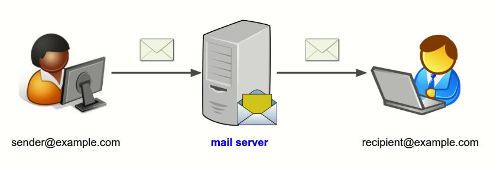
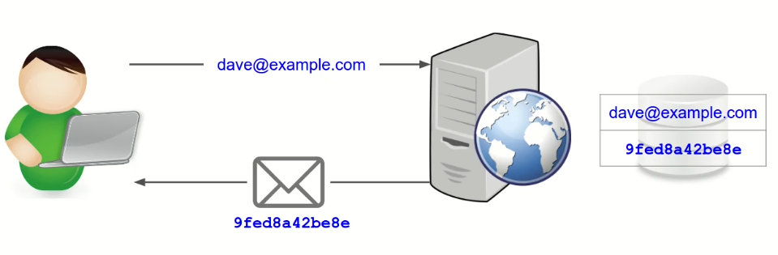
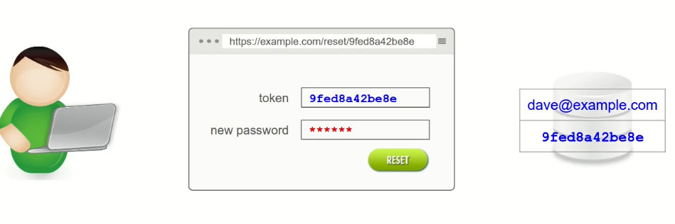
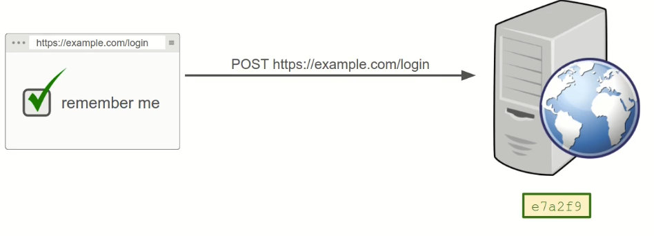
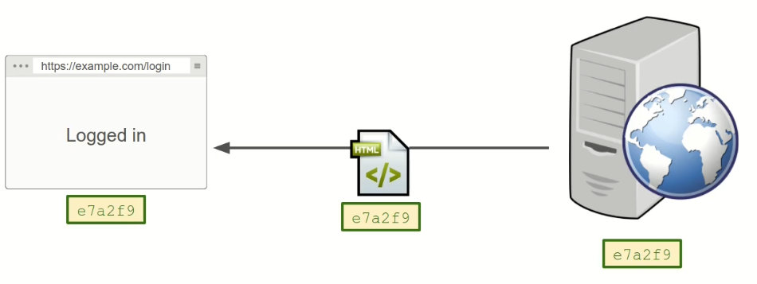
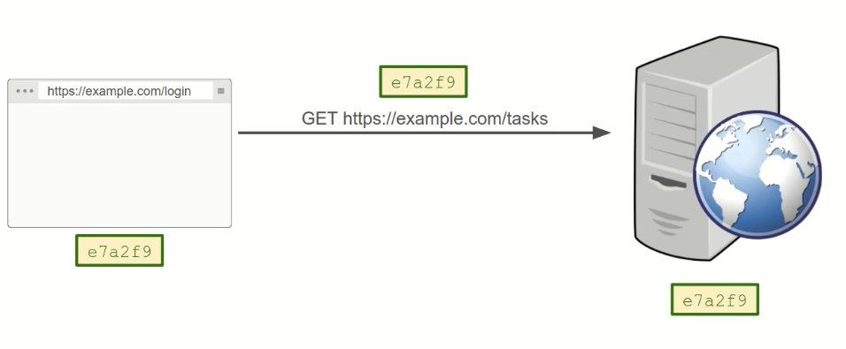

# CodeIgniter


# Installation

```
composer create-project codeigniter4/appstarter codeigniter
```

### Configure the framework to display error messages

1. rename `env` to `.env`
2. change `#CI_ENVIRONMENT = production` to `CI_ENVIRONMENT = development`

```
php spark serve
```

### NGINX config

```sh
server {
        listen 2020;
        server_name amz_ladder.nginx.com;

        index index.php index.html;
        root /vagrant/amz_ladder/public/;


        location ~ \.php {
        try_files $uri /index.php =404;
        #fastcgi_pass 127.0.0.1:9000;
        fastcgi_pass unix:/run/php/php8.0-fpm.sock;
        include fastcgi_params;
        fastcgi_index index.php;
        fastcgi_split_path_info ^(.+\.php)(.*)$;
        fastcgi_param SCRIPT_FILENAME $document_root$fastcgi_script_name;
        fastcgi_param PATH_INFO $fastcgi_path_info;
        }

	location /{
        	if (!-e $request_filename){
        	        rewrite ^/(.*)$ index.php?$1 last;
       		      	break;
       		 }
  	 }
}
```


# Application structure

```sh
# Config
Stores the configuration files

# Controllers
determine the program flow

# Database
Stores the database migrations and seeds files

# Filters
Stores filter classes that can run before and after controller

# Helpers
Stores collections of standalone functions

# Language
Multiple language support reads the language strings from here

# Libraries
Useful classes that do not fit in another category

# Models
Work with the database to represent the business entities

# ThirdParty
Can be used in application

# Views
Make up the HTML that is displayed to the client

# System
All core file are available in this location, we can extend, create the classes

# Public
CI4 application will load from this location, we can also keep assets like css, js

# Writable
Used to store log files, Cache files and uploads

# Tests
For unit testing, _support: contains mock files
```


# URLs

### Query String based URLs

http://example.com/view.php?product=20&cat=books

### Segment based URLs

http://example.com/view/product/20/cat/books

URL = Base URL + URI

URL = http://example.com/view/product/20/cat/books

URI = /view/product/20/cat/books

# Basic

### View layouts: use a base layout for common view code

layouts/default.php

```php+HTML
<!DOCTYPE html>
<html lang="en">
<head>
  <meta charset="UTF-8">
  <meta http-equiv="X-UA-Compatible" content="IE=edge">
  <meta name="viewport" content="width=device-width, initial-scale=1.0">
  <title><?= $this->renderSection("title"); ?></title>
</head>
<body>
  <?= $this->renderSection("content"); ?>
</body>
</html>
```

home.php

```php+HTML
<?= $this->extend('layouts/default'); ?>
<?= $this->section('title'); ?>
Home
<?= $this->endsection(); ?>

<?= $this->section('content'); ?>


<?= $this->endsection(); ?>  

```


# Data

### Display dynamic data from controller

```php
$data = [
  ['id' => 1, 'description' => 'First task'],
  ['id' => 2, 'description' => 'Second task']
];
return view('Tasks/index', ['task' => $data]);
```

```php+HTML
<ul>
    <?php foreach($tasks as $task): ?>
      <li>
        <?= $task['id'] ?>
        <?= $task['description'] ?>
      </li>
    <?php endforeach; ?>
</ul>
```


### Connect to database

`.env` uncomment the necessary of database

### Migration

A convenient way to alter your database in a structured and organized manner.

E.g.

```
php spark migrate:create create_task
```

The **UP** method is doing the changes.

The **DOWN** method is undoing or rolling back these changes.

Inside a migration class, we use the Database Forge class to manipulate the database.

```php
public function up()
    {
        $this->forge->addField([
            'id' => [
                'type' => 'INT',
                'constraint' => 5,
                'unsigned' => true,
                'auto_increment' => true
            ],
            'description' => [
                'type' => 'VARCHAR',
                'constraint' => '128'
            ]
        ]);

        $this->forge->addPrimaryKey('id');
        $this->forge->createTable('task');
    }

public function down()
  {
    $this->forge->dropTable('task');
  }
```

```
php spark migrate
```

#### Roll back

```
php spark migrate:rollback
```

#### Migrations without the command line : add columns using a controller

1. create file `2021-10-18-074954_add_timestamps_to_task.php`

2. ```php
   <?php
   
   namespace App\Database\Migrations;
   
   use CodeIgniter\Commands\Database\Migrate;
   use CodeIgniter\Database\Migration;
   
   class AddTimestampsToTask extends Migration {
     public function up() {
       $this->forge->addColumn('task', [
         'created_at' => [
           'type' => 'DATETIME',
           'null' => true,
           'default' => null
         ],
         'updated_at' => [
           'type' => 'DATETIME',
           'null' => true,
           'default' => null
         ]
       ]);
     }
   
     public function down() {
       $this->forge->dropColumn('task', 'updated_at');
       $this->forge->dropColumn('task', 'created_at');
     }
   }
   ```

3. add a controller `Migrate`

4. ```php
   <?php
   
   namespace App\Controllers;
   
   class Migrate extends BaseController {
     public function index() {
       $migrate = \Config\Services::migrations();
   
       try {
         $migrate->latest();
         echo "migrated";
       } catch(\Exception $e) {
         echo $e->getMessage();
       }
     }
   }
   ```

5. To browser: localhost/migrate
6. Success

### Models: connect to the database and select data automatically

```php
<?php

namespace App\Models;

class TaskModel extends \CodeIgniter\Model {
  protected $table = 'task';
}
```

```php
<?php

namespace App\Controllers;

class Tasks extends BaseController
{
    public function index()
    {
      $model = new \App\Models\TaskModel;
      $data = $model->findAll();

      return view('Tasks/index', ['tasks' => $data]);
    }
}

```


### Debugging tools: enable the debug bar and use the dd function

1. in `.env`   =>  app.baseURL = 'http://localhost:8080/'

​			2.  dd($data) == var_dump($data); exit;


# CRUD

### Part 1: Displaying and inserting new data


#### Add a page to show an individual record

```php
public function show($id)
    {
      $model = new \App\Models\TaskModel;
      $task = $model->find($id);
      
      return view('Tasks/show', ['task' => $task]);
    }
```

```php+HTML
  <dl>
    <dt>ID</dt>
    <dd><?= $task['id'] ?></dd>

    <dt>Description</dt>
    <dd><?= $task['description'] ?></dd>

    <dt>Created at</dt>
    <dd><?= $task['created_at'] ?></dd>

    <dt>Updated at</dt>
    <dd><?= $task['updated_at'] ?></dd>
  </dl>
```

#### Add links between pages using the site_url helper

```php+HTML
<a href="<?= site_url("/tasks/show/" . $task['id']) ?>">
	<?= $task['description'] ?>
</a>
```

#### Create and display a form for adding a new task using the form helper

1. in `BaseController.php`  ==>  protected $helpers = ["form"];

2. ```php
   public function new()
       {
         return view('Tasks/new');
       }
   ```

3. ```php+HTML
     <?= form_open("/tasks/create") ?>
       <div>
         <label for="description">Description</label>
         <input type="text" name="description" id="description" value="">
       </div>
       <button>Save</button>
       <a href="<?= site_url("/tasks")?>">Cancel</a>
   ```

   

#### Add a method tp process the submitted form and insert a new record

1. ```php
   class TaskModel extends \CodeIgniter\Model {
     protected $table = 'task';
   
     protected $allowedFields = ['description'];
   }
   ```

   

2. ```php
   public function create()
       {
         $model = new \App\Models\TaskModel;
   
         $model->insert([
           'description' => $this->request->getPost("description")
         ]);
   
         dd($model->insertID);
       }
   ```

   

#### Add validation rules and validate the form

1. ```php
   class TaskModel extends \CodeIgniter\Model {
     protected $table = 'task';
   
     protected $allowedFields = ['description'];
   
     protected $validationRules = [
       'description' => 'required'
     ];
   
     protected $validationMessages = [
       'description' => [
         'required' => 'Please enter a description'
       ]
     ];
   }
   ```

   

2. ```php
   public function create()
       {
         $model = new \App\Models\TaskModel;
   
         $result = $model->insert([
           'description' => $this->request->getPost("description")
         ]);
   
         if($result === false) {
           dd($model->errors());
         } else {
           dd($result);
         }
   
       }
   ```

   when the method `insert` is called, it validate at first.

#### Redirect to the show page if validation passes or redisplay the form if not

1. ```php
   public function create()
       {
         $model = new \App\Models\TaskModel;
   
         $result = $model->insert([
           'description' => $this->request->getPost("description")
         ]);
   
         if($result === false) {
           return redirect()->back()
                            ->with('errors', $model->errors());
         } else {
           return redirect()->to("/tasks/show/$result");
         }
   
       }
   ```

   

2. ```php
   <?php if(session()->has('errors')): ?>
       <ul>
         <?php foreach(session('errors') as $error): ?>
           <li><?= $error ?></li>
         <?php endforeach; ?>
       </ul>
     <?php endif; ?>
   ```

   

#### Flash messages: add status messages to the result of processing the form

1. ```php
   if($result === false) {
           return redirect()->back()
                            ->with('errors', $model->errors())
                            ->with('warning', 'Invalid data');
   } else {
           return redirect()->to("/tasks/show/$result")
                            ->with('info', 'Task created successfully');
   }
   ```

   

2.  layouts/default.php

   ```php+HTML
     <?php if(session()->has('warning')): ?>
      <div class="warning">
       <?= session('warning') ?>
      </div>
     <?php endif; ?>
     <?php if(session()->has('info')): ?>
      <div class="info">
       <?= session('info') ?>
      </div>
     <?php endif; ?>
   ```

   

#### Prevent XSS attacks by escaping untrusted data

cross site scripting: `<em>XSS?</em>  `   ==> <em>XSS?</em>

```php
<?= esc($task['description']) ?>
```

### Part 2: Editing and deleting existing records

#### Add a form to edit an existing task and link to it from the show page

​			Controller/tasks.php

1. ```php
   public function edit($id) 
       {
         $model = new \App\Models\TaskModel;
         $task = $model->find($id);
         
         return view('Tasks/edit', ['task' => $task]);
       }
   ```

   edit.php

2. ```php+HTML
   <?= $this->extend('layouts/default'); ?>
   
   <?= $this->section('title'); ?>Edit Task<?= $this->endsection(); ?>
   
   <?= $this->section('content'); ?>
     <h1>Edit Task</h1>
     <?php if(session()->has('errors')): ?>
       <ul>
         <?php foreach(session('errors') as $error): ?>
           <li><?= $error ?></li>
         <?php endforeach; ?>
       </ul>
     <?php endif; ?>
     <?= form_open("/tasks/update/" . $task['id']) ?>
       <div>
         <label for="description">Description</label>
         <input type="text" name="description" id="description" value="<?= esc($task['description']) ?>">
       </div>
       <button>Save</button>
       <a href="<?= site_url("/tasks/show/" . $task['id'])?>">Cancel</a>
   <?= $this->endsection(); ?>
   ```

   show.php

3. ```php+HTML
   <a href="<?= site_url("/tasks/edit/" . $task['id'])?>">Edit</a>
   ```

   

#### Add a method to process the submitted form

```php
public function update($id)
    {
      $model = new \App\Models\TaskModel;

      $result = $model->update($id, [
        'description' => $this->request->getPost("description")
      ]);

      if($result === false) {
        return redirect()->back()
                         ->with('errors', $model->errors())
                         ->with('warning', 'Invalid data');
      } else {
        return redirect()->to("/tasks/show/$id")
                         ->with('info', 'Task updated successfully');
      }

    }
```

#### Show the previously-entered values in the form when redisplay

​				Controllers/tasks.php

1. ```php
   return redirect()->back()
                 ->with('errors', $model->errors())
                 ->with('warning', 'Invalid data')
                 ->withInput();  // 'withInput' is what specifies "old data" should be saved
   ```

   edit.php

2. ```php+HTML
   <input type="text" name="description" id="description" value="<?= old('description', esc($task['description'])) ?>">
   ```

   

#### Extract shared form code out into a shared view

​				form.php

1. ```php+HTML
   <div>
     <label for="description">Description</label>
     <input type="text" name="description" id="description" value="<?= old('description', esc($task['description'])) ?>">
   </div>
   ```

   new.php   and    edit.php

2.   replace the code upon with `<?= $this->include('Tasks/form') ?>`

   

   Controllers/tasks.php

3. ```php
   public function new()
       {
         return view('Tasks/new', [
           'task' => ['description' => '']
         ]);
       }
   ```

   

#### Entity classes: use an object to represent a database row instead of an array

1. Create the Entity Class

   ```php
   <?php
   
   namespace App\Entities;
   
   use CodeIgniter\Entity\Entity;
   
   class Task extends Entity
   {
       // ...
   }
   ```

2. In the Model App/Models/TaskModel.php

   ```php
   protected $returnType = 'App\Entities\Task';
   ```

3. In the View

   ```php
   <?= esc($task->description) ?>
   ```

4. In the controller

   ```php
   /*
   public function new()
       {
         return view('Tasks/new', [
           'task' => ['description' => '']
         ]);
       }
   */
   public function new()
       {
         $task = new \App\Entities\Task;
   
         return view('Tasks/new', [
           'task' => $task
         ]);
       }
   ```

   

#### Change the methods to use the Task entity class

```php
public function create()
    {
      $model = new \App\Models\TaskModel;

      $task = new Task($this->request->getPost());

      if($model->insert($task)) {
        return redirect()->to("/tasks/show/{$model->insertID}")
                         ->with('info', 'Task created successfully');
        
      } else {
        return redirect()->back()
                         ->with('errors', $model->errors())
                         ->with('warning', 'Invalid data');
      }

    }
```

```php
public function update($id)
    {
      $model = new \App\Models\TaskModel;

      $task = $model->find($id);

      $task->fill($this->request->getPost());

      if(!$task->hasChanged()) {
        return redirect()->back()
                         ->with('warning', 'Nothing to update')
                         ->withInput();
      }
      if($model->save($task)) {
        return redirect()->to("/tasks/show/$id")
                         ->with('info', 'Task updated successfully');
      } else {
        return redirect()->back()
                         ->with('errors', $model->errors())
                         ->with('warning', 'Invalid data')
                         ->withInput();  // 'withInput' is what specifies "old data" should be saved                 
      }
    }
```

#### Enable automatic updating of the created_at and updated_at fields

​		/Models/TaskModel.php

```php
  protected $useTimestamps = true;
```

#### Add a page with a confirmation message for deleting a task record

1. ```php
       public function delete($id)
       {
         $task = $this->getTaskOr404($id);
         if($this->request->getMethod() === 'post') {
           $this->model->delete($id);
           return redirect()->to("/tasks")
                            ->with('info', 'Task deleted successfully');
         }
         return view('Tasks/delete', [
           'task' => $task
         ]);
       }
   ```

   Views

2. ```php+HTML
   <?= $this->extend('layouts/default'); ?>
   
   <?= $this->section('title'); ?>Delete Task<?= $this->endsection(); ?>
   
   <?= $this->section('content'); ?>
     <h1>Delete Task</h1>
     
     <p>Are you sure?</p>
   
     <?= form_open('/tasks/delete/' . $task->id) ?>
       <button>Yes</button>
       <a href="<?= site_url('/tasks/show/' . $task->id) ?>">Cancel</a>
   <?= $this->endsection(); ?>
   ```

   

# Signup: User account registration

### Add and run a migration to create the user table

```php
class CreateUser extends Migration
{
    public function up()
    {
        $this->forge->addField([
            'id' => [
                'type' => 'INT',
                'constraint' => 5,
                'unsigned' => true,
                'auto_increment' => true
            ],
            'name' => [
                'type' => 'VARCHAR',
                'constraint' => '128'
            ],
            'email' => [
                'type' => 'VARCHAR',
                'constraint' => '255'
            ],
            'password_hash' => [
                'type' => 'VARCHAR',
                'constraint' => '255'
            ],
            'created_at' => [
                'type' => 'DATETIME',
                'null' => true,
                'default' => null
            ],
            'updated_at' => [
                'type' => 'DATETIME',
                'null' => true,
                'default' => null
            ]
        ]);
        $this->forge->addPrimaryKey('id')
                    ->addUniqueKey('email');
        
        $this->forge->createTable('user');

    }

    public function down()
    {
        $this->forge->dropTable('user');
    }
}

```

### Add a signup controller and display the signup form

```php+HTML
<?= $this->extend('layouts/default'); ?>

<?= $this->section('title'); ?>Signup<?= $this->endsection(); ?>

<?= $this->section('content'); ?>
  <h1>Signup</h1>
  <?php if(session()->has('errors')): ?>
    <ul>
      <?php foreach(session('errors') as $error): ?>
        <li><?= $error ?></li>
      <?php endforeach; ?>
    </ul>
  <?php endif; ?>
  <?= form_open("/signup/create") ?>
    <div>
      <label for="name">Name</label>
      <input type="text" name="name" id="name" value="<?= old('name') ?>">
    </div>

    <div>
      <label for="email">Email</label>
      <input type="text" name="email" id="email" value="<?= old('email') ?>">
    </div>

    <div>
      <label for="password">Password</label>
      <input type="text" name="password">
    </div>

    <div>
      <label for="password_confirmation">Repeat password</label>
      <input type="text" name="password_confirmation">
    </div>
    <button>Sign up</button>
    <a href="<?= site_url("/")?>">Cancel</a>
<?= $this->endsection(); ?>
```

### Add a create method and insert a new user record

1. create user entity

2. create user model

   ```php
     protected $table = 'user';
   
     protected $allowedFields = ['name', 'email', 'password'];
   
     protected $returnType = 'App\Entities\User';
   
     protected $useTimestamps = true;
   ```

   

   2.1.  use a model event to hash the password when a new record is inserted

   ```php
     protected $beforeInsert = ['hashPassword'];
   
     protected function hashPassword(array $data) {
       if(isset($data['data']['password'])) {
         $data['data']['password_hash'] = password_hash($data['data']['password'], PASSWORD_DEFAULT);
         unset($data['data']['password']);
         unset($data['data']['password_confirmation']);
       }
   
       return $data;
     }
   ```

   2.2. validate the data

   ```php
   protected $validationRules = [
       'name' => 'required',
       'email' => 'required|valid_email|is_unique[user.email]',
       'password' => 'required|min_length[6]',
       'password_confirmation' => 'required|matches[password]'
     ];
   
     protected $validationMessages = [
       'email' => [
         'is_unique' => 'That email address is taken'
       ],
       'password_confirmation' => [
         'required' => 'Please confirm the password',
         'matches' => 'Please enter the same password again'
       ]
     ];
   ```

   

3. create method

   ```php
     public function create()
     {
       $user = new \App\Entities\User($this->request->getPost());
       $model = new \App\Models\UserModel;
       if($model->insert($user)) {
         return redirect()->to('/signup/success');
       } else {
         return redirect()->back()
                          ->with('errors', $model->errors())
                          ->with('warning', 'Invalid data')
                          ->withInput();
       }
     }
   ```

   

# Authentication

### Verify the email and password against the user records in the database

```php
public function create()
  {
    $email = $this->request->getPost('email');
    $password = $this->request->getPost('password');

    $model = new \App\Models\UserModel();
    $user = $model->where('email', $email)
          ->first();
    
    if($user === null) {
      return redirect()->back()
                       ->with('warning', 'User not found')
                       ->withInput();
    } else {
      if(password_verify($password, $user->password_hash)) {
        $session = session();
        $session->regenerate(); // generate a new session id to protect user data
        $session->set('user_id', $user->id);
        
        return redirect()->to("/")
                         ->with('info', 'Login successfully');
      } else {
        return redirect()->back()
                       ->with('warning', 'Incorrect password')
                       ->withInput();
      }
    }
  }
```

Home/index.php

```php+HTML

  <?php if(session()->has('user_id')): ?>
    <p>User is logged in</p>
  <?php else: ?>
    <p>User is not logged in</p>
  <?php endif; ?>
```

### Log out the user when the browser closes and also with a logout action

app/Config/App.php

```php
    public $sessionExpiration = 0;
```

Controllers

```php
public function delete() {
    session()->destroy();
    return redirect()->to("/")
                     ->with('info', 'Logout successfully');
  }
// in this case the flash message will not display, cause it's stored in the session which is destroyed

 public function delete() {
    session()->destroy();
    return redirect()->to('/login/logoutMessage');
  }

  public function logoutMessage() {
    return redirect()->to("/")
                     ->with('info', 'Logout successfully');
  }
```

app/Config/Routes.php

```php
$routes->get('/logout', 'Login::delete');
```

### Add a helper to show the current user name

app/Helpers/auth_helper.php

```php
<?php

if(!function_exists('current_user')) {
  function current_user() {
    if(!session()->has('user_id')) {
      return null;
    }

    $model = new \App\Models\UserModel();
    return $model->find(session()->get('user_id'));
  }

```

Controllers/BaseController.php

```php
protected $helpers = ["form", "auth"];
```

Home/index.php

```php+HTML
<p>Hello <?= esc(current_user()->name) ?></p>
```

### Create and use a class for all the authentication code

app/Libraries/Authentication.php

```php
<?php

namespace App\Libraries;

class Authentication {
  public function login($email, $password) {
    $model = new \App\Models\UserModel();
    $user = $model->where('email', $email)
          ->first();
    
    if($user === null) {
      return false;
    } 

    if(!password_verify($password, $user->password_hash)) {
      return false;
    }

    $session = session();
    $session->regenerate();
    $session->set('user_id', $user->id);

    return true;
  }

  public function logout() {
    session()->destroy();
  }
  
  public function getCurrentUser() {
    if(!session()->has('user_id')) {
      return null;
    }

    $model = new \App\Models\UserModel();
    return $model->find(session()->get('user_id'));
  }
}
```

Controllers/Login.php

```php
public function create()
  {
    $email = $this->request->getPost('email');
    $password = $this->request->getPost('password');

    $auth = new \App\Libraries\Authentication;
    if($auth->login($email, $password)) {
      return redirect()->to("/")
                       ->with('info', 'Login successfully');        
    } else {
      return redirect()->back()
                       ->with('warning', 'Invalid login')
                       ->withInput();
    }
  }
```


### Access the authentication object using a service

Get rid of calling individual object all the time

1. app/Config/Services

   ```php
   public static function auth($getShared = true)
       {
           if ($getShared) {
               return static::getSharedInstance('auth');
           }
      
           return new \App\Libraries\Authentication;
       }
   ```

   

2. `$auth = \Config\Services::auth();`

   or

   `$auth = service('auth');`

### Simplify the authentication class: extract code out to the user model and entity

UserModel.php

```php
public function findByEmail($email) {
    return $this->where('email', $email)
                 ->first();
  }
```

Entities/User.php

```php
public function verifyPassword($password) {
    return password_verify($password, $this->password_hash);
  }
```

Authentication.php

```php
public function login($email, $password) {
    $model = new \App\Models\UserModel();
    $user = $model->findByEmail($email);
    
    if($user === null) {
      return false;
    } 

    if(!$user->verifyPassword($password)) {
      return false;
    }

    $session = session();
    $session->regenerate();
    $session->set('user_id', $user->id);

    return true;
  }
```

### Avoid multiple identical database queries



here `current_user()` executes twice, and the same query is executed twice.

Authentication.php

```php
private $user;
public function getCurrentUser() {
    if(!session()->has('user_id')) {
      return null;
    }

    if($this->user === null) {
      $model = new \App\Models\UserModel();
      $this->user = $model->find(session()->get('user_id'));
    }
    
    return $this->user;
  }
```


# Protecting content: require the user to login to access the tasks index page

​					Authentication.php

1. ```php
   public function isLoggedIn() {
       return session()->has('user_id');
     }
   ```

   Controllers/Tasks.php

2. ```php
   public function index()
       {
         if(!service('auth')->isLoggedIn()) {
           return redirect()->to('/login')
                            ->with('info', 'Please login first');
         }
         $data = $this->model->findAll();
   
         return view('Tasks/index', ['tasks' => $data]);
       }
   ```

   

### Controller filters: require login for all the methods in the tasks controller

To not repeating ourselves with the code above

1. app/Filters/LoginFilter.php

   ```php
   <?php
   
   namespace App\Filters;
   
   use CodeIgniter\HTTP\RequestInterface;
   use CodeIgniter\HTTP\ResponseInterface;
   use CodeIgniter\Filters\FilterInterface;
   
   class LoginFilter implements FilterInterface
   {
       public function before(RequestInterface $request, $arguments = null)
       {
         if(!service('auth')->isLoggedIn()) {
           return redirect()->to('/login')
                            ->with('info', 'Please login first');
         }
       }
   
       public function after(RequestInterface $request, ResponseInterface $response, $arguments = null)
       {
           // Do something here
       }
   }
   
   ```

   

2. app/Config/Filters.php

   ```php
   public $aliases = [
           'login'    => \App\Filters\LoginFilter::class,
       ];
   
   public $filters = [
           'login' => ['before' => ['tasks(/*)?']] // to make filter valid for /tasks
       ];
   ```

   

### Apply a filter to certain routes to require the user not to be logged in

1. app/Filters/GuestFilter.php

   ```php
   <?php
   
   namespace App\Filters;
   
   use CodeIgniter\HTTP\RequestInterface;
   use CodeIgniter\HTTP\ResponseInterface;
   use CodeIgniter\Filters\FilterInterface;
   
   class GuestFilter implements FilterInterface
   {
       public function before(RequestInterface $request, $arguments = null)
       {
         if(service('auth')->isLoggedIn()) {
           return redirect()->to('/');
         }
       }
   
       public function after(RequestInterface $request, ResponseInterface $response, $arguments = null)
       {
           // Do something here
       }
   }
   
   ```

2. app/Config/Filters.php

   ```php
   public $aliases = [
           'guest'    => GuestFilter::class,
       ];
   ```

3. app/Config/Routes.php

   ```php
   $routes->get('/signup', 'Signup::new', ['filter' => 'guest']);
   $routes->get('/login', 'Login::new', ['filter' => 'guest']);
   ```

   

### Redirect to the originally requested page after logging in

1. app/Filters/LoginFilter.php

   ```php
   public function before(RequestInterface $request, $arguments = null)
       {
         if(!service('auth')->isLoggedIn()) {
           // save url to session
           session()->set('redirect_url', current_url());
           return redirect()->to('/login')
                            ->with('info', 'Please login first');
         }
       }
   ```

2. Controllers/Login.php

   ```php
     public function create()
     {
       $email = $this->request->getPost('email');
       $password = $this->request->getPost('password');
   
       $auth = \Config\Services::auth();
       if($auth->login($email, $password)) {
   
         $redirect_url = session('redirect_url') ?? '/';
         unset($_SESSION['redirect_url']);
         
         return redirect()->to($redirect_url)
                          ->with('info', 'Login successfully');        
       } else {
         return redirect()->back()
                          ->with('warning', 'Invalid login')
                          ->withInput();
       }
     }
   ```

   

### Protect against cross-site request forgery (CSRF) attacks with the CSRF Filter

1. app/Config/Filters

   ```php
       public $globals = [
           'before' => [
               'csrf',
           ]
       ];
   ```

   with this filter enabled, a hidden csrf field is displayed automatically

   ```php+HTML
   <input type="hidden" name="csrf_test_name" value="ab80e10ca78b4d40c4576501da895d4f" /> 
   ```

   

2. To display the error

   Views/layouts/default.php 

   ```php+HTML
     <?php if(session()->has('error')): ?>
      <div class="error">
       <?= session('error') ?>
      </div>
     <?php endif; ?>
   ```

   Just to check if csrf is working (can be deleted)

   Views/Tasks/form.php

   ```php+HTML
   <input type="hidden" name="<?= csrf_token() ?>" value="an invalid token">
   ```

   

# Link the tasks to users and paginate the task index

### Add a foreign key from the task table to the id column in the user table

1. ```
   php spark migrate:create add_user_id_to_task
   ```

2. To add a foreign key in a new table, we could use

   ```php
   $forge->addForeignKey['users_id', 'users', 'id'];
   ```

   

   But in a existing table, we should do it manually

   ```php
   class AddUserIdToTask extends Migration
   {
       public function up()
       {
           $this->forge->addColumn('task', [
                   'user_id' => [
                       'type' => 'INT',
                       'constraint' => 5,
                       'unsigned' => true
                   ]
               ]
           );
           $sql = "ALTER TABLE task
                   ADD CONSTRAINT task_user_id_fk
                   FOREIGN KEY (user_id) REFERENCES user(id)
                   ON DELETE CASCADE ON UPDATE CASCADE";
   
           $this->db->simpleQuery($sql);
       }
   
       public function down()
       {
           $this->forge->dropForeignKey('task', 'task_user_id_fk');
           $this->forge->dropColumn('task', 'user_id');
       }
   }
   
   ```

   

3. ```
   php spark migrate
   ```

   

### Show only the tasks for the current user in the task index

1. Models/TaskModel.php

   ```php
     public function getTasksByUserID($id) {
       return $this->where('user_id', $id)
                           ->findAll();
     }
   ```

2. Controllers/Tasks.php

   ```php
       public function index()
       {
         $auth = service('auth');
         $user = $auth->getCurrentUser();
         $data = $this->model->getTasksByUserID($user->id);
   
         return view('Tasks/index', ['tasks' => $data]);
       }
   ```

   

### Select individual task records for the current user only

1. Models/TaskModel.php

   ```php
     public function getTaskByUserID($id, $user_id) {
       return $this->where('id', $id)
                   ->where('user_id', $user_id)
                   ->first();
     }
   ```

   

2. Controllers/Tasks.php

   ```php
    public function getTaskOr404($id)
       {
      		// new code start
         $user = service('auth')->getCurrentUser();
         $task = $this->model->getTaskByUserID($id, $user->id);
   			// new code end
      
         if($task === null) {
           throw new \CodeIgniter\Exceptions\PageNotFoundException("Task with id $id not found");
         }
         return $task;
       }
   ```

   

### Assign the id of the current user when creating a new task record

1. Models/TaskModel.php

   ```php
   protected $allowedFields = ['description', 'user_id']
   ```

2. Controllers/Tasks.php

   ```php
   public function create()
       {
   
         $task = new Task($this->request->getPost());
   
     		// new code start
         $user = service('auth')->getCurrentUser();
         $task->user_id = $user->id;
     		// new code end
         
         if($this->model->insert($task)) {
           return redirect()->to("/tasks/show/{$this->model->insertID}")
                            ->with('info', 'Task created successfully');
           
         } else {
           return redirect()->back()
                            ->with('errors', $this->model->errors())
                            ->with('warning', 'Invalid data');
         }
   
       }
   ```

   ```php
   public function update($id)
       {
   
         $task = $this->model->find($id);
     // avoid problem of someone submitting a different user ID
     // new code start
         $post = $this->request->getPost();
         unset($post['user_id']);
         $task->fill($post);
   	// new code end
         if(!$task->hasChanged()) {
           return redirect()->back()
                            ->with('warning', 'Nothing to update')
                            ->withInput();
         }
   
         if($this->model->save($task)) {
           return redirect()->to("/tasks/show/$id")
                            ->with('info', 'Task updated successfully');
         } else {
           return redirect()->back()
                            ->with('errors', $this->model->errors())
                            ->with('warning', 'Invalid data')
                            ->withInput();  // 'withInput' is what specifies "old data" should be saved                 
         }
       }
   ```

   

### Display the list of tasks in chronological order

1. ```
   php spark migrate:create add_index_to_task_created_at
   ```

2. ```php
   class AddIndexToTaskCreatedAt extends Migration
   {
       public function up()
       {
           $this->db->simpleQuery("ALTER TABLE task ADD INDEX (created_at)");
       }
   
       public function down()
       {
           $this->db->simpleQuery("ALTER TABLE task DROP INDEX (created_at)");
       }
   }
   ```

3. ```
   php spark migrate
   ```

4. ```php
     public function getTasksByUserID($id) {
       return $this->where('user_id', $id)
                           ->orderBy('created_at', 'DESC')
                           ->findAll();
     }
   ```

   

### Paginate the list of tasks

1. Models/TaskModel.php

   ```php
     public function paginateTasksByUserID($id) {
       return $this->where('user_id', $id)
                           ->orderBy('created_at', 'DESC')
                           ->paginate();
     }
   ```

2. change the number per page

   **solution 1)**

   app/Config/Pager.php

   ```php
   public $perPage = 5;
   ```

   **solution 2)**

   ```php
     public function paginateTasksByUserID($id) {
       return $this->where('user_id', $id)
                           ->orderBy('created_at', 'DESC')
                           ->paginate(5);
     }
   ```

3. Controllers/Tasks.php

   ```php
   public function index()
       {
         $data = $this->model->paginateTasksByUserID($this->current_user->id);
   
         return view('Tasks/index', [
           'tasks' => $data,
           'pager' => $this->model->pager
         ]);
       }
   ```

4. Views/Tasks/index.php

   ```php
    <?= $pager->links() ?>
   ```

   

# User administration: restrict access to administrator user

### Add a column to the user table to identify admin user

```php
class AddIsAdminToUser extends Migration
{
    public function up()
    {
        $this->forge->addColumn('user', [
            'is_admin' => [
                'type' => 'BOOLEAN',
                'null' => false,
                'default' => false
            ]
        ]);
    }

    public function down()
    {
        $this->forge->dropColumn('user', 'is_admin');
    }
}

```

### Add a seeder to insert an admin user

Database seeding is a simple way to add data into your database.

1. ```
   php spark make:seeder UserSeeder
   ```

2. ```php
   class UserSeeder extends Seeder
   {
       public function run()
       {
           $model = new \App\Models\UserModel();
   
           $data = [
               'name' => 'Admin',
               'email' => 'admin@example.com',
               'password' => 'secret',
               'is_admin' => true,
             	'is_active' => true // newly added
           ];
   
           $model->protect(false)     // get rid of protecting data from allowedFields
                 ->insert($data);
       }
   }
   ```

3. ```
   php spark db:seed UserSeeder
   ```

   

### Require an admin user to access the user admin controller

1. app/Filters/AdminFilter.php

   ```php
   class AdminFilter implements FilterInterface
   {
       public function before(RequestInterface $request, $arguments = null)
       {
         $user = service('auth')->getCurrentUser();
         if(!$user->is_admin) {
           $response = service('response');
           $response->setStatusCode(403);
           $response->setBody('You do not have permission to access that resource');
   
           return $response;
         }
       }
   
       public function after(RequestInterface $request, ResponseInterface $response, $arguments = null)
       {
           // Do something here
       }
   }
   
   ```

   

2. app/Config/Filters.php

   ```php
   public $aliases = [
           'admin'    => AdminFilter::class,
       ];
       
   public $filters = [
           'login' => [
               'before' => [
                   'tasks(/*)?',
                   'admin/*'
               ]
           ],
           'admin' => [
               'before' => [
                   'admin/*'
               ]
           ]
       ];
   ```

   

### Add an is_admin checkbox to the form for creating or editing a user

1. app/Views/Admin/Users/form.php

   ```php+HTML
     <div>
       <label for="is_admin">
         <input type="checkbox" id="is_admin" name="is_admin" value="1"
                 <?php if(old('is_admin', $user->is_admin)): ?> checked <?php endif; ?>> administrator
       </label>
     </div>
   ```

   

2. Controllers/Users.php

   ```php
   public function create() {
   			// add protect false
         if($this->model->protect(false)->insert($user)) {}
       }
   
   
     public function update($id) {
   			// add protect false
         if($this->model->protect(false)->save($user)) {       
         }
       }
   ```

   

### Enable removal of admin privileges when editing an existing admin user

```php+HTML
  <div>
    <label for="is_admin">
      <!-- new code start -->
      <input type="hidden" name="is_admin" value="0">
      <!-- new code end -->
      <input type="checkbox" id="is_admin" name="is_admin" value="1"
             <?php if(old('is_admin', $user->is_admin)): ?> checked <?php endif; ?>> administrator
    </label>
  </div>
```

If it's not checked, the value of the hidden field will be submitted in this case, zero. 

Without this new code, is_admin has no value if unchecked so no modification.


### Prevent an admin user from removing admin access while logged in

--> disable the checkbox if selected userId equals to current userId


# Account activation by email



### Add columns to the user table for account activation

```php
class AddAccountActivationToUser extends Migration
{
    public function up()
    {
      $this->forge->addColumn('user', [
            'activation_hash' => [
              'type' => 'VARCHAR',
              'constraint' => 64,
              'unique' => true
            ],
            'is_active' => [
                'type' =>'BOOLEAN',
                'null' => false,
                'default' => false
            ]
        ]);  
    }

    public function down()
    {
        $this->forge->dropColumn('user', 'is_active');
        $this->forge->dropColumn('user', 'activation_hash');
    }
}

```

### Generate a random activation token and its keyed hash

key used in hash_hmac() can be found in https://randomkeygen.com/

1. .env

   ```
   HASH_SECRET_KEY = 'o4JMNFyZyXErBuLnv1ydXiWDr947y2QT'
   ```

2. ```php
    $token = bin2hex(random_bytes(16));
    $hash = hash_hmac('sha256', $token, $_ENV['HASH_SECRET_KEY']);
   ```

   

### Store the activation hash in the database when a user signs up

1. app/Entities/User.php

   ```php
     public function startActivation()
     {
       $this->token = bin2hex(random_bytes(16));
       $this->activation_hash = hash_hmac('sha256', $this->token, $_ENV['HASH_SECRET_KEY']);
     }
   ```

2. Controllers/Signup.php

   ```php
     public function create()
     {
       $user = new \App\Entities\User($this->request->getPost());
       $model = new \App\Models\UserModel;
       // new code start
       $user->startActivation();
       // new code end
       if($model->insert($user)) {
         return redirect()->to('/signup/success');
       } else {
         return redirect()->back()
                          ->with('errors', $model->errors())
                          ->with('warning', 'Invalid data')
                          ->withInput();
       }
     }
   ```

3. Models/UserModel.php

   ```php
   protected $allowedFields = ['activation_hash'];
   ```

### Prevent inactive accounts from logging in

```php
if(!$user->is_active) {
  return false;
}
```


### Send an email using the CodeIgniter email library

SMTP mail server



1. app/Config/Email.php

   ```php
       public $fromEmail = 'biyun233@gmail.com';
   
       public $fromName = 'Task application';
   
       public $protocol = 'smtp';
   
       public $mailType = 'html';
   ```

2. .env

   ```php
   email.SMTPHost = 'smtp.gmail.com'
   email.SMTPUser = 'biyun233@gmail.com'
   email.SMTPPass = 'meghmzqbneonxnbm' // App password https://myaccount.google.com/
   email.SMTPPort = '587'
   email.SMTPCrypto = 'tls'
   ```

   

3. Controllers/Home.php

   ```php
   public function testEmail() {
           $email = service('email');
           $email->setTo('634332404@qq.com');
           $email->setSubject('A test email');
           $email->setMessage('<h1>Hello world</h1>');
   
           if($email->send()) {
               echo 'Message sent';
           } else {
               echo $email->printDebugger();
           }
       }
   ```

   

### Send an activation email containing the token to the user when they sign up

1. Views/Signup/activation_email.php

   ```php+HTML
   <h1>Account activation</h1>
   
   <p>Please click on the link below to activate your account:</p>
   
   <p><a href="<?= site_url("/signup/activate/$token") ?>">Activate account</a></p>
   ```

2. Controllers/Signup.php

   ```php
   private function sendActivationEmail($user) {
       $email = service('email');
       $email->setTo($user->email);
       $email->setSubject('Account activation');
       $message = view('Signup/activation_email', [
         'token' => $user->token
       ]);
       $email->setMessage($message);
   
       $email->send();
     }
   
   
     public function create()
     {
       $user = new \App\Entities\User($this->request->getPost());
       $model = new \App\Models\UserModel;
       $user->startActivation();
       if($model->insert($user)) {
         // new code start
         $this->sendActivationEmail($user);
         // new code end
         return redirect()->to('/signup/success');
       } else {
         return redirect()->back()
                          ->with('errors', $model->errors())
                          ->with('warning', 'Invalid data')
                          ->withInput();
       }
     }
   ```

   

### Activate the account when the user clicks on the link in the email

1. Entities/User.php

   ```php
     public function activate()
     {
       $this->is_active = true;
       $this->activation_hash = null;
     }
   ```

2. Models/UserModel.php

   ```php
   public function activateByToken($token)
     {
       $token_hash = hash_hmac('sha256', $token, $_ENV['HASH_SECRET_KEY']);
       $user = $this->where('activation_hash', $token_hash)
                    ->first();
   
       if($user !== null) {
         $user->activate();
         $this->protect(false)->save($user); // is_active column is not in the allowedFields, and we don't want put it in, so protect false for a while
       }
     }
   ```

3. Controllers/Signup.php

   ```php
     public function activate($token) {
       $model = new \App\Models\UserModel;
       $model->activateByToken($token);
       return view('Signup/activated');
     }
   ```

4. Views/Signup/activated.php

   ```php+HTML
   <?= $this->extend('layouts/default'); ?>
   
   <?= $this->section('title'); ?>Signup<?= $this->endsection(); ?>
   
   <?= $this->section('content'); ?>
     <h1>Signup</h1>
   
     <p>Account activation successful.</p>
     <a href="<?= site_url("/")?>">Home</a>
   <?= $this->endsection(); ?>
   ```

   

### Instantly log a user out by making their account inactive

Libraries/Authentication.php

```php
  public function getCurrentUser() {
    if(!session()->has('user_id')) {
      return null;
    }

    if($this->user === null) {
      $model = new \App\Models\UserModel();
      $user = $model->find(session()->get('user_id'));
      if($user && $user->is_active) {
        $this->user = $user;
      }
    }
    
    return $this->user;
  }

  public function isLoggedIn() {
    return $this->getCurrentUser() !== null;
  }
```


# User-initiated password reset





### Add a controller and view for starting the password reset process

1. Controllers/Password.php

   ```php
   <?php
   
   namespace App\Controllers;
   
   class Password extends BaseController {
     public function forgot()
     {
       return view("/Password/forgot");
     }
   }
   ```

2. Views/Password/forgot.php

   ```php+HTML
   <?= $this->extend('layouts/default'); ?>
   
   <?= $this->section('title'); ?>Forgot password<?= $this->endsection(); ?>
   
   <?= $this->section('content'); ?>
     <h1>Forgot password</h1>
     <?= form_open("/password/processforgot") ?>
       <div>
         <label for="email">Email</label>
         <input type="text" name="email" id="email" value="<?= old('email') ?>">
       </div>
   
       <button>Send</button>
     </form>
     
   <?= $this->endsection(); ?>
   ```

3. Views/Login/new.php

   ```php+HTML
   <a href="<?= site_url("/password/forgot")?>">Password Forgot?</a>
   ```

4. app/Config/Filters.php

   ```php
   public $filters = [
           'guest' => [
               'before' => [
                   'password/*'
               ]
           ]
       ];
   ```

   

### Add a migration to add password reset columns to the user table

```php
class AddPasswordResetToUser extends Migration
{
    public function up()
    {
        $this->forge->addColumn('user', [
            'reset_hash' => [
                'type' => 'VARCHAR',
                'constraint' => '64',
                'unique' => true
            ],
            'reset_expires_at' => [
                'type' => 'DATETIME'
            ]
        ]);
    }

    public function down()
    {
        $this->forge->dropColumn('user', 'reset_hash');
        $this->forge->dropColumn('user', 'reset_expires_at');
    }
}

```

### Create a class to generate random tokens and their hashes

1. Libraries/Token.php

   ```php
   <?php
   
   namespace App\Libraries;
   
   class Token {
     private $token;
   
     public function __construct($token = null)
     {
       if($token === null) {
         $this->token = bin2hex(random_bytes(16)); 
       } else {
         $this->token = $token;
       }
     }
   
     public function getValue()
     {
       return $this->token;
     }
   
     public function getHash()
     {
       return hash_hmac('sha256', $this->token, $_ENV['HASH_SECRET_KEY']);
     }
   }
   ```

   

### Process the password reset form and generate a random reset token and expiry


1. Entities/User.php

   ```php
     public function startPasswordReset()
     {
       $token = new Token;
       $this->reset_token = $token->getValue();
       $this->reset_hash = $token->getHash();
       $this->reset_expires_at = date('Y-m-d H:i:s', time() + 7200); // in 2 hours
     }
   ```

2. Controllers/Password.php

   ```php
   public function processForgot()
     {
       $model = new \App\Models\UserModel();
       $user = $model->findByEmail($this->request->getPost('email'));
   
       if($user && $user->is_active) {
         $user->startPasswordReset();
         $model->save($user);
       } else {
         return redirect()->back()
                          ->with('warning', 'No active user found with that email address')
                          ->withInput();
       }
     }
   ```

3. Models/UserModel.php

   ```php
   protected $allowedFields = ['reset_hash', 'reset_expires_at'];
   ```

   

### Send the password reset email to the user

Controllers/Password.php

```php
  public function processForgot()
  {
    $model = new \App\Models\UserModel();
    $user = $model->findByEmail($this->request->getPost('email'));

    if($user && $user->is_active) {
      $user->startPasswordReset();
      $model->save($user);
      // new code start
      $this->sendResetEmail($user);
      return redirect()->to("/password/resetsent");
      // new code end
    } else {
      return redirect()->back()
                       ->with('warning', 'No active user found with that email address')
                       ->withInput();
    }
  }

  private function sendResetEmail($user) {
    $email = service('email');
    $email->setTo($user->email);
    $email->setSubject('Password reset');
    $message = view('Password/reset_email', [
      'token' => $user->reset_token
    ]);
    $email->setMessage($message);

    $email->send();
  }

  public function resetSent()
  {
    return view("Password/reset_sent");
  }
```

### Display the password reset form, checking the token and its expiry

1. Models/UserModel.php

   ```php
   public function getUserForPasswordReset($token)
     {
       $token = new Token($token);
       $reset_hash = $token->getHash();
       $user = $this->where('reset_hash', $reset_hash)
                    ->first();
   
       if($user) {
         if($user->reset_expires_at < date('Y-m-d H:i:s')) {
           $user = null;
         }
       }
   
       return $user;
     }
   ```

2. Controllers/Password.php

   ```php
     public function reset($token)
     {
       $model = new \App\Models\UserModel();
       $user = $model->getUserForPasswordReset($token);
       if($user) {
         return view('Password/reset', [
           'token' => $token
         ]);
       } else {
         return redirect()->to('/password/forgot')
                          ->with('warning', 'Link invalid or has expired. Please try again');
       } 
     }
   ```

3. Views/Password/reset.php

   ```php
   <?= $this->extend('layouts/default'); ?>
   
   <?= $this->section('title'); ?>Password reset<?= $this->endsection(); ?>
   
   <?= $this->section('content'); ?>
     <h1>Password reset</h1>
     
     <?php if(session()->has('errors')): ?>
       <ul>
         <?php foreach(session('errors') as $error): ?>
           <li><?= $error ?></li>
         <?php endforeach; ?>
       </ul>
     <?php endif; ?>
     <?= form_open("/password/processreset/$token") ?>
       <div>
         <label for="password">Password</label>
         <input type="password" name="password">
       </div>
       <div>
         <label for="password_confirmation">Repeat Password</label>
         <input type="password_confirmation" name="password_confirmation">
       </div>
   
       <button>Reset password</button>
     </form>
   <?= $this->endsection(); ?>
   ```

   

### Process the password reset form and reset the user's password

1. Entities/User.php

   ```php
     public function completePasswordReset()
     {
       $this->reset_hash = null;
       $this->reset_expires_at = null;
     }
   ```

2. Controllers/Password.php

   ```php
     public function processReset($token)
     {
       $model = new \App\Models\UserModel();
       $user = $model->getUserForPasswordReset($token);
       if($user) {
         $user->fill($this->request->getPost());
         if($model->save($user)) {
           $user->completePasswordReset();
           $model->save($user);
           return redirect()->to('/password/resetsuccess');
         } else {
           return redirect()->back()
                            ->with('errors', $model->errors())
                            ->with('warning', 'Invalid data');
         }
       } else {
         return redirect()->to('/password/forgot')
                          ->with('warning', 'Link invalid or has expired. Please try again');
       } 
     }
   
     public function resetSuccess()
     {
       return view('Password/reset_success');
     }
   ```

3. Views/Password/reset_success.php

   ```php+HTML
   <?= $this->extend('layouts/default'); ?>
   
   <?= $this->section('title'); ?>Password reset<?= $this->endsection(); ?>
   
   <?= $this->section('content'); ?>
     <h1>Password reset</h1>
     
     <p>Password reset successfully</p>
   
     <p><a href="<?= site_url("/login") ?>">Login</a></p>
   <?= $this->endsection(); ?>
   ```

   

# User profile: allow a user to change their own data

### Add a profile controller and restrict access to authenticated user only

1. Controllers/Profile.php

   ```php
   class Profile extends BaseController {
     public function show()
     {
       $user = service('auth')->getCurrentUser();
       return view('Profile/show', [
         'user' => $user
       ]);
     }
   }
   ```

2. Views/Profile/show.php

   ```php+HTML
   <?= $this->extend('layouts/default'); ?>
   
   <?= $this->section('title'); ?>Profile<?= $this->endsection(); ?>
   
   <?= $this->section('content'); ?>
     <h1>Profile</h1>
     
     <dl>
       <dt>Name</dt>
       <dd><?= esc($user->name) ?></dd>
   
       <dt>email</dt>
       <dd><?= esc($user->email) ?></dd>
     </dl>
   
     <p><a href="<?= site_url("/profile/edit") ?>">Edit</a></p>
   <?= $this->endsection(); ?>
   ```

3. Config/Filters.php

   ```php
   public $filters = [
           'login' => [
               'before' => [
                   'profile/*'
               ]
           ]
       ];
   ```

4. Views/layouts/default.php

   ```php+HTML
   <p><a href="<?= site_url("/profile/show") ?>">Profile</a></p>
   ```

   

### Add a form to edit the current user's details

1. Controllers/Profile.php

   ```php
   public function edit()
     {
       return view('Profile/edit', [
         'user' => $this->user
       ]);
     }
   ```

2. Views/Profile/edit.php

   ```php+HTML
   <?= $this->extend('layouts/default'); ?>
   
   <?= $this->section('title'); ?>Edit profile<?= $this->endsection(); ?>
   
   <?= $this->section('content'); ?>
     <h1>Edit profile</h1>
     <?php if(session()->has('errors')): ?>
       <ul>
         <?php foreach(session('errors') as $error): ?>
           <li><?= $error ?></li>
         <?php endforeach; ?>
       </ul>
     <?php endif; ?>
     <?= form_open("/profile/update") ?>
       <div>
         <label for="name">Name</label>
         <input type="text" name="name" id="name" value="<?= old('name', esc($user->name)) ?>">
       </div>
   
       <div>
         <label for="email">Email</label>
         <input type="text" name="email" id="email" value="<?= old('email', esc($user->email)) ?>">
       </div>
       <button>Save</button>
       <a href="<?= site_url("/profile/show") ?>">Cancel</a>
   <?= $this->endsection(); ?>
   ```

   

### Validate and update the profile data

1. Controllers/Profile.php

   ```php
   public function update()
     {
       $this->user->fill($this->request->getPost());
       if(!$this->user->hasChanged()) {
         return redirect()->back()
                          ->with('warning', 'Nothing to update')
                          ->withInput();
       }
   
       $model = new \App\Models\UserModel();
       if($model->save($this->user)) {
         return redirect()->to("/profile/show")
                          ->with('info', 'Details updated successfully');
       } else {
         return redirect()->back()
                          ->with('errors', $model->errors())
                          ->with('warning', 'Invalid data')
                          ->withInput();
       }
     }
   ```

   

### Add a form for changing the current user's password

1. Controllers/Profile.php

   ```php
     public function editPassword()
     {
       return view('Profile/edit_password');
     }
   ```

   

2. Views/Profile/edit_password.php

   ```php+HTML
   <?= $this->extend('layouts/default'); ?>
   
   <?= $this->section('title'); ?>Edit password<?= $this->endsection(); ?>
   
   <?= $this->section('content'); ?>
     <h1>Edit password</h1>
     <?php if(session()->has('errors')): ?>
       <ul>
         <?php foreach(session('errors') as $error): ?>
           <li><?= $error ?></li>
         <?php endforeach; ?>
       </ul>
     <?php endif; ?>
     <?= form_open("/profile/updatepassword") ?>
       <div>
         <label for="current_password">Current password</label>
         <input type="password" name="current_password">
       </div>
   
       <div>
         <label for="password">New password</label>
         <input type="password" name="password">
       </div>
   
       <div>
         <label for="password_confirmation">Repeat new password</label>
         <input type="password" name="password_confirmation">
       </div>
   
       <button>Save</button>
       <a href="<?= site_url("/profile/show") ?>">Cancel</a>
   <?= $this->endsection(); ?>
   ```

   

### Change the current user's password

```php
public function updatePassword()
  {
    if(!$this->user->verifyPassword($this->request->getPost('current_password'))) {
      return redirect()->back()
                       ->with('warning', 'Invalid current password');
    }

    $this->user->fill($this->request->getPost());
    $model = new \App\Models\UserModel();

    if($model->save($this->user)) {
      return redirect()->to("/profile/show")
                       ->with('info', 'Password updated successfully');
    } else {
      return redirect()->back()
                       ->with('errors', $model->errors())
                       ->with('warning', 'Invalid data');
    }
  }
```


# Handling file uploads and images: user profile image

### Add a column to the user table for the profile image

```php
class AddProfileImageToUser extends Migration
{
    public function up()
    {
        $this->forge->addColumn('user', [
            'profile_image' => [
                'type' => 'VARCHAR',
                'constraint' => '128'
            ]
            ]);
    }

    public function down()
    {
        $this->forge->dropColumn('user', 'profile_image');
    }
}

```

### Add a controller with an edit method for uploading an image

1. Config/Filters.php

   ```php
   public $filters = [
           'login' => [
               'before' => [
                   'profileimage/*'
               ]
           ]
       ];
   ```

2. Controllers/Profileimage.php

   ```php
   public function edit()
     {
       return view('Profileimage/edit');
     }
   ```

3. Views/Profileimage/edit.php

   ```php+HTML
   <?= $this->extend('layouts/default'); ?>
   
   <?= $this->section('title'); ?>Edit profile image<?= $this->endsection(); ?>
   
   <?= $this->section('content'); ?>
     <h1>Edit profile image</h1>
   
     <?= form_open_multipart("/profileimage/update") ?>
       <div>
         <label for="image">File</label>
         <input type="file" name="image" id="image">
       </div>
   
       <button>Upload</button>
       <a href="<?= site_url("/profile/show") ?>">Cancel</a>
   <?= $this->endsection(); ?>
   ```

   

### Validate the uploaded file

```php
public function update()
  {
    $file = $this->request->getFile('image');
    if(!$file->isValid()) {
      $error_code = $file->getError();
      if($error_code == UPLOAD_ERR_NO_FILE) {
        return redirect()->back()
                         ->with('warning', 'No file selected');
      }
      throw new \RuntimeException($file->getErrorString() . " " . $error_code);
    }
  }
```

### Restrict the file uploaded by size and type

```php
		$size = $file->getSizeByUnit('mb');
    if($size > 2) {
      return redirect()->back()
                       ->with('warning', 'File too large (max 2mb)');
    }

    $type = $file->getMimeType();
    if(!in_array($type, ['image/png', 'image/jpeg'])) {
      return redirect()->back()
                       ->with('warning', 'Invalid file format (PNG or JPEG only)');
    }

    echo $file->getClientName();
```

### Store the uploaded file in its permanent location

​		it will be stored in folder writable/

```php
$path = $file->store('profile_images/', 'profile.png');
```

### Resize and crop the uploaded image

```php
$path = WRITEPATH . 'uploads/' . $path;
service('image')
				->withFile($path)
				->fit(200, 200, 'center')
				->save($path);
```

### Save the name of the uploaded file to the user record

1. Models/UserModel.php

   ```php
     protected $allowedFields = ['profile_image'];
   ```

2. Controllers/Profileimage.php

   ```php
   $user = service('auth')->getCurrentUser();
   $user->profile_image = $file->getName();
   $model = new \App\Models\UserModel();
   $model->save($user);
   return redirect()->to('/profile/show')
                    ->with('info', 'Image uploaded successfully');
   ```

### Display profile image for users

1. Controllers/Profile.php

   ```php
     public function image()
     {
       if($this->user->profile_image) {
         $path = WRITEPATH . 'uploads/profile_images/' . $this->user->profile_image;
         $finfo = new \finfo(FILEINFO_MIME);
         $type = $finfo->file($path);
         header("Content-Type: $type");
         header("Content-Length: " . filesize($path));
         readfile($path);
         exit;
       }
     }
   ```

2. Views/Profile/show.php

   ```php+HTML
   <?php if($user->profile_image): ?>
       " width="200" height="200" alt="profile image">
     <?php else: ?>
       " width="200" height="200" alt="profile image">
     <?php endif; ?>
   ```

### Add an option to delete the profile image

1. Controllers/Profileimage.php

   ```php
   public function delete()
     {
       if($this->request->getMethod() === 'post') {
         $user = service('auth')->getCurrentUser();
         $path = WRITEPATH . 'uploads/profile_images/' . $user->profile_image;
         if(is_file($path)) {
           unlink($path);
         }
         $user->profile_image = null;
         $model = new \App\Models\UserModel();
         $model->save($user);
         return redirect()->to('/profile/show')
                         ->with('info', 'Image deleted successfully');
       }
       return view('Profileimage/delete');
     }
   ```

2. Views/Profileimage/delete.php

   ```php+HTML
   <?= $this->extend('layouts/default'); ?>
   
   <?= $this->section('title'); ?>Delete profile image<?= $this->endsection(); ?>
   
   <?= $this->section('content'); ?>
     <h1>Delete profile image</h1>
   
     <p>Are you sure?</p>
     <?= form_open("/profileimage/delete") ?>
   
       <button>Yes</button>
       <a href="<?= site_url("/profile/show") ?>">Cancel</a>
   <?= $this->endsection(); ?>
   ```

   

# Remembering the login between browser sessions







### Add a migration to store the remember tokens in the database

```php
class CreateRememberedLogin extends Migration
{
    public function up()
    {
        $this->forge->addField([
            'token_hash' => [
                'type' => 'VARCHAR',
                'constraint' => '64'
            ],
            'user_id' => [
                'type' => 'INT',
                'constraint' => 5,
                'unsigned' => true
            ],
            'expires_at' => [
                'type' => 'DATETIME'
            ]
        ]);

        $this->forge->addPrimaryKey('token_hash')
                    ->addForeignKey('user_id', 'user', 'id', 'CASCADE', 'CASCADE')
                    ->addKey('expires_at');

        $this->forge->createTable('remembered_login');
    }

    public function down()
    {
        $this->forge->dropTable('remembered_login');
    }
}

```

### Add a remember me checkbox to the login form and get its value in the controller

Views/Login/new.php

```php+HTML
<div>
  <label for="remember_me">
    <input type="checkbox" name="remember_me" id="remember_me"
           <?php if(old('remember_me')): ?> checked <?php endif; ?>> remember me
  </label>
</div>
```

### Generate a random remember me token and save its hash in the database

1. Models/RememberLoginModel.php

   ```php
   class RememberedLoginModel extends \CodeIgniter\Model {
     protected $table = 'remembered_login';
   
     protected $allowedFields = ['token_hash', 'user_id', 'expires_at'];
   
     public function rememberUserLogin($user_id)
     {
       $token = new Token();
       $token_hash = $token->getHash();
       $expiry = time() + 864000;
   
       $data = [
         'token_hash' => $token_hash,
         'user_id' => $user_id,
         'expires_at' => date('Y-m-d H:i:s', $expiry)
       ];
   
       $this->insert($data);
       return [
         $token->getValue(),
         $expiry
       ];
     }
   }
   ```

   

2. Libraries/Authentication.php

   ```php
   private function rememberLogin($user_id) {
       $model = new \App\Models\RememberedLoginModel();
       $model->rememberUserLogin($user_id);
     }
   
   public function login($email, $password, $remember_me) {
       $model = new \App\Models\UserModel();
       $user = $model->findByEmail($email);
       
       if($user === null) {
         return false;
       } 
   
       if(!$user->verifyPassword($password)) {
         return false;
       }
   
       if(!$user->is_active) {
         return false;
       }
   
       $session = session();
       $session->regenerate();
       $session->set('user_id', $user->id);
   // new code start
       if($remember_me) {
         $this->rememberLogin($user->id);
       }
   // new code end
       return true;
     }
   ```

3. Controllers/Login.php

   ```php
     public function create()
     {
       $email = $this->request->getPost('email');
       $password = $this->request->getPost('password');
       // new code start
       $remember_me = (bool) $this->request->getPost('remember_me');
       // new code end
   
       $auth = service('auth');
       $auth = \Config\Services::auth();
       if($auth->login($email, $password, $remember_me)) {
   
         $redirect_url = session('redirect_url') ?? '/';
         unset($_SESSION['redirect_url']);
         return redirect()->to($redirect_url)
                          ->with('info', 'Login successfully');        
       } else {
         return redirect()->back()
                          ->with('warning', 'Invalid login')
                          ->withInput();
       }
     }
   ```

### Set a cookie containing the remember me token

1. Libraries/Authentication.php

   ```php
   
     private function rememberLogin($user_id) {
       $model = new \App\Models\RememberedLoginModel();
       list($token, $expiry) = $model->rememberUserLogin($user_id);
   
       // new code start
       $response = service('response');
       $response->setCookie('remember_me', $token, $expiry);
       // new code end
     }
   ```

2. Controllers/Login.php

   ```php
         return redirect()->to($redirect_url)
                          ->with('info', 'Login successfully')
   							        //new code start
                          ->withCookies();        
   											// new code end
   ```

### Refactor the authentication class

```php
public function getUserFromSession()
  {
    if(!session()->has('user_id')) {
      return null;
    }

    $model = new \App\Models\UserModel();
    $user = $model->find(session()->get('user_id'));
    if($user && $user->is_active) {
      return $user;
    }
  }

  public function getCurrentUser() {
    
    if($this->user === null) {
      $this->user = $this->getUserFromSession();
    }
    
    return $this->user;
  }


  private function logInUSer($user) {
    $session = session();
    $session->regenerate();
    $session->set('user_id', $user->id);
  }

  public function login($email, $password, $remember_me) {
    $model = new \App\Models\UserModel();
    $user = $model->findByEmail($email);
    
    if($user === null) {
      return false;
    } 

    if(!$user->verifyPassword($password)) {
      return false;
    }

    if(!$user->is_active) {
      return false;
    }

    $this->logInUSer($user);

    if($remember_me) {
      $this->rememberLogin($user->id);
    }
    return true;
  }
```

### Log in automatically using the token in the cookie

1. Models/RememberedLoginModel.php

   ```php
   public function findByToken($token)
     {
       $token = new Token($token);
       $token_hash = $token->getHash();
       $remembered_login = $this->where('token_hash', $token_hash)
                                ->first();
   
       if($remembered_login) {
         if($remembered_login['expires_at'] > date('Y-m-d H:i:s')) {
           return $remembered_login;
         }
       }                        
     }
   ```

2. Libraries/Authentication.php

   ```php
   public function getUserFromRememberCookie()
     {
       $request = service('request');
       $token = $request->getCookie('remember_me');
       if($token === null) {
         return null;
       }
       $remembered_login_model = new \App\Models\RememberedLoginModel();
       $remembered_login = $remembered_login_model->findByToken($token);
   
       if($remembered_login === null) {
         return null;
       }
   
       $user_model = new \App\Models\UserModel();
       $user = $user_model->find($remembered_login['user_id']);
       if($user && $user->is_active) {
         $this->logInUSer($user);
         return $user;
       }
     }
   
     public function getCurrentUser() {
       
       if($this->user === null) {
         $this->user = $this->getUserFromSession();
       }
   // new code start
       if($this->user === null) {
         $this->user = $this->getUserFromRememberCookie();
       }
   // new code end
       return $this->user;
     }
   ```


### Delete the cookie and the remembered token in the database

1. Models/RememberedLoginModel.php

   ```php
   public function deleteByToken($token)
     {
       $token = new Token($token);
       $token_hash = $token->getHash();
       $this->where('token_hash', $token_hash)
            ->delete();
     }
   ```

   

2. Libraries/Authentication.php

   ```php
     public function logout() {
       // new code start
       $token = service('request')->getCookie('remember_me');
       if($token !== null) {
         $model = new \App\Models\RememberedLoginModel();
         $model->deleteByToken($token);
       }
       service('response')->deleteCookie('remember_me');
       // new code end
       session()->destroy();
     }
   ```

   

3. Controllers/Login.php

   ```php
     public function delete() {
       service('auth')->logout();
       return redirect()->to("/")
                        ->with('info', 'Logout successfully')
                        // new code start
                        ->withCookies();
                        // new code end
     }
   ```

   

### Add a custom console command to clean up expired remembered login record

1. Models/RememberedLoginModel.php

   ```php
     public function deleteExpired()
     {
       $this->where('expires_at <', date('Y-m-d H:i:s'))
            ->delete();
       
       return $this->db->affectedRows();
     }
   ```

2. app/Commands/DeleteExpiredRememberedLogin.php

   ```php
   <?php
   
   namespace App\Commands;
   
   use CodeIgniter\CLI\BaseCommand;
   use CodeIgniter\CLI\CLI;
   use App\Models\RememberedLoginModel;
   
   class DeleteExpiredRememberedLogin extends BaseCommand
   {
       protected $group       = 'Auth';
       protected $name        = 'auth:cleanup';
       protected $description = 'Clears expired remembered login records';
   
       public function run(array $params)
       {
         $model = new RememberedLoginModel();
         $rows = $model->deleteExpired();
         echo "$rows rows deleted. \n";
       }
   }
   ```

3. ```
   php spark auth:cleanup
   ```

   

# Ajax requests and JSON: searching for tasks

### Add a JavaScript autocomplete library

​		https://goodies.pixabay.com/javascript/auto-complete/demo.html

​		/public/css/auto-complete.css

​		/public/js/auto-complete.min.js

​		Views/layouts/default.php

```php+HTML
<link rel="stylesheet" type="text/css" href="<?= site_url('/css/auto-complete.css') ?>">
```

​		Views/Tasks/index.php

```php+HTML
script src="<?= site_url('/js/auto-complete.min.js') ?>"></script>
```

### Search for tasks by matching the description to the search term

1. Models/TaskModel.php

   ```php
   public function search($term, $user_id)
     {
      if($term === null) {
         return [];
       }
       return $this->select('id, description')
                   ->where('user_id', $user_id)
                   ->like('description', $term)
                   ->get()
                   ->getResultArray();
     }
   ```

2. Controllers/Tasks.php

   ```php
   public function search()
       {
         $tasks = $this->model->search($this->request->getGet('q'), 
                                       $this->current_user->id);
         var_dump($tasks);
       }
   ```

   

### Return JSON from the search method

```php
public function search()
    {
      $tasks = $this->model->search($this->request->getGet('q'), $this->current_user->id);
      return $this->response->setJSON($tasks);
    }
```

### Add a search input and make an Ajax request to the search URL

```php+HTML
<?= $this->extend('layouts/default'); ?>

<?= $this->section('title'); ?>Tasks<?= $this->endsection(); ?>

<?= $this->section('content'); ?>
  <h1>Tasks</h1>
  <a href="<?= site_url("/tasks/new")?>">New Task</a>

<!-- new code start -->
  <div>
    <label for="query">Search</label>
    <input name="query" id="query">
  </div>
<!-- new code end -->
  <?php if($tasks): ?>
    <ul>
      <?php foreach($tasks as $task): ?>
        <li>
          <a href="<?= site_url("/tasks/show/" . $task->id) ?>">
            <?= esc($task->description) ?>
          </a>
        </li>
      <?php endforeach; ?>
    </ul>
    <?= $pager->links() ?>
  <?php else: ?>
    <p>No task found</p>
  <?php endif; ?>

  <script src="<?= site_url('/js/auto-complete.min.js') ?>"></script>
<!-- new code start -->
  <script>
    var searchUrl = "<?= site_url('/tasks/search?q=hhh') ?>";
    document.getElementById('query').onclick = function(e) {
      var request = new XMLHttpRequest();
      request.open('GET', searchUrl, true);
      request.onload = function() {
        console.log(this.response);
        data = JSON.parse(this.response);
        console.log(data);
      };
      request.send();
    };
  </script>
<!-- new code end -->
<?= $this->endsection(); ?>
```

### Use the autocomplete library to search for tasks

```js
var searchUrl = "<?= site_url('/tasks/search?q=') ?>";

var searchAutoComplete = new autoComplete({
  selector: 'input[name="query"]',
  cache: false,
  source: function(term, response) {
    var request = new XMLHttpRequest();
    request.open('GET', searchUrl + term, true);

    request.onload = function() {
      data = JSON.parse(this.response);
      var suggestions = data.map(task => task.description);
      response(suggestions);
    };
    request.send();
  }
});
```

### Navigate to the task show page when selected in the autocomplete control

```js
var searchUrl = "<?= site_url('/tasks/search?q=') ?>";
var showUrl = "<?= site_url('/tasks/show/') ?>";
var data;
var i;

var searchAutoComplete = new autoComplete({
  selector: 'input[name="query"]',
  cache: false,
  source: function(term, response) {
    var request = new XMLHttpRequest();
    request.open('GET', searchUrl + term, true);

    request.onload = function() {
      data = JSON.parse(this.response);
      i = 0;
      var suggestions = data.map(task => task.description);
      response(suggestions);
    };
    request.send();
  },
  renderItem: function(item, search) {
    var id = data[i].id;
    i++;
    return '<div class="autocomplete-suggestion" data-id="' + id + '">' + item + '</div>';
  },
  onSelect: function(e, term, item) {
    window.location.href = showUrl + item.getAttribute('data-id');
  }
});
```

# Styling and displaying dates and times

### Load a CSS framework in the HTML

​		https://bulma.io/

```html
<link rel="stylesheet" href="https://cdn.jsdelivr.net/npm/bulma@0.9.3/css/bulma.min.css">
```


# Internationalization & localization: show content in more than one language

### Create files to store translations and display translated text in the browser

1. app/Languages/zh-CN/Signup.php

   ```php
   <?php
   
   return [
     'title' => '注册'
   ];
   
   ```

2. Views/Signup/new.php

   ```php+HTML
   <h1 class="title"><?= lang('Signup.title') ?></h1>
   ```

3. Config/App.php

   ```php
   public $defaultLocale = 'zh-CN';
   ```

   

### Translate flash messages: organise translations using nested messages

1. app/Languages/zh-CN/App.php

   ```php
   <?php
   
   return [
     'messages' => [
       'invalid' => '输入错误',
     ]
   ];
   
   ```

2. Controllers/Signup.php

   ```php
    ->with('warning', lang('App.messages.invalid'))
   ```

   

### Translate validation messages: manually and with the translations package

1. app/Languages/zh-CN/User.php

   ```php
   <?php
   
   return [
     'email' => [
       'is_unique' => '邮箱地址已存在'
     ],
     'password_confirmation' => [
       'required' => '请确认密码',
       'matches' => '请输入相同的密码'
     ]
   ];
   ```

2. Models/UserModel.php

   ```php
   protected $validationMessages = [
       'email' => [
         'is_unique' => 'User.email.is_unique'
       ],
       'password_confirmation' => [
         'required' => 'User.password_confirmation.required',
         'matches' => 'User.password_confirmation.matches'
       ]
     ];
   ```

To install the translation package:

```
composer require codeigniter4/translations
```


### Set the application locale based on the browser's language settings

​		Config/App.php

```php
public $negotiateLocale = true;
public $supportedLocales = ['en', 'zh-CN'];
```

### Specify the locale code in the URL

```php
// modify
$routes->get('{locale}/signup', 'Signup::new', ['filter' => 'guest']);
```

http://localhost:8080/zh-CN/signup

### Include the locale code in the form action URL using a global view variable

1. Controllers/BaseController.php

   ```php
   protected $locale;
       /**
        * Constructor.
        */
       public function initController(RequestInterface $request, ResponseInterface $response, LoggerInterface $logger)
       {
           // Do Not Edit This Line
           parent::initController($request, $response, $logger);
   
           $this->locale = $this->request->getLocale();
           $view = service('renderer');
           $view->setVar('locale', $this->locale);
           // Preload any models, libraries, etc, here.
   
           // E.g.: $this->session = \Config\Services::session();
       }
   ```

2. Views/Signup/new.php

   ```php+HTML
   <?= form_open("/$locale/signup/create") ?>
   ```

3. Config/Routes.php

   ```php
   // add
   $routes->post('{locale}/signup/create', 'Signup::create', ['filter' => 'guest']);
   ```

   

### Translate the signup success message and activation email content

1. app/Languages/zh-CN/Signup.php

   ```php
   <?php
   
   return [
     'successful' => '注册成功。',
     'activation' => '账号激活',
     'activation_message' => '请点击下方链接激活账号',
     'activation_link' => '激活账号',
     'activation_successful' => '激活成功。',
   ];
   
   ```

2. Controllers/Signup.php

   ```php
     return redirect()->to("/{this->locale}/signup/success");
   
     private function sendActivationEmail($user) {
       $email = service('email');
       $email->setTo($user->email);
       // new code start
       $email->setSubject(lang('Signup.activation'));
       // new code end
       $message = view('Signup/activation_email', [
         'token' => $user->token
       ]);
       $email->setMessage($message);
   
       $email->send();
     }
   ```

3. Config/Routes.php

   ```php
   // add
   $routes->get('{locale}/signup/success', 'Signup::success', ['filter' => 'guest']);
   ```

   

### Route placeholders: add a route for activation with the locale and token

1. Views/Signup/activation_email.php

   ```php
   <p><a href="<?= site_url("/$locale/signup/activate/$token") ?>"><?= lang('Signup.activation_link') ?></a></p>
   ```

2. Config/Routes.php

   ```php
   // add
   $routes->get('{locale}/signup/activate/(:alphanum)', 'Signup::activate/$1');
   ```

   

### Route groups: reduce the code needed to specify route with a common prefix

​		Config/Routes.php

```php
// modify
$routes->group('{locale}', ['filter' => 'guest'], function($routes) {
    $routes->get('signup', 'Signup::new');
    $routes->post('signup/create', 'Signup::create');
    $routes->get('signup/success', 'Signup::success');
    $routes->get('signup/activate/(:alphanum)', 'Signup::activate/$1');
});
```

​		To verify routes with commands:

```
php spark routes
```

### Select the homepage language with the local code in the URL

1. Config/Routes.php

   ```php
   $routes->get('([a-z]{2}|zh-CN)', 'Home::index/$1');
   ```

2. Controllers/Home.php

   ```php
   public function index($locale = '')
       {
     			if($locale === '') {
               return redirect()->to($this->locale);
           }
           $this->request->setLocale($locale);
           return view('Home/index');
       }
   ```

### Require the locale code on the homepage and add language selection links

Views/layouts/default.php

```php+HTML
<a class="navbar-item" href="<?= site_url('/') ?>"><?= lang('App.nav.home') ?></a>
<a class="navbar-item" href="<?= site_url('/en') ?>">English</a>          
<a class="navbar-item" href="<?= site_url('/zh-CN') ?>">中文</a> 
```

### Remember the local in the session for URLs without the locale

1. Controllers/Home.php

   ```php
       public function index($locale = '')
       {
           if($locale === '') {
               return redirect()->to($this->locale);
           }
   
           $this->request->setLocale($locale);
         // new code start
           session()->set('locale', $locale);
         // new code end
           return view('Home/index');
       }
   ```

2. Controllers/BaseController.php

   ```php
       public function initController(RequestInterface $request, ResponseInterface $response, LoggerInterface $logger)
       {
           // Do Not Edit This Line
           parent::initController($request, $response, $logger);
   
           $session = session();
           if(session()->has('locale')) {
               $this->locale = $session->get('locale');
           } else {
               $this->locale = $this->request->getLocale();
           }
           $this->request->setLocale($this->locale);
           $view = service('renderer');
           $view->setVar('locale', $this->locale);
           // Preload any models, libraries, etc, here.
   
           // E.g.: $this->session = \Config\Services::session();
       }
   ```

3. Views/Tasks/index.php

   ```php+HTML
   <h1 class="title"><?= lang('Task.title') ?></h1>
   ```

   Not necessary to modify or add new Routes.

### Restore the flash messages shown when logging in and logging out

Controllers/Home.php

```php
    public function index($locale = '')
    {
        if($locale === '') {
            session()->keepFlashdata('info');
            return redirect()->to($this->locale);
        }

        $this->request->setLocale($locale);
        unset($_SESSION['locale']);
        session()->set('locale', $locale);
        
        return view('Home/index');
    }
```


# Deployment: install the application on a production web server

### Prepare a folder on a production web server and an empty database

### Create an env.example file containing serrings that differ between environment

### Create a controller to seed the database from the browser

Controllers/Seed.php

```php
<?php

namespace App\Controllers;

class Seed extends BaseController {
  public function index()
  {
    $seeder = \Config\Database::seeder();
    $seeder->call('UserSeeder');

    echo 'Seeded.';
  }
}
```

### Copy the files to the production server

### configure the application on the live server

