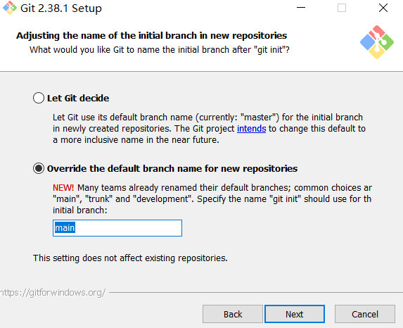
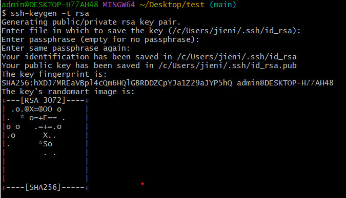
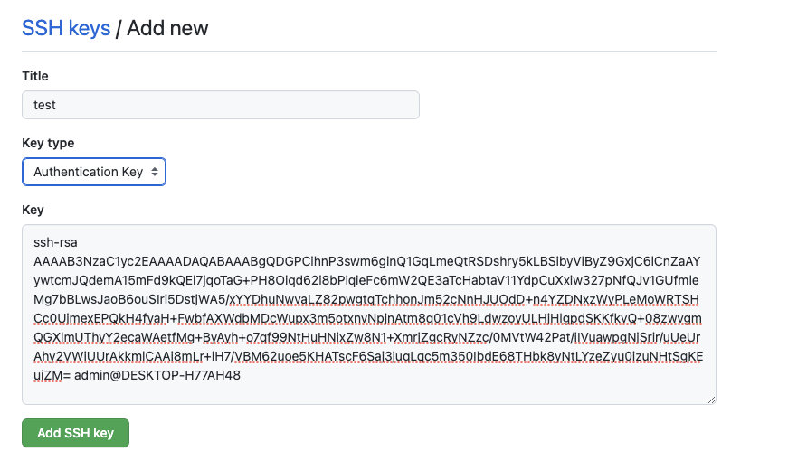
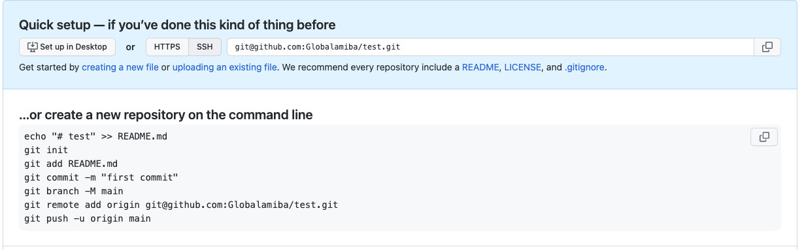
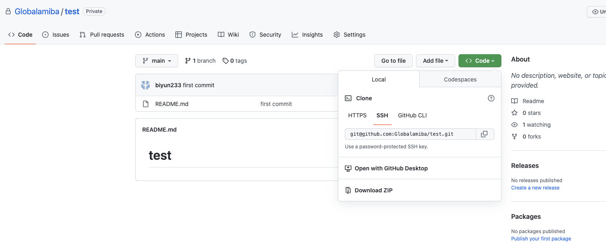

# GIT教程


### 1. 安装

https://gitforwindows.org/



```sh
git --version
# git version 2.38.1.windows.1
```


### 2. 配置

```sh
ssh-keygen -t rsa
```



```
cat /c/Users/jieni/.ssh/id_rsa.pub
```

去 https://github.com/settings/ssh 配置ssh keys



### 3. 新建仓库




### 4. 拉取仓库



```sh
git clone git@github.com:Globalamiba/test.git
cd test
```


### 5. 基础操作

```sh
## 查看分支
git branch 

## 创建并切换到分支a
git checkout -b a

## 切换到分支a
git checkout a

## 将线上的最新仓库拉取到本地
git pull origin {分支名}


## 将本地的修改上传到线上
git add .
git commit -m "msg"
git push origin {分支名}
```


### 6. 进阶操作

	#### 6.1. 回退到某个commit

```sh
git log
git reset --hard 9cbca2b
git push -f origin {branch}
```


#### 6.2. 获取因为回退而失去的commit

```sh
git reflog
git reset --hard 9cbca2b
git push -f origin {branch}
```


#### 6.3. 修改本地分支名

```sh
git branch -m {oldName} {newName}
```


#### 6.4. 修改远程分支名

```sh
git branch -m {oldName} {newName}
git push --delete origin {oldName}
git push origin {newName}
```

